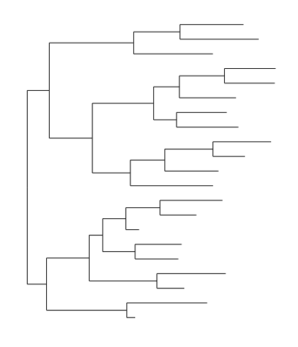
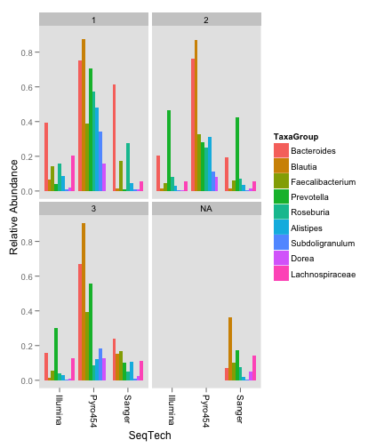

<link href="http://joey711.github.com/phyloseq/markdown.css" rel="stylesheet"></link>


Microbial biogeography of public restroom surfaces
========================================================
###### This demonstration is an example using [the phyloseq package](http://joey711.github.io/phyloseq/) to (re)investigate a DNA sequencing based census of the microbes on public restroom surfaces. The [original article by Flores et al.](http://dx.plos.org/10.1371/journal.pone.0028132) was published in 2011 under an open access license by [the journal PLoS ONE](http://www.plosone.org/). Here is the official citation: Flores GE, Bates ST, Knights D, Lauber CL, Stombaugh J, et al. (2011) Microbial Biogeography of Public Restroom Surfaces. PLoS ONE 6(11): e28132. [doi:10.1371/journal.pone.0028132](http://dx.plos.org/10.1371/journal.pone.0028132). The data was accessed from Study `1335`, Project Name `Flores_restroom_surface_biogeography` at [microbio.me/qiime](http://www.microbio.me/qiime/). The zipfile of the data is exposed at [this FTP address](ftp://thebeast.colorado.edu/pub/QIIME_DB_Public_Studies/study_1335_split_library_seqs_and_mapping.zip). 

This demo was built:


```r
date()
```

```
## [1] "Tue Apr 30 17:42:09 2013"
```


**(Figure 3 in orig Tue Apr 30 17:47:45 2013
Light blue indicates low abundance while dark blue indicates high abundance of taxa. **Panel A** Although skin-associated taxa (Propionibacteriaceae, Corynebacteriaceae, Staphylococcaceae and Streptococcaceae) were abundant on all surfaces, they were relatively more abundant on surfaces routinely touched with hands. **Panel B** Gut-associated taxa (Clostridiales, Clostridiales group XI, Ruminococcaceae, Lachnospiraceae, Prevotellaceae and Bacteroidaceae) were most abundant on toilet surfaces. **Panel C** Although soil-associated taxa (Rhodobacteraceae, Rhizobiales, Microbacteriaceae and Nocardioidaceae) were in low abundance on all restroom surfaces, they were relatively more abundant on the floor of the restrooms we surveyed. Figure not drawn to scale.
You can also check out [this image at the original article](http://www.ncbi.nlm.nih.gov/core/lw/2.0/html/tileshop_pmc/tileshop_pmc_inline.html?title=Click%20on%20image%20to%20zoom&p=PMC3&id=3223236_pone.0028132.g003.jpg).


## Load phyloseq package


```r
library("phyloseq")
packageVersion("phyloseq")
```

```
## [1] '1.5.8'
```


I also want to make some nice graphics using the ggplot2 package, so I will also load that and adjust its default theme


```r
library("ggplot2")
packageVersion("ggplot2")
```

```
## [1] '0.9.3.1'
```

```r
theme_set(theme_bw())
```


## Import data
The microbio.me/qiime site has provided a zip file with two key data files. Namely, a file with the abundance data and some metadata, and a tab delimited text file with sample meta data. This following code chunk imports both files, and then combines them in one integrated phyloseq object that we will use in the remaining (re)analysis.


```r
import_dir = "~/Downloads/study_1335_split_library_seqs_and_mapping"
# Import from the .biom file
biomfile = paste0(import_dir, "/study_1335_closed_reference_otu_table.biom")
biom = import_biom(biomfile, parseFunction = parse_taxonomy_greengenes)
# Import from the sample data file
sdfile = paste0(import_dir, "/study_1335_mapping_file.txt")
sample_metadata = import_qiime_sample_data(sdfile)
# Combine the two data objects
restroom = merge_phyloseq(biom, sample_metadata)
```


Now we have available a new combined data object, called `restroom`, that contains all the data we should need for this tutorial. We can query different features of `restroom` using the phyloseq API in the form of accessor functions/methods. We can also just print it to standard out and we get some summary information.


```r
restroom
```

```
## phyloseq-class experiment-level object
## otu_table()   OTU Table:         [ 4467 taxa and 56 samples ]
## sample_data() Sample Data:       [ 56 samples by 42 sample variables ]
## tax_table()   Taxonomy Table:    [ 4467 taxa by 7 taxonomic ranks ]
```

```r
rank_names(restroom)
```

```
## [1] "Kingdom" "Phylum"  "Class"   "Order"   "Family"  "Genus"   "Species"
```

```r
sample_variables(restroom)
```

```
##  [1] "X.SampleID"                    "BarcodeSequence"              
##  [3] "LinkerPrimerSequence"          "TARGET_SUBFRAGMENT"           
##  [5] "ASSIGNED_FROM_GEO"             "EXPERIMENT_CENTER"            
##  [7] "TITLE"                         "RUN_PREFIX"                   
##  [9] "TAXON_ID"                      "DEPTH"                        
## [11] "COMMON_NAME"                   "ELEVATION"                    
## [13] "RUN_DATE"                      "COLLECTION_DATE"              
## [15] "GENDER"                        "ALTITUDE"                     
## [17] "LEVEL"                         "ENV_BIOME"                    
## [19] "PLATFORM"                      "COUNTRY"                      
## [21] "SAMPLE_CENTER"                 "SAMP_SIZE"                    
## [23] "FLOOR"                         "LONGITUDE"                    
## [25] "STUDY_ID"                      "EXPERIMENT_DESIGN_DESCRIPTION"
## [27] "Description_duplicate"         "SEQUENCING_METH"              
## [29] "ENV_MATTER"                    "TARGET_GENE"                  
## [31] "BUILDING"                      "ENV_FEATURE"                  
## [33] "KEY_SEQ"                       "AGE_IN_YEARS"                 
## [35] "RUN_CENTER"                    "SURFACE"                      
## [37] "PCR_PRIMERS"                   "LIBRARY_CONSTRUCTION_PROTOCOL"
## [39] "LATITUDE"                      "REGION"                       
## [41] "STUDY_CENTER"                  "Description"
```

```r
levels(sample_data(restroom)$BUILDING)
```

```
## [1] "Ekeley" "Porter"
```

```r
levels(sample_data(restroom)$SURFACE)
```

```
##  [1] "Door in"             "Door out"            "Faucet handles"     
##  [4] "Sink floor"          "Soap dispenser"      "Stall in"           
##  [7] "Stall out"           "Toilet Floor"        "Toilet flush handle"
## [10] "Toilet seat"         "Water"
```


Okay, let's move on to preprocessing the data as needed, and reproducing the figures in the article.

## Preprocessing
The phyloseq package includes a [tutorial on preprocessing microiome census data](http://joey711.github.io/phyloseq/preprocess.html) with several broad and flexible methods. Here we want to use one of those preprocessing approaches as well as the one used by Flores et al. in this article. Unfortunately, they used random subsampling of their data with on reported seed or random number generation method, so it is impossible to exactly recapitulate their randomly subsampled data. However, we can do our best using a function included in phyloseq for exactly this purpose, `rarefy_even_depth`. 

Are there any OTUs included in this dataset that have no counted reads at all prior to preprocessing? If so, how many?


```r
any(taxa_sums(restroom) == 0)
```

```
## [1] TRUE
```

```r
sum(taxa_sums(restroom) == 0)
```

```
## [1] 1040
```

So of the 

```

Error in eval(expr, envir, enclos) : could not find function "ntaxa"

```

 OTUs in the dataset, there were 

```

Error in eval(expr, envir, enclos) : could not find function "taxa_sums"

```

 OTUs that were apparently not observed even once in any of the samples (

```

Error in eval(expr, envir, enclos) : could not find function "taxa_sums"

```

%). This sounds very odd, but more likely this is evidence of some data "massaging" that removed the abundance values of those taxa, but their entries in the `.biom` file are inexplicably included.

Here I remove those "unobserved" OTUs. Note how I first save the originally-imported data as `restroom0` in case I want to go back to it after modifying/preprocessing `restroom`.


```r
restroom0 = restroom
restroom = prune_taxa(taxa_sums(restroom) > 0, restroom)
```


Any empty samples? Apparently not, though the code for pruning "empty" samples is also shown. And procedes quickly since there is nothing in `restroom` to modify.


```r
any(sample_sums(restroom) == 0)
```

```
## [1] FALSE
```

```r
restroom = prune_samples(sample_sums(restroom) > 0, restroom)
```


What about the total reads per sample, and what do the distributions look like?

```r
title = "Sum of reads for each OTU across all samples"
plot(log10(sort(taxa_sums(restroom), TRUE)), type = "h", main = title, ylab = "log10( reads )")
```

 

```r
title = "Sum of reads for each sample"
plot(sort(sample_sums(restroom), TRUE), type = "h", main = title, ylab = "reads")
```

 


This looks pretty typical for the distribution of reads from an amplicon-based microbiome census, if not even surprisingly evenly distributed across most samples... I've seen much, much worse. In any case, one of the main preprocessing steps we will do is to transform the abundances of each sample in a way that will make the represented "sequencing effort", AKA the sum of the counts, the same across all samples. As mentioned earlier, I will redo a random subsampling ("rarefying") to 500 reads as the original authors did; and, separately, I will also simply transform the abundance vectors of each sample by multiplying the OTU proportion within each sample by the arbitrary value, `500` used in the random subsampling. We can later compare the how the two datasets perform.

First, I will remove the samples with a total number of reads below the threshold set by the original uauthors of `500`. 


```r
restroom = prune_samples(sample_sums(restroom) > 500, restroom)
```


This resulted in the removal of 

```

Error in eval(expr, envir, enclos) : could not find function "nsamples"

```

 sample(s) from the dataset.

### Transform to equal sample sum

**Rarefy**
We will call this `restroomR`. The way to accomplish this in phyloseq is to **first define a random number seed** so that others can reproduce your subsetted data, and then use the `rarefy_even_depth` function. Here I use the "ePub" number assigned to this article by PLoS ONE as the seed. Seemed appropriate.


```r
set.seed(28132)
restroomR = rarefy_even_depth(restroom, sample.size = 500)
```


And now an alternative to random subsampling, a simple proportional transformation, calling it `restroomP`.


```r
restroomP = transform_sample_counts(restroom, function(x) 500 * x/sum(x))
```


Just for fun, let's replot the sample sums of each of these new data objects, to convince ourselves that all of the samples now sum to 500.

```r
title = "Sum of reads for each sample, restroomR"
plot(sort(sample_sums(restroomR), TRUE), type = "h", main = title, ylab = "reads")
```

 

```r
title = "Sum of reads for each sample, restroomP"
plot(sort(sample_sums(restroomP), TRUE), type = "h", main = title, ylab = "reads")
```

 


## Figure 1
### Original Figure


Original Figure caption, quoted here:
"Figure 1. Taxonomic composition of bacterial communities associated with public restroom surfaces.
(A) Average composition of bacterial communities associated with restroom surfaces and potential source environments. (B) Taxonomic differences were observed between some surfaces in male and female restrooms. Only the 19 most abundant taxa are shown. For a more detailed taxonomic breakdown by gender including some of the variation see [Supplemental Table S2](http://www.plosone.org/article/info%3Adoi%2F10.1371%2Fjournal.pone.0028132#pone.0028132.s002)."

### Figure 1 - Reproduced
I will use the phyloseq plotting function `plot_bar` to reproduce Figure 1. I have taken liberties to improve the representation of the data to make certain features more comparable.

First, they have mixed taxonomic ranks in this plot between family and order, but most are family so I will use that. Furthermore, they showed only the most-abundant 19 OTUs, so we will add a variant taxonomic rank to the data, called `Family19`, that will only have non-NA values if the OTU is among those top 19.

```r
top19otus = names(sort(taxa_sums(restroomR), TRUE)[1:19])
taxtab19 = cbind(tax_table(restroomR), family19 = NA)
taxtab19[top19otus, "family19"] <- as(tax_table(restroomR)[top19otus, "Family"], 
    "character")
tax_table(restroomR) <- tax_table(taxtab19)
```


Now create the abundance bar plot of `restroomR` using the `plot_bar` function. 

```r
title = "Figure 1 Part A (remake), attempt 1"
plot_bar(restroomR, "SURFACE", fill = "family19", title = title) + coord_flip()
```

 


Hey that was easy! But the abundance values get over 500. How come? Oh, each of these categories includes more than one sample, so we expect them to exceed 500. In fact, you can see that the totals are multiples of 500. This is easy to fix by re-doing our earlier transformation on `restroomR` after mergeing by category. The phyloseq package includes a function specifically for doing this kind of categorical merge, called `merge_samples`.


```r
restroomRm = merge_samples(restroomR, "SURFACE")
```

Repair the merged values associated with each surface after merge.

```r
sample_data(restroomRm)$SURFACE <- levels(sample_data(restroomR)$SURFACE)
```


Transform to percentages of total available in the 19 OTUs

```r
restroomRm = transform_sample_counts(restroomRm, function(x) 100 * x/sum(x))
```


Now we can plot Figure 1A with each category on equivalent footing. 

```r
title = "Figure 1 Part A (remake), attempt 2"
plot_bar(restroomRm, "SURFACE", fill = "family19", title = title) + coord_flip() + 
    ylab("Percentage of Sequences")
```

 


To better match Figure 1 Panel A from the original article, I can remove the gray rectangles that represent OTUs that were not among the most abundant 19. 


```r
restroomRm19 = prune_taxa(top19otus, restroomRm)
title = "Figure 1 Part A (remake), attempt 3"
plot_bar(restroomRm19, "SURFACE", fill = "family19", title = title) + coord_flip() + 
    ylab("Percentage of Sequences") + ylim(0, 100)
```

 


**Figure 1, Panel B -- Gender**
What about separating by gender? 

First, we will merge samples by a dummy variable representing both `GENDER` and `SURFACES`, repair flattened factors, and transform to proportional abundances.

```r
sample_data(restroomR)$gensurf <- paste0(sample_data(restroomR)$GENDER, sample_data(restroomR)$SURFACE)
restroomRgsm = merge_samples(restroomR, "gensurf")
```

```
## Warning: NAs introduced by coercion
```

```r
# repair factors

# transform to proportions
```


Now add 


```r

restroomRgsm19 = prune_taxa(top19otus, restroomRgsm)
p = plot_bar(restroomR, "GENDER", fill = "family19", title = title) + coord_flip() + 
    labs(colour = "family")
p + facet_wrap(~SURFACE)
```

 


---

## Figure 2

### Figure 2 - Original Article

### Figure 2 - Reproduced


## Soil source

The soil source data was taken from [this 2009 article by Lauber et al. in AEM](http://aem.asm.org/content/75/15/5111.full)


## Supplementary Figure 3. Heatmap in SourceTracker
Supplementary Figure 3. Heatmap of the 454 OTUs present in at least 20 samples. in the [microbial source tracking article](http://www.nature.com/nmeth/journal/v8/n9/full/nmeth.1650.html)

Heatmap values represent log relative abundance. Hierarchical clustering (Unweighted Pair Group Method with Arithmetic Mean - UPGMA) was performed on the columns (OTUs), and again on the rows within each environment.


---

# Recapitulating SourceTracker

The authors describe using an algorithm called "SourceTracker", previously described in [Blah et al. (2011) Nature Methods](http://www.nature.com/nmeth/journal/v8/n9/full/nmeth.1650.html), and apparently written as a [commented R script published at sourceforge/sourcetracker](http://sourceforge.net/projects/sourcetracker/).

The plan will be to reuse the relevant parts of this code to recapitulate the SourceTracker algorithm that the authors of this restroom survey also used in their analysis.


