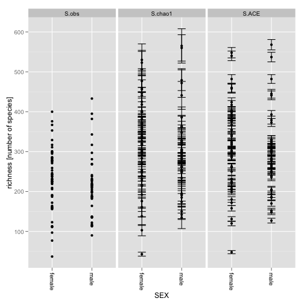
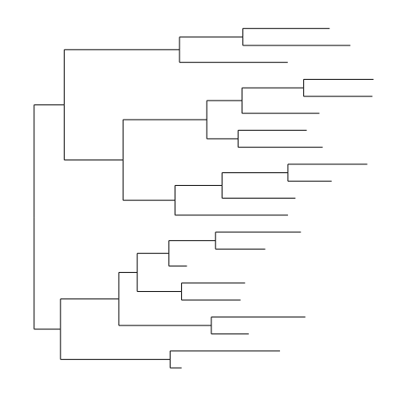
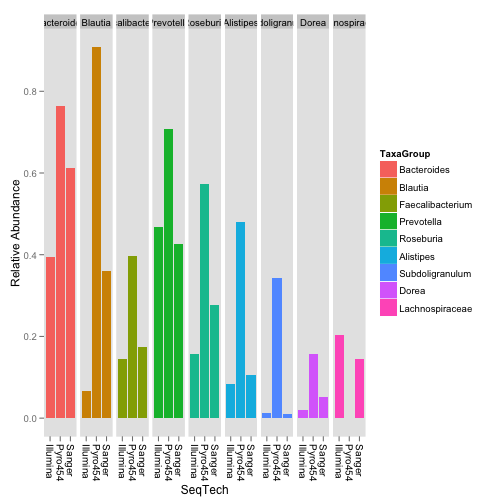
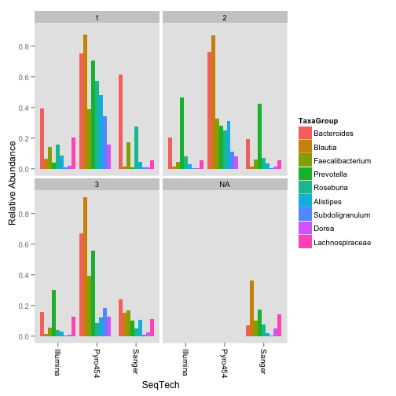
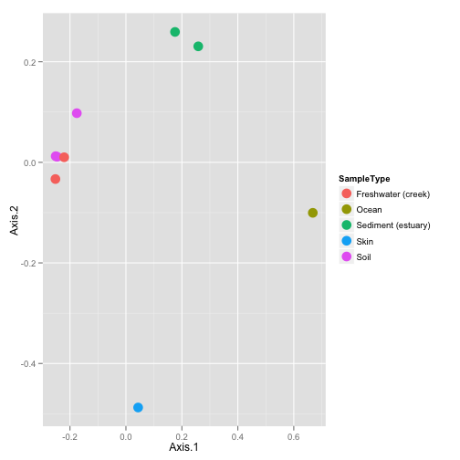

 Demo: phyloseq – A Bioconductor package for handling and analysis of high-throughput phylogenetic sequence data 
====================================================================================================================

 Paul J. McMurdie and Susan Holmes
    Statistics Department, Stanford University,
    Stanford, CA 94305, USA
    
    E-mail: mcmurdie@stanford.edu
    https://github.com/joey711/phyloseq
    susan@stat.stanford.edu\
    http://www-stat.stanford.edu/~susan/

Summary
---------

This is a demonstration manual for the phyloseq package. It is a Sweave
source-file with example code-chunks that can be reused if you have
phyloseq installed.

About this demo
-------------------

Vignettes are included in phyloseq. A quick way to load them from within `R` is:


```r
vignette("phyloseqbasics")
```

```
## Warning: vignette 'phyloseqbasics' not found
```

```r
vignette("phyloseqanalysis")
```

```
## Warning: vignette 'phyloseqanalysis' not found
```


This demonstration document supports a live demonstration of tools in
phyloseq, and supplements other documentation resources
available for [the phyloseq package](https://github.com/joey711/phyloseq) (e.g. wiki, vignettes, publications, function-level documentation, etc.).

Let’s start by loading the phyloseq-package:


```r
library("phyloseq")
```

```
## Loading required package: ade4
```

```
## Attaching package: 'ade4'
```

```
## The following object(s) are masked from 'package:base':
## 
## within
```

```
## Loading required package: picante
```

```
## Loading required package: ape
```

```
## Loading required package: vegan
```

```
## Loading required package: permute
```

```
## This is vegan 2.0-3
```

```
## Attaching package: 'vegan'
```

```
## The following object(s) are masked from 'package:ade4':
## 
## cca
```

```
## Loading required package: nlme
```

```r
library("ggplot2")
```

```
## Find out what's changed in ggplot2 with news(Version == "0.9.1", package =
## "ggplot2")
```


And because we will show examples of custom modifications to ggplot2
plots, we also loaded [the ggplot2 package](http://had.co.nz/ggplot2/) as well.

Data
--------------
<a name="sec:data"/>
To facilitate testing and exploration of tools in phyloseq,
this package includes example data from published studies. Many of the
examples in this vignette use either the GlobalPatterns or enterotype
datasets as source data. The GlobalPatterns data was described in an
article in PNAS in 2011 \cite{Caporaso15032011}, and compares the
microbial communities of 25 environmental samples and three known “mock
communities” — a total of 9 sample types — at a depth averaging 3.1
million reads per sample. The enterotype dataset was described in a 2011
article in Nature \cite{Arumugam:2011fk}, which compares, the faecal
microbial communities from 22 subjects using complete shotgun DNA
sequencing. The authors further compare these microbial communities with
the faecal communities of subjects from other studies, for a total of
280 faecal samples / subjects, and 553 genera. Sourcing data from
different studies invariable leads to gaps in the data for certain
variables, and this is easily handled by R’s core NA features.

Because this data is included in the package, the examples can easily be
run on your own computer using the code shown in this vignette. The data
is loaded into memory using the data command. Let’s start by loading the
GlobalPatterns data.

Later on we will use an additional categorical designation — human
versus non-human associated samples — that was not in the original
dataset. Now is a good time to add it as an explicit variable of the
sampleData, and because we don’t want to type long words over and over,
we’ll choose a shorter name for this modified version of GlobalPatterns,
call it GP, and also remove a handful of taxa that are not present in
any of the samples included in this dataset (probably an artifact):


```r
data(GlobalPatterns)
# prune OTUs that are not present in at least one sample
GP <- prune_species(speciesSums(GlobalPatterns) > 0, GlobalPatterns)
# Define a human-associated versus non-human categorical variable:
sampleData(GP)$human <- factor(getVariable(GP, "SampleType") %in% 
    c("Feces", "Mock", "Skin", "Tongue"))
```


[Data Section Test Reference](#sec:data)

Simple exploratory graphics
===========================


Easy Richness Estimates
-----------------------

We can easily create a complex graphic that compares the richness
estimates of samples from different environment types in the
GlobalPatterns dataset, using the plot\_richness\_estimates function.
Note that it is important to use raw (untrimmed) OTU-clustered data when
performing richness estimates, as they are highly dependent on the
number of singletons in a sample.


```r
p <- plot_richness_estimates(GP, "human", "SampleType")
print(p)
```

 


Adding an extra layer with the boxplot geometric object, using the ggplot2 function `geom_boxplot`, groups the y-values for the same horizontal position and color (shape, etc.). For example


```r
(p <- p + geom_boxplot(data = p$data, aes(x = human, y = value, color = NULL), 
    alpha = 0.1))
```

 


<sub><sup>
Estimates of the species richness of samples in the “Global Patterns”
dataset. Each panel shows a different type of “estimate”. S.obs,
observed richness; S.chao1, Chao1 estimate; S.ACE, an ACE estimate.
Individual color-shaded points and brackets represent the richness
estimate and the theoretical standard error range associated with that
estimate, respectively. The colors group the sample-sources into
“types”. Within each panel, the samples are further organized into
human-associated (TRUE) or not (FALSE), and a boxplot is overlayed on
top of this for the two groups, illustrating that these human-associated
samples are less rich than the environmental samples (although the type
of environment appears to matter a great deal as well). [fig:richness]
</sup></sub>

Note the alternative way to tell `R` to generate the plot. Any print-like command for a ggplot2 object will attempt to render the plot to the plot device. In this case, just type `p` and then pressing the `<return>` key would also work.


Exploratory tree plots
----------------------

*phyloseq* also contains a method for easily plotting an annotated
phylogenetic tree with information regarding the sample in which a
particular taxa was observed, and optionally the number of individuals
that were observed.

For the sake of creating a readable tree, let’s subset the data to just
the [Chlamydiae](http://en.wikipedia.org/wiki/Chlamydiae) phylum, which
consists of obligate intracellular pathogens and is present in only a
subset of environments in this dataset.


```r
GP.chl <- subset_species(GP, Phylum == "Chlamydiae")
```


And now we will create the tree graphic form this subset of
GlobalPatterns, shading by the "SampleType" variable, which indicates
the environment category from which the microbiome samples originated.
The following command also takes the option of labelling the number of
individuals observed in each sample (if at all) of each taxa. The
symbols are slightly enlarged as the number of individuals increases.


```r
(p <- plot_tree(GP.chl, color = "SampleType", shape = "Family", label.tips = "Genus", 
    size = "abundance"))
```

 


Phylogenetic tree representation of the Chlamydiae species in the microbiome samples of the “Global Patterns” dataset \cite{Caporaso15032011}. [fig:treeplot]


Exploratory bar plots
---------------------

[sec:barplots] In the following example we use the included “enterotype”
dataset \cite{Arumugam:2011fk}.


```r
data(enterotype)
par(mar = c(10, 4, 4, 2) + 0.1)  # make more room on bottom margin
N <- 30
barplot(sort(speciesSums(enterotype), TRUE)[1:N]/nsamples(enterotype), 
    las = 2)
```

 


We start with a simple rank-abundance barplot, using the cumulative
fractional abundance of each OTU in the dataset. In the enterotype
dataset, the available published data are simplified as sample-wise
fractional occurrences, rather than counts of individuals[^1], and OTUs
are clustered/labeled at the genus level, but no other taxonomic
assignment is available. For the barplot in Figure [fig:abundbarplot],
we further normalize by the total number of samples (280).

[htbp]  An example exploratory
barplot using base R graphics and the speciesSums and nsamples
functions. [fig:abundbarplot]

Note that this first barplot is clipped at the 30th OTU. This was chosen
because nspecies(enterotype) = 553 OTUs would not be legible on the
plot. As you can see, the relative abundances have decreased
dramatically by the 10th-ranked OTU.

So what are these OTUs? In the enterotype dataset, only a single
taxonomic rank type is present:


```r
rank.names(enterotype)
```

```
## [1] "Genus"
```


This means the OTUs in this dataset have been grouped at the level of
genera, and no other taxonomic grouping/transformation is possible
without additional information (like might be present in a phylogenetic
tree, or with further taxonomic classification analysis).

We need to know which taxonomic rank classifiers, if any, we have
available to specify in the second barplot function in this example,
plot\_taxa\_bar(). We have already observed how quickly the abundance
decreases with rank, so wo we will subset the enterotype dataset to the
most abundant N taxa in order to make the barplot legible on this page.


```r
TopNOTUs <- names(sort(speciesSums(enterotype), TRUE)[1:10])
ent10 <- prune_species(TopNOTUs, enterotype)
print(ent10)
```

```
## phyloseq-class experiment-level object
## OTU Table:          [10 species and 280 samples]
##                      species are rows
## Sample Data:         [280 samples by 9 sample variables]:
## Taxonomy Table:     [10 species by 1 taxonomic ranks]:
```


Note also that there are 280 samples in this dataset, and so a remaining
challenge is to consolidate these samples into meaningful groups. A good
place to look is the available sample variables, which in most cases
will carry more “meaning” than the sample names alone.


```r
sample.variables(ent10)
```

```
## [1] "Enterotype"     "Sample_ID"      "SeqTech"        "SampleID"      
## [5] "Project"        "Nationality"    "Gender"         "Age"           
## [9] "ClinicalStatus"
```


The parameters to plot\_taxa\_bar in the following code-chunk were
chosen after various trials. We suggest that you also try different
parameter settings while you’re exploring different features of the
data. In addition to the variables names of sampleData, the
plot\_taxa\_bar() function recognizes a special parameter name
"TaxaGroup", which is not (should not be) a sample variable name in
sampleData(enterotype), but instead indicates that the particular
graphic parameter should group values by the taxanomic rank specified in
the taxavec argument. In this example we have also elected to separate
the samples by “facets” (separate, adjacent sub-plots) according to the
enterotype to which they have been assigned. Within each enterotype
facet, the samples are further separated by sequencing technology, and
the genera is indicated by fill color. Multiple samples having the same
enterotype designation and sequencing technology are plotted
side-by-side as separate bars.


```r
(p <- plot_taxa_bar(ent10, "Genus", x = "SeqTech", fill = "TaxaGroup") + 
    facet_wrap(~Enterotype))
```

 


[htbp]  width=1.0 An example
exploratory barplot using the plot\_taxa\_bar() function. In this case
we have faceted the samples according to their assigned Enterotype. The
small subset of samples in the dataset that do not have an assigned
Enterotype are shown in the NA panel. Within each Enterotype facet, the
samples are further separated by sequencing technology, and each genera
is shaded a different color. Multiple samples from the same Enterotype
and sequencing technology are plotted side-by-side as separate bars
(dodged). [fig:barplot]

Figure [fig:barplot] summarizes quantitatively the increased abundances
of *Bacteroides* and *Prevotella* in the Enterotypes 1 and 2,
respectively. Interestingly, a large relative abundance of *Blautia* was
observed for Enterotype 3, but only from 454-pyrosequencing data sets,
not the Illumina or Sanger datasets. This suggests the increased
*Blautia* might actually be an artifact. Similarly, *Prevotella* appears
to be one of the most abundant genera in the Illumina-sequenced samples
among Enterotype 3, but this is not reproduced in the 454-pyrosequencing
or Sanger sequencing data.

Exploratory analysis and graphics
=================================

[sec:analysisplots]

Exploratory Heat Map
--------------------

[sec:heatmap] As the number of taxa in a dataset gets very large, the
ability to effectively display all of the elements of the data becomes
compromised, and a heatmap representation is no exception. It can also
be time-consuming to render. To address both these issues, we show an
example in which we have subsetted the Global Patterns dataset to a
manageable portion, in this case, the Crenarchaeota phylum.


```r
data("GlobalPatterns")
gpac <- subset_species(GlobalPatterns, Phylum == "Crenarchaeota")
(p <- plot_heatmap(gpac, "NMDS", "bray", "SampleType", "Family"))
```

 


Note that it is possible to order the sample/species indices by any of
the ordination methods supported in the ordinate function; and also that
the color scheme can be modified with additional arguments. For
additional details and examples, try the function-level documentation in
the phyloseq-package itself, or the wiki-page showing detailed code/plot
examples for heat maps at:

<https://github.com/joey711/phyloseq/wiki/plot_heatmap>.

[htbp]  

Heat map
representation of the Crenarchaeota phylum abundance pattern across
different sample types in the Global Patterns dataset. [fig:heatmap]

Microbiome Network Representation
---------------------------------

[sec:network] Continuing with the enterotype dataset, here are some
examples for creating a custom network representation of the
relationship between microbiome samples in an experiment. This relies
heavily on the igraph and ggplot2 packages to create a network display
of the “connectedness” of samples according to some user-provided
ecological similarity. By default, the position of points (samples) are
determined using an algorithm that optimizes the clarity of the display
of network “edges”, but the spatial position of points does not imply
any continuous similarity information like would be the case in an
ordination. In this example, the default dissimilarity index was used
(Jaccard, co-occurrence), with a maximum distance of 0.3 required to
create an edge. Any function that can operate on phyloseq-objects and
return a sample-wise distance can be provided as the dist.fun argument,
or a character string of the name of the distance function already
supported in phyloseq. Other distances may result in very different
clustering, and this is a choice that should be understood and not taken
too lightly, although there is little harm in trying many different
distances.


```r
data(enterotype)
ig <- make_network(enterotype, max.dist = 0.3)
(p <- plot_network(ig, enterotype, color = "SeqTech", shape = "Enterotype", 
    line_weight = 0.4, label = NULL))
```

```
## Warning: Removed 5 rows containing missing values (geom_point).
```

 


Interestingly, at this level of analysis and parameter-settings the two
major sub-graphs appear to be best explained by the sequencing
technology and not the subject enterotype (Figure [fig:makenetwork]),
suggesting that the choice of sequencing technology has a major effect
on the microbial community one can observe. This seems to differ
somewhat with the inferences described in the “enterotype”
article \cite{Arumugam:2011fk}. However, there could be some confounding
or hidden variables that might also explain this phenomenon, and the
well-known differences in the sequence totals between the technologies
may also be an important factor. Furthermore, since this is clearly an
experimental artifact (and they were including data from multiple
studies that were not orginally planned for this purpose), it may be
that the enterotype observation can also be shown in a network analysis
of this data after removing the effect of sequencing technology and
related sequencing effort. Such an effort would be interesting to show
here, but is not yet included.

[htbp]  Network
representation of the relationship between microbiome samples in the
“Enterotype” dataset \cite{Arumugam:2011fk}. [fig:makenetwork]

Ordination Methods
------------------

[sec:ordination] Ordination methods can be a useful tool for exploring
complex phylogenetic sequencing data, particularly when the hypothesized
structure of the data is poorly defined (or there isn’t a hypothesis).
The phyloseq package provides some useful tools for performing
ordinations and plotting their results, via the ordinate() and
plot\_ordination() functions, respectively. Although there are many
options and methods supported, a first-step will probably look something
like the following:

```
my.physeq <- import("Biom", BIOMfilename="myBiomFile.biom")
my.ord    <- ordinate(my.physeq)
plot_ordination(my.physeq, my.ord, color="myFavoriteVarible")
```

It is probably a good idea to read the documentation for these two
functions, as they also provide links to related functions and
additional examples you can try immediately on your own machine.

```
?import
?ordinate
?distance
?plotordination
```

### Principal Coordinates Analysis (PCoA)

[sec:PCoA] We take as our first example, a reproduction of Figure 5 from
the “Global Patterns” article \cite{Caporaso15032011}. The authors show
a 3-dimensional representation of the first three axes of a Principal
Coordinates Analysis (PCoA[^2]) performed on the unweighted-UniFrac
distance (see section [sec:unifrac]) using all of the available
sequences (their approach included both 5’ and 3’ sequences). According
to the authors, “the first axis [appears to be associated with a] host
associated/free living [classification],” and similarly the third axis
with “saline/nonsaline environment[s].”

The following reproduces the unweighted UniFrac distance calculation on
the full dataset. Note that this calculation can take a long time
because of the large number of OTUs. Parallelization is recommended for
large datasets, typically if they are as large as GlobalPatterns, or
larger. For details on parallelization, see the details section and
examples in the UniFrac() documentation, and also the page dedicated to
the topic on the phyloseq-wiki:

<https://github.com/joey711/phyloseq/wiki/Fast-Parallel-UniFrac>


```r
data(GlobalPatterns)
### Do note eval GPUF <- UniFrac(GlobalPatterns)
load("Unweighted_UniFrac.RData")
```

```
## Warning: cannot open compressed file 'Unweighted_UniFrac.RData', probable
## reason 'No such file or directory'
```

```
## Error: cannot open the connection
```

```r
GloPa.pcoa <- pcoa(GPUF)
```

```
## Error: object 'GPUF' not found
```


Before we look at the results, let’s first investigate how much of the
total distance structure we will capture in the first few axes. We can
do this graphically with a “scree plot”, an ordered barplot of the
relative fraction of the total eigenvalues associated with each axis
(Fig. [fig:PCoAScree]).


```r
barplot(GloPa.pcoa$values$Relative_eig)
```

```
## Error: object 'GloPa.pcoa' not found
```


Scree plot of the PCoA used to create Figure 5 from the “Global
Patterns” article \cite{Caporaso15032011}. 

The first three axes represent ` r round(100*sum(GloPa.pcoa$values$Relative_eig[1:3]))` \% of the 
total variation in the distances. Interestingly, the fourth axis represents another 


```

Error in eval(expr, envir, enclos) : object 'GloPa.pcoa' not found

```

 \%, 
and so may warrant exploration as well. A scree plot is an important tool 
for any ordination method, as the relative importance of axes can vary widely from one dataset to another.


Next, we will reproduce Figure 5 from the “Global Patterns”
article \cite{Caporaso15032011}, but separating the three axes into 2
plots using plot\_ordination() (Fig. [fig:GPfig5]).


```r
(p12 <- plot_ordination(GlobalPatterns, GloPa.pcoa, "samples", color = "SampleType") + 
    geom_line() + geom_point(size = 5) + scale_colour_hue(guide = "none"))
```

```
## Error: object 'GloPa.pcoa' not found
```

```r
(p13 <- plot_ordination(GlobalPatterns, GloPa.pcoa, "samples", axes = c(1, 
    3), color = "SampleType") + geom_line() + geom_point(size = 5))
```

```
## Error: object 'GloPa.pcoa' not found
```


A reproduction in *phyloseq* / R of the main panel of Figure 5
from the “Global Patterns” article \cite{Caporaso15032011}, on two
plots. The horizontal axis represents the first axis in the PCoA
ordination, while the top and bottom vertical axes represent the second
and third axes, respectively. Different points represent different
samples within the dataset, and are shaded according to the environment
category to which they belong. The color scheme is the default used by
*ggplot*. [fig:GPfig5]

### non-metric Multi-Dimensional Scaling (NMDS)

[sec:NMDS] We repeat the previous example, but instead using non-metric
multidimensional scaling (NMDS - metaMDS()) limited to just two
dimensions. This approach limits the amount of residual distance “not
shown” in the first two (or three) axes, but forefeits some mathematical
properties and does not always converge within the specified number of
axes.


```r
data(GlobalPatterns)
load("Unweighted_UniFrac.RData")  # reloads GPUF variable
```

```
## Warning: cannot open compressed file 'Unweighted_UniFrac.RData', probable
## reason 'No such file or directory'
```

```
## Error: cannot open the connection
```

```r
GP.NMDS <- metaMDS(GPUF, k = 2)  # perform NMDS, set to 2 axes
```

```
## Error: object 'GPUF' not found
```

```r
(p <- plot_ordination(GlobalPatterns, GP.NMDS, "samples", color = "SampleType") + 
    geom_line() + geom_point(size = 5))
```

```
## Error: object 'GP.NMDS' not found
```


An example exploratory
ordination using non-metric multidimensional scaling (NMDS) on the
unweighted UniFrac distance between samples of the “Global Patterns”
dataset. Sample points are shaded by environment type, and connected by
a line if they belong to the same type. Compare with Figure 5 from the
“Global Patterns” article \cite{Caporaso15032011}. 


Figure REF nicely shows the relative dissimilarities
between microbial communities from different habitats. However, it fails
to indicate *what* was different between the communities. For an
ordination method that provides information on the taxa that explain
differences between samples (or groups of samples), we use
Correspondence Analysis (Section [sec:CA]).

### Correspondence Analysis (CA)

[sec:CA] In the following section we will show continue our exploration
of the “GlobalPatterns” dataset using various features of an ordination
method called Correspondence Analysis. We give special emphasis to
exploratory interpretations using the biplot, because it provides
additional information that is not available from PCoA or NMDS.

Let’s start by performing a Correspondence Analysis and investigating
the scree plot (Figure [fig:GPCAscree]). Both interestingly and
challengingly, the scree plot suggests that the GlobalPatterns abundance
data is quite high-dimensional, with the first two CA axes accounting
for not quite 17% of the total (chi-square) variability. Note the
absence of a steep decline in eigenvalue fraction as axis number
increases. Each additional axis represents only marginally less
variability than the previous. It is often more convenient if the first
two (or three) axes account for most of the variability.

First, let’s severely subset the number of species for the sake of
run-time.[^3]


```r
data(GlobalPatterns)
# Take a subset of the GP dataset, top 200 species
topsp <- names(sort(speciesSums(GlobalPatterns), TRUE)[1:200])
GP <- prune_species(topsp, GlobalPatterns)
# Subset further to top 5 phyla, among the top 200 OTUs.
top5ph <- sort(tapply(speciesSums(GP), taxTab(GP)[, "Phylum"], sum), 
    decreasing = TRUE)[1:5]
GP <- subset_species(GP, Phylum %in% names(top5ph))
# Re-add human variable to sample data:
sampleData(GP)$human <- factor(human)
```

```
## Error: object 'human' not found
```


Now perform the correspondence analysis.


```r
gpca <- ordinate(GP, "CCA")
barplot(gpca$CA$eig/sum(gpca$CA$eig), las = 2)
```

 


[htbp]  The correspondence analysis
(CA) scree plot of the “Global Patterns”
dataset \cite{Caporaso15032011}. [fig:GPCAscree]

Now let’s investigate how the samples behave on the first few CA axes.


```r
(p12 <- plot_ordination(GP, gpca, "samples", color = "SampleType") + 
    geom_line() + geom_point(size = 5))
```

 

```r
(p34 <- plot_ordination(GP, gpca, "samples", axes = c(3, 4), color = "SampleType") + 
    geom_line() + geom_point(size = 5))
```

 


[htbp] [Axes 1, 2][fig:sub:GPCA12]
[Axes 3, 4][fig:sub:GPCA34] width=1.0
First 4 axes of Correspondence Analysis (CA) of the “Global Patterns”
dataset \cite{Caporaso15032011}. [fig:GPCA]

A clear feature of these plots is that the feces and mock communities
cluster tightly together, far away from all other samples on the first
axis (CA1) in Fig. [fig:sub:GPCA12]. The skin and tongue samples
separate similarly, but on the second axis. Taken together, it appears
that the first two axes are best explained by the separation of
human-associated “environments” from the other non-human environments in
the dataset, with a secondary separation of tongue and skin samples from
feces.

We will now investigate further this top-level structure of the data,
using an additional feature of correspondence analysis that allows us to
compare the relative contributions of individual taxa on the same
graphical space: the “biplot”. However, because we just displayed the
position of samples in the ordination and there are often many thousands
of OTUs, we will focus on creating an interpretable plot of the OTUs.
For creating graphics that combine the two plots, try the “biplot” or
“split” option for type in plot\_ordination().


```r
p1 <- plot_ordination(GP, gpca, "species", color = "Phylum")
(p1 <- ggplot(p1$data, p1$mapping) + geom_point(size = 5, alpha = 0.5) + 
    facet_wrap(~Phylum) + scale_colour_hue(guide = "none"))
```

 


[htbp]  Species plot of the
“Global Patterns” correspondence analysis first two axes, with each
phylum on a different panel (“facet”). Only the most abundant 5 phyla
among the most abundant 200 taxa (cumulative, all samples) are included.
Arbitrary reduction, for computational efficiency of example.
[fig:GPCAspecplot]

Let’s try drawing Fig [fig:GPCAspecplot] again, only this time
summarizing the species points as a 2D density estimate, without any
individual points.


```r
(p3 <- ggplot(p1$data, p1$mapping) + geom_density2d() + facet_wrap(~Phylum) + 
    scale_colour_hue(guide = "none"))
```

 


Redrawn Fig. [fig:GPCAspecplot], which is severely overplotted, as a
2-dimensional species-density topographic map, faceted in the same way.
[fig:GPCAspecplotTopo]

Figs [fig:GPCAspecplot] and [fig:GPCAspecplotTopo] reveal some useful
patterns and interesting outliers, but what if we want a complete
summary of how each phylum is represented along each axis? The following
code is a way to show this using boxplots, while still avoiding the
occlusion problem (points layered on top of each other), and also
conveying some useful information about the pattern of taxa that
contribute to the separation of human-associated samples from the other
sample types. It re-uses the data that was stored in the ggplot2 plot
object created in the previous figure, p, and creates a new boxlot
graphical summary of the positions of each phylum
(Fig [fig:GPCAjitter]).


```r
library("reshape")
```

```
## Loading required package: plyr
```

```
## Attaching package: 'reshape'
```

```
## The following object(s) are masked from 'package:plyr':
## 
## rename, round_any
```

```r
# Melt the species-data.frame, DF, to facet each CA axis separately
mdf <- melt(p1$data[, c("CA1", "CA2", "Phylum", "Family", "Genus")], 
    id = c("Phylum", "Family", "Genus"))
# Select some special outliers for labelling
LF <- subset(mdf, variable == "CA2" & value < -1)
# build plot: boxplot summaries of each CA-axis, with labels
p <- ggplot(mdf, aes(Phylum, value, color = Phylum)) + geom_boxplot() + 
    facet_wrap(~variable, 2) + scale_colour_hue(guide = "none") + theme_bw() + 
    opts(axis.text.x = theme_text(angle = -90, hjust = 0))
# Add the text label layer, and render ggplot graphic
(p <- p + geom_text(aes(Phylum, value + 0.1, color = Phylum, label = Family), 
    data = LF, vjust = 0, size = 2))
```

 


[htbp]  Boxplot of taxa (species
in this case) of the “Global Patterns” CA first two axes,
shaded/separated by phylum. Through this approach it is much easier to
see particular species that cluster unusually relative to the rest of
their phylum, for example the Bacteroidetes species (*Prevotellaceae*
family) that is positioned most in the negative CA2 direction toward the
Tongue/Skin samples. [fig:GPCAjitter]

One way to relate some of the high-level patterns we observed from
correspondence analysis is to visualize the relative abundances of the
relevant phylogenetic groups, to see if this does in fact support /
explain the human/environment microbiome differences. Here is an example
using the plot\_taxa\_bar function described earlier in
Section [sec:barplots].


```r
(p <- plot_taxa_bar(GP, "Phylum", NULL, threshold = 0.9, "human", 
    "SampleType", facet_formula = TaxaGroup ~ .))
```

```
## Error: object 'human' not found
```


Phylum-level comparison of
relative abundance of taxa in samples that are from human microbiomes
(or not). [fig:GPtaxaplot]

In Fig [fig:GPtaxaplot] we’ve used the threshold parameter to omit all
but phyla accounting for the top 90% of phyla in any one sample. Some
patterns emerging from this display appear to be: (1) Cyanobacteria,
Actinobacteria appear under-represented in human samples; (2)
conversely, Firmicutes appear over-represented in human samples; (3)
Acidobacteria, Verrucomicrobia appear over-represented in the fecal
samples; (4) the only Crenarchaeota were observed in the Mock sample,
which is not really a community but a simulated community used as a
control. These are not hugely surprising based on previous biological
observations from the field, but it is hopefully useful code that can be
applied on other datasets that you might have.

### Double Principle Coordinate Analysis (DPCoA)

Here is a quick example illustrating the use of Double Principal
Coordinate Analysis (DPCoA \cite{Pavoine2004523}), using the using the
DPCoA() function in phyloseq, as well as the “biplot” option for
plot\_ordination(). For a description that includes an applied example
using the “enterotype” dataset and comparison with UniFrac/PCoA, see
Fukuyama et al \cite{fukuyama2012com}.


```r
GP.dpcoa <- DPCoA(GP)
# GP.dpcoa <- ordinate(GP, 'DPCoA') # Alternative; ordinate() function
pdpcoa <- plot_ordination(GP, GP.dpcoa, type = "biplot", color = "SampleType", 
    shape = "Phylum")
shape.fac <- pdpcoa$data[, deparse(pdpcoa$mapping$shape)]
man.shapes <- c(19, 21:25)
names(man.shapes) <- c("samples", levels(shape.fac)[levels(shape.fac) != 
    "samples"])
p2dpcoa <- pdpcoa + scale_shape_manual(values = man.shapes)
```


[htbp]  A biplot representation
of a Double Principal Coordinate Analysis (DPCoA), on a simplified
version of the “Global Patterns” dataset with only the most abundant 200
OTUs included. [fig:GPdpcoaBiplot]

Distance Methods
----------------

### distance(): Central Distance Function

Many comparisons of microbiome samples, including the graphical model
(Section [sec:network]) and the PCoA analysis (Section [sec:PCoA]),
require a calculation for the relative dissimilarity of one microbial
community to another, or “distance”. The phyloseq-package provides a
general “wrapper” function for calculating ecological distance matrices
between the samples in an experiment.

distance() currently supports 43 method options, as well as
user-provided arbitrary methods via an interface to vegan’s designdist()
function. Currrently only sample-wise distances are supported (the type
argument), but eventually species-wise (OTU-wise) distances will be
supported as well. In addition to supporting any of the method options
to the three main distance functions of the
vegan-package \cite{veganpkg} — including the 14 distances of the
vegdist() function and all 24 ecological distances reviewed in Koleff et
al. 2003 \cite{Koleff2003JAE} coded by betadiver — distance() will
eventually support many of the distance methods in the
ade4-package \cite{Dray:2007vs}, and others. It also supports the Fast
UniFrac distance function (Section [sec:unifrac]) included in phyloseq
as native R code, and a wrapper for retreiving the sample-distances from
Double Principal Coordinate Analysis (DPCoA).

The function takes a phyloseq-class object and an argument indicating
the distance type; and it returns a dist-class distance matrix.


```r
data(esophagus)
distance(esophagus)  # Unweighted UniFrac
```

```
##        B      C
## C 0.5176       
## D 0.5182 0.5422
```

```r
distance(esophagus, weighted = TRUE)  # weighted UniFrac
```

```
##        B      C
## C 0.2035       
## D 0.2603 0.2477
```

```r
distance(esophagus, "jaccard")  # vegdist jaccard
```

```
##        B      C
## C 0.5776       
## D 0.6646 0.7427
```

```r
distance(esophagus, "g")  # betadiver method option 'g'
```

```
##        B      C
## C 0.6136       
## D 0.6250 0.6078
```

```r
distance("help")
```

```
## Available arguments to methods:
##  [1] "unifrac"    "dpcoa"      "jsd"        "manhattan"  "euclidean" 
##  [6] "canberra"   "bray"       "kulczynski" "jaccard"    "gower"     
## [11] "altGower"   "morisita"   "horn"       "mountford"  "raup"      
## [16] "binomial"   "chao"       "maximum"    "binary"     "minkowski" 
## [21] "w"          "-1"         "c"          "wb"         "r"         
## [26] "I"          "e"          "t"          "me"         "j"         
## [31] "sor"        "m"          "-2"         "co"         "cc"        
## [36] "g"          "-3"         "l"          "19"         "hk"        
## [41] "rlb"        "sim"        "gl"         "z"         
## Please be exact, partial-matching not supported.
## Can alternatively provide a custom distance.
## See:
##  help("distance") 
```

```
## NULL
```


### UniFrac and weighted UniFrac

[sec:unifrac] UniFrac is a recently-defined \cite{Lozupone:2005gn} and
popular distance metric to summarize the difference between pairs of
ecological communities. All UniFrac variants use a phylogenetic tree of
the relationship among taxa as central information to calculating the
distance between two samples/communities. An unweighted UniFrac distance
matrix only considers the presence/absence of taxa, while weighted
UniFrac accounts for the relative abundance of taxa as well as their
phylogenetic distance. Prior to *phyloseq*, a non-parallelized, non-Fast
implementation of the unweighted UniFrac was available in packages
(picante::unifrac \cite{Kembel:2010ft}). In the *phyloseq* package we
provide optionally-parallelized implementations of Fast
UniFrac \cite{Hamady:2009fk} (both weighted and unweighted, with plans
for additional UniFrac variants), all of which return a sample-wise
distance matrix from any phyloseq-class object that contains a
phylogenetic tree component.

The following is an example calculating the UniFrac distance (both
weighted and unweighted) matrix using the “esophagus” example dataset:


```r
data(esophagus)
UniFrac(esophagus, weighted = TRUE)
```

```
##        B      C
## C 0.2035       
## D 0.2603 0.2477
```

```r
# distance(esophagus, weighted=TRUE) # Alternative using the distance()
# function
UniFrac(esophagus, weighted = FALSE)
```

```
##        B      C
## C 0.5176       
## D 0.5182 0.5422
```

```r
# distance(esophagus) # Alternative using the distance() function
round(UniFrac(esophagus, weighted = TRUE), 3)
```

```
##       B     C
## C 0.204      
## D 0.260 0.248
```

```r
round(UniFrac(esophagus, weighted = FALSE), 3)
```

```
##       B     C
## C 0.518      
## D 0.518 0.542
```


See the wiki-page devoted to details about calculating the UniFrac
distances for your experiment. In particular, some example run-times are
provided for comparison, as well as details for initializing a parallel
“back end” to perform the computation with multiple processor cores
simultaneously:

<https://github.com/joey711/phyloseq/wiki/Fast-Parallel-UniFrac>

Hierarchical Clustering
-----------------------

Another potentially useful and popular way to visualize/decompose
sample-distance matrices is through hierarchical clustering (e.g.
hclust()). In the following example, we reproduce Figure 4 from the
“Global Patterns” article \cite{Caporaso15032011}, using the unweighted
UniFrac distance and the UPGMA method (hclust parameter
method="average"). Try help("hclust") for alternative clustering methods
included in standard R.


```r
# (Re)load UniFrac distance matrix and GlobalPatterns data
data(GlobalPatterns)
load("Unweighted_UniFrac.RData")  # reloads GPUF variable
```

```
## Warning: cannot open compressed file 'Unweighted_UniFrac.RData', probable
## reason 'No such file or directory'
```

```
## Error: cannot open the connection
```

```r
# Manually define color-shading vector based on sample type.
colorScale <- rainbow(length(levels(getVariable(GlobalPatterns, "SampleType"))))
cols <- colorScale[getVariable(GlobalPatterns, "SampleType")]
GP.tip.labels <- as(getVariable(GlobalPatterns, "SampleType"), "character")
GP.hclust <- hclust(GPUF, method = "average")
```

```
## Error: object 'GPUF' not found
```


Plot the hierarchical clustering results as a dendrogram, after first
converting the hclust-class object to phylo-class tree using the
as.phylo() function.


```r
plot(as.phylo(GP.hclust), show.tip.label = TRUE, tip.color = "white")
```

```
## Error: object 'GP.hclust' not found
```

```r
tiplabels(GP.tip.labels, col = cols, frame = "none", adj = -0.05, 
    cex = 0.7)
```

```
## Error: object 'last_plot.phylo' not found
```


Create an alternative plot, using the Jaccard distance and
complete-linkage clustering (the default) instead of UPGMA.


```r
jaccCLC <- hclust(distance(GlobalPatterns, "jaccard"))
plot(as.phylo(jaccCLC), show.tip.label = TRUE, tip.color = "white")
tiplabels(GP.tip.labels, col = cols, frame = "none", adj = -0.05, 
    cex = 0.7)
```

 


An alternative means of summarizing a distance matrix via
hierarchical clustering and plotting as an annotated dendrogram. Compare
with Figure 4 from the “Global Patterns”
article \cite{Caporaso15032011}. Panel [fig:sub:GPfig4] represents a
faithful reproduction of the original approach from the article using R
utilities, while Panel [fig:sub:GPjaccCLC] is an illustration of
slightly different results with different choices of distance measure
and clustering algorithm. Some differences in Panel [fig:sub:GPfig4]
from the original article might be explained by the GlobalPatterns
dataset in *phyloseq* includes the summed observations from both
directions (5’ and 3’), while in the article they show the results
separately. Furthermore, in the article the “mock” community is not
included in the dataset, but an extra fecal sample is included.


Validation
==========

Multiple Inference Correction
-----------------------------

[sec:multtest] The *phyloseq* package includes support for significance
testing with correction for multiple inference. This is particularly
important when testing for significance of the abundance patterns among
thousands of microbes (OTUs). This is a common question of phylogenetic
sequence data, that is, “what is the subset of microbes that
significantly correlate with a scientifically-interesting sample
variable”. Although we plan to include support for other types of
multiple-inference corrected tests, this “which taxa?” test is the only
directly supported test at the moment.

Our initial implementation of this support is via an extension to the
mt.maxT() and mt.minP functions in the *multtest*
package \cite{multtest} (Bioconductor repo). This uses
permutation-adjusted p-values in a multiple testing procedure that
provides strong control of the Family-Wise Error Rate (FWER) among the
taxa being tested. The user specifies a sample-variable among the
sampleData component, or alternatively provides a sample-wise vector or
factor that classifies the samples into groups. Additional optional
parameters can be provided that specify the type of test (“test=”), the
sidedness of the test (“side=”), as well as some additional
technical/computational parameters.

In the following example we test whether a particular genera correlates
with the Enterotype classification of each sample. Note that we have to
specify an alternate test, test="f", because the default test (t-test)
can only handle up to 2 classes, and there are three enterotype classes.


```r
data(enterotype)
# Filter samples that don't have Enterotype classification.
x <- subset_samples(enterotype, !is.na(Enterotype))
# Calculate the multiple-inference-adjusted P-values
ent.p.table <- mt(x, "Enterotype", test = "f")
```

```
## B=10000
## b=100	b=200	b=300	b=400	b=500	b=600	b=700	b=800	b=900	b=1000	
## b=1100	b=1200	b=1300	b=1400	b=1500	b=1600	b=1700	b=1800	b=1900	b=2000	
## b=2100	b=2200	b=2300	b=2400	b=2500	b=2600	b=2700	b=2800	b=2900	b=3000	
## b=3100	b=3200	b=3300	b=3400	b=3500	b=3600	b=3700	b=3800	b=3900	b=4000	
## b=4100	b=4200	b=4300	b=4400	b=4500	b=4600	b=4700	b=4800	b=4900	b=5000	
## b=5100	b=5200	b=5300	b=5400	b=5500	b=5600	b=5700	b=5800	b=5900	b=6000	
## b=6100	b=6200	b=6300	b=6400	b=6500	b=6600	b=6700	b=6800	b=6900	b=7000	
## b=7100	b=7200	b=7300	b=7400	b=7500	b=7600	b=7700	b=7800	b=7900	b=8000	
## b=8100	b=8200	b=8300	b=8400	b=8500	b=8600	b=8700	b=8800	b=8900	b=9000	
## b=9100	b=9200	b=9300	b=9400	b=9500	b=9600	b=9700	b=9800	b=9900	b=10000	
## r=5	r=10	r=15	r=20	r=25	r=30	r=35	r=40	r=45	r=50	
## r=55	r=60	r=65	r=70	r=75	r=80	r=85	r=90	r=95	r=100	
## r=105	r=110	r=115	r=120	r=125	r=130	r=135	r=140	r=145	r=150	
## r=155	r=160	r=165	r=170	r=175	r=180	r=185	r=190	r=195	r=200	
## r=205	r=210	r=215	r=220	r=225	r=230	r=235	r=240	r=245	r=250	
## r=255	r=260	r=265	r=270	r=275	r=280	r=285	r=290	r=295	r=300	
## r=305	r=310	r=315	r=320	r=325	r=330	r=335	r=340	r=345	r=350	
## r=355	r=360	r=365	r=370	r=375	r=380	r=385	r=390	r=395	r=400	
## r=405	r=410	r=415	r=420	r=425	r=430	r=435	r=440	r=445	r=450	
## r=455	r=460	r=465	r=470	r=475	r=480	r=485	r=490	r=495	r=500	
## r=505	r=510	r=515	r=520	r=525	r=530	r=535	r=540	r=545	r=550	
```

```r
print(head(ent.p.table, 10))
```

```
##                       index teststat   rawp   adjp plower
## Prevotella              207  344.733 0.0001 0.0158 0.0001
## Bacteroides             203   85.018 0.0001 0.0158 0.0001
## Blautia                 187   19.526 0.0001 0.0158 0.0001
## Bryantella              503   16.383 0.0001 0.0158 0.0001
## Parabacteroides         205   12.894 0.0001 0.0158 0.0001
## Alistipes               208    8.708 0.0002 0.0301 0.0158
## Bifidobacterium         240    9.294 0.0004 0.0560 0.0430
## Holdemania              201    7.638 0.0009 0.1146 0.1031
## Dorea                   182    7.445 0.0009 0.1146 0.1031
## Phascolarctobacterium   513    7.006 0.0014 0.1695 0.1585
```


For computational efficiency this calculation was run separately, and
results embedded here. [tab:entmt]

Not surprisingly, *Prevotella* and *Bacteroides* top the list, since
they were major components of the “Enterotype” classification.

Please also note that we are planning to incorporate other tools from
*multtest* that would allow for other types of multiple-inference
correction procedures, for instance, strong control of the False
Discovery Rate (FDR). These additional options will be made available
shortly.

Further Examples
================

This vignette is limited in size and scope because of constraints on the
cumulative-size of packages allowed in Bioconductor.

phyloseq Wiki
-------------

For further examples presented in html/wiki format, please see:

<https://github.com/joey711/phyloseq/wiki/Graphics-Examples>

phyloseq Vignette Gallery
-------------------------

For additional and/or updated vignettes not present in the official
Bioconductor release, please see:

<https://github.com/joey711/phyloseq/wiki/Vignettes>

phyloseq Feedback
-----------------

For feature requests, bug reports, and other suggestions and issues,
please go to:

<https://github.com/joey711/phyloseq/issues>

[^1]: Unfortunate, as this means we lose information about the total
    number of reads and associated confidences, ability to do more
    sophisticated richness estimates, etc. For example, knowing that we
    observed 1 sequence read of a species out of 100 total reads means
    something very different from observing 10,000 reads out of
    1,000,000 total.

[^2]: This is also sometimes referred to as “Multi-Dimensional Scaling”,
    or “MDS”

[^3]: This is for illustration purposes only, do not repeat unless you
    are very sure you have a good reason for doing this.
