<link href="http://joey711.github.com/phyloseq/markdown.css" rel="stylesheet"></link>

Demo: phyloseq – An R package for microbiome census data 
========================================================

## Paul J. McMurdie and Susan Holmes

Statistics Department, Stanford University,

Stanford, CA 94305, USA
    
### E-mail

mcmurdie@stanford.edu

susan@stat.stanford.edu

### Websites
joey711.github.com/phyloseq

http://www-stat.stanford.edu/~susan/


---

# Summary and Other Documentation Resources

## [Download all demo materials](https://github.com/joey711/phyloseq-demo/zipball/master)

## [The phyloseq main page](joey711.github.com/phyloseq)
This link is the official starting point for phyloseq-related documentation, including links to the key tutorials for phyloseq functionality, installation, and extension.

### [The phyloseq Issue Tracker](https://github.com/joey711/phyloseq/issues)
There is a GitHub-hosted [issue-tracker for phyloseq](https://github.com/joey711/phyloseq/issues), currently describing over 100 feature requests, bug reports, documentation revisions, help requests, and other openly-documented development communication. Only a small fraction of these issues are still outstanding, but the descriptions remain available for anyone to view and add comments/code. If you have a problem with phyloseq that isn't already mentioned on the issue tracker, please contribute to phyloseq by posting the issue! These issues can be about anything related to using the phyloseq package, and help encourage development and generally solve problems. Solutions are often posted with code or the version number of phyloseq that includes a fix (if it is a bug), and these "threads" sit around for others to benefit from as well.

---

# [Installation](http://joey711.github.io/phyloseq/install)
The phyloseq package is under active development. Users are encouraged to update their version [to the latest phyloseq development release on GitHub](https://github.com/joey711/phyloseq) for the access to the latest fixes/features. The most stable releases and development versions of phyloseq are hosted by Bioconductor. Please see [the official installation tutorial](http://joey711.github.com/phyloseq/install) for further details.


---

# Load phyloseq
Of course we need to start this tutorial by loading [the phyloseq package](http://joey711.github.com/phyloseq/). This assumes you have already [installed phyloseq](http://joey711.github.io/phyloseq/install.html).

```r
library("phyloseq")
packageVersion("phyloseq")
```

```
## [1] '1.7.24'
```

```r
library("ggplot2")
packageVersion("ggplot2")
```

```
## [1] '0.9.3.1'
```

```r
library("scales")
packageVersion("scales")
```

```
## [1] '0.2.3'
```

```r
library("grid")
packageVersion("grid")
```

```
## [1] '3.0.2'
```


ggplot2 package theme set. See [the ggplot2 online documentation](http://docs.ggplot2.org/current/) for further help.

```r
theme_set(theme_bw())
```


---

# In-package documentation
The phyloseq package includes extensive documentation of all functions, data, and classes; usually with example code that you can run yourself. For example, here are two different R commands for accessing documentation (**man**ual) pages for phyloseq

```r
`?`("phyloseq-package")
`?`(phyloseq)
```

The latter loads instead the documentation for the constructor function named `phyloseq()`

## In-package vignettes
vignettes are included in phyloseq. A quick way to load them from within `R` is:


```r
vignette("phyloseq_basics")
vignette("phyloseq_analysis")
```


---

# Basic Data Import


### Importing the Output from [QIIME](http://qiime.org/)

```r
otufile = system.file("extdata", "GP_otu_table_rand_short.txt.gz", package = "phyloseq")
mapfile = system.file("extdata", "master_map.txt", package = "phyloseq")
trefile = system.file("extdata", "GP_tree_rand_short.newick.gz", package = "phyloseq")
qiimex = import_qiime(otufile, mapfile, trefile, showProgress = FALSE)
```

```
## Processing map file...
## Processing otu/tax file...
## Reading file into memory prior to parsing...
## Detecting first header line...
## Header is on line 2  
## Converting input file to a table...
## Defining OTU table... 
## Parsing taxonomy table...
## Processing phylogenetic tree...
##  /Library/Frameworks/R.framework/Versions/3.0/Resources/library/phyloseq/extdata/GP_tree_rand_short.newick.gz ...
```

```
## Warning: treefilename failed import. It will not be included.
```

```r
qiimex
```

```
## phyloseq-class experiment-level object
## otu_table()   OTU Table:         [ 500 taxa and 26 samples ]
## sample_data() Sample Data:       [ 26 samples by 7 sample variables ]
## tax_table()   Taxonomy Table:    [ 500 taxa by 7 taxonomic ranks ]
```


### Importing the Output from [mothur](http://www.mothur.org/)
Example: Manually re-import [the "esophagus dataset"](http://www.ncbi.nlm.nih.gov/pmc/articles/PMC384727), which is already inclduded in [the phyloseq package](http://joey711.github.com/phyloseq/). Note that the esophagus dataset is a simple dataset consisting of just 3 samples and a relatively small richness, described with just a tree and OTU table. It is most useful for showing quick examples, such as computing the UniFrac distance, but for not much else. If interested, further details can be found by entering `?esophagus`.

```r
mothlist = system.file("extdata", "esophagus.fn.list.gz", package = "phyloseq")
mothgroup = system.file("extdata", "esophagus.good.groups.gz", package = "phyloseq")
mothtree = system.file("extdata", "esophagus.tree.gz", package = "phyloseq")
cutoff = "0.10"
esophman = import_mothur(mothlist, mothgroup, mothtree, cutoff)
print(esophman)
```

```
## phyloseq-class experiment-level object
## otu_table()   OTU Table:         [ 591 taxa and 3 samples ]
## phy_tree()    Phylogenetic Tree: [ 591 tips and 590 internal nodes ]
```

```r
ntaxa(esophman)
```

```
## [1] 591
```


Let's test if they are identical as expected

```r
data(esophagus)
identical(esophagus, esophman)
```

```
## [1] FALSE
```


### Importing [biom-format](http://biom-format.org/) files
The biom-format is intended to be a complete representation of the OTU-clustering results, and so import can be performed with just one connection/file path.


```r
rich_sparse_biom = system.file("extdata", "rich_sparse_otu_table.biom", package = "phyloseq")
rich_sparse = import_biom(rich_sparse_biom, parseFunction = parse_taxonomy_greengenes)
print(rich_sparse)
```

```
## phyloseq-class experiment-level object
## otu_table()   OTU Table:         [ 5 taxa and 6 samples ]
## sample_data() Sample Data:       [ 6 samples by 4 sample variables ]
## tax_table()   Taxonomy Table:    [ 5 taxa by 7 taxonomic ranks ]
```

```r
rank_names(rich_sparse)
```

```
## [1] "Kingdom" "Phylum"  "Class"   "Order"   "Family"  "Genus"   "Species"
```


Note: the current biom-format definition lacks a phylogenetic tree. I am working with the biom-format team on including a phylogenetic tree in the next version of the format, and have contributed a [preliminary R package for biom-format I/O support](https://github.com/biom-format/biom-format/pull/27) as a pull-request to [the biom-format development page on GitHub](https://github.com/biom-format/biom-format). 

The biom-format definition allows for both sparse and dense representations of the abundance data, and is also flexible enough to allow a "minimal" (abundance table onle) and "rich" forms (includes sample and taxonomy data). *All of these forms are supported and automatically recognized/interpreted in phyloseq* through the `import_biom` function.

Define file path to all four format combinations

```r
rich_dense_biom = system.file("extdata", "rich_dense_otu_table.biom", package = "phyloseq")
rich_sparse_biom = system.file("extdata", "rich_sparse_otu_table.biom", package = "phyloseq")
min_dense_biom = system.file("extdata", "min_dense_otu_table.biom", package = "phyloseq")
min_sparse_biom = system.file("extdata", "min_sparse_otu_table.biom", package = "phyloseq")
```


Each import is only one line, we will import four different example "datasets"


```r
rich_dense = import_biom(rich_dense_biom, parseFunction = parse_taxonomy_greengenes)
rich_sparse = import_biom(rich_sparse_biom, parseFunction = parse_taxonomy_greengenes)
min_dense = import_biom(min_dense_biom, parseFunction = parse_taxonomy_greengenes)
min_sparse = import_biom(min_sparse_biom, parseFunction = parse_taxonomy_greengenes)
```


Print summary if phyloseq, the component class otherwise.


```r
biom_ex_print = function(i) {
    if (class(i) != "phyloseq") {
        class(i)
    } else {
        i
    }
}
sapply(list(rich_dense, rich_sparse, min_dense, min_sparse), biom_ex_print)
```

```
## [[1]]
## phyloseq-class experiment-level object
## otu_table()   OTU Table:         [ 5 taxa and 6 samples ]
## sample_data() Sample Data:       [ 6 samples by 4 sample variables ]
## tax_table()   Taxonomy Table:    [ 5 taxa by 7 taxonomic ranks ]
## 
## [[2]]
## phyloseq-class experiment-level object
## otu_table()   OTU Table:         [ 5 taxa and 6 samples ]
## sample_data() Sample Data:       [ 6 samples by 4 sample variables ]
## tax_table()   Taxonomy Table:    [ 5 taxa by 7 taxonomic ranks ]
## 
## [[3]]
## [1] "otu_table"
## 
## [[4]]
## [1] "otu_table"
```


## A More Complicated Import Example
One of the example datasets included in [the phyloseq package](http://joey711.github.com/phyloseq/) is derived from [the study first describing human microbiome "Enterotypes"](http://www.nature.com/nature/journal/v473/n7346/full/nature09944.html), and that dataset is called simply `enterotype`. It will be called in later examples using the `data` command.

A more recent study investigating human microbiome "Enterotypes" is titled [Linking Long-Term Dietary Patterns with Gut Microbial Enterotypes](http://www.sciencemag.org/content/334/6052/105.short) by Wu et al., Science, 334 (6052), 105–108. One of the three corresponding authors has the last name "Bushman", which also happens to be the title of the QIIME-processed version of this dataset at [the microbio.me/qiime database](http://www.microbio.me/qiime/). Last accessed `2013-April-22`, the data from this study had the name `Bushman_enterotypes_COMBO`, with `study_1011` as an alternative index. Here is [the ftp address for a compressed copy of this data](ftp://thebeast.colorado.edu/pub/QIIME_DB_Public_Studies/study_1011_split_library_seqs_and_mapping.zip). The `microbio.me` servers might require that you log in before you can download from this link.

Since I don't have any direct relationship with that service, I cannot guarantee that the previous link will remain valid. However, for convenience and stability, I already downloaded these "Bushman" data files, and saved the uncompressed, unmodified files locally within the phyloseq-demo repository -- in which this demo is being run. Thus, the examples below are showing how to import the data using phyloseq and when the files are in the current working directory. An even more complicated "direct import" example is provided in the last section ("Extra Example") below, but produces the same result and is not run by the embedded code.

Import Bushman data, already downloaded, main file unzipped.

```r
biom_file = "study_1011_closed_reference_otu_table.biom"
map_file = "study_1011_mapping_file.txt"
biomot = import_biom(biom_file, parseFunction = parse_taxonomy_greengenes)
bmsd = import_qiime_sample_data(map_file)
class(bmsd)
```

```
## [1] "sample_data"
## attr(,"package")
## [1] "phyloseq"
```

```r
dim(bmsd)
```

```
## [1] 102 225
```

```r
biomot
```

```
## phyloseq-class experiment-level object
## otu_table()   OTU Table:         [ 1873 taxa and 100 samples ]
## tax_table()   Taxonomy Table:    [ 1873 taxa by 7 taxonomic ranks ]
```


Even though the biom-format definition is intended to also store sample meta data as one of its required fields, in this case the sample metadata was stored as the tab-delimited text file `"study_1011_mapping_fiel.txt"`. It is easy to combine the two data objects that resulted from the import of these two files, `bmsd` and `biomot` using the `merge_phyloseq` function, explained in the next section.

## Merging datasets or components
We need to merge these two separate Bushman dataset objects into one "phyloseq" object. Presently, the two data objects contain the `otu_table`/`tax_table`, and `sample_data` components, respectively. If tree and/or representative sequence data were also available, we could combine them as well. If we had three objects that were all components (think single tables, or a tree), then we would use the constructor function, `phyloseq`. However, because the `.biom` file contains two tables (including an `otu_table`), the `import_biom` function returned a valid `"phyloseq-class"` instance instead that contains both components. Whenever you need to add or merge data componentes from one (or more) phyloseq-class objects, the merging function, `merge_phyloseq`, is recommended, rather than the constructor (`phyloseq`).


```r
Bushman = merge_phyloseq(biomot, bmsd)
Bushman
```

```
## phyloseq-class experiment-level object
## otu_table()   OTU Table:         [ 1873 taxa and 100 samples ]
## sample_data() Sample Data:       [ 100 samples by 225 sample variables ]
## tax_table()   Taxonomy Table:    [ 1873 taxa by 7 taxonomic ranks ]
```

```r
plot_richness(Bushman, x = "SEX", color = "SOLUBLE_DIETARY_FIBER_G_AVE") + geom_boxplot()
```

 


## Extra Example: [the Human Microbiome Project](http://obs.rc.fas.harvard.edu/turnbaugh/Papers/Turnbaugh_HMP.pdf)

See the demo page devoted to importing the HMP dataset:
[Import the HMP-v35 Dataset](http://joey711.github.io/phyloseq-demo/HMP_import_example.html). It is an example importing with [phyloseq](http://joey711.github.com/phyloseq/) the files produced by [Qiime](http://qiime.org/) after being run on [the Human Microbiome Project](http://obs.rc.fas.harvard.edu/turnbaugh/Papers/Turnbaugh_HMP.pdf)'s [v35 dataset](http://hmpdacc.org/micro_analysis/microbiome_analyses.php), which is avilable from [HMP-DACC](http://hmpdacc.org/).

The code takes about 35 minutes on a laptop, and we are providing the resulting phyloseq-formatted result as an `.RData` file, so that you do not have to repeat the import process if you do not want to. See [the HMP demo](http://joey711.github.io/phyloseq-demo/HMP_import_example.html) for more details.


## Extra Example: Direct ftp Download, Unzip, and Import
The `.biom` and sample data files are also [provided online (ftp)](ftp://thebeast.colorado.edu/pub/QIIME_DB_Public_Studies/study_1011_split_library_seqs_and_mapping.zip), and a useful way to download and import into phyloseq directly from the ftp address in the following example code. This is an example in which we download a zip file with both biom- and qiime-formatted data, unzip it in a temporary directory from with in R, import the relavant files using phyloseq importers, and then delete the temporary files. This code *should* be platform independent, but occasionally there are finicky Windows issues that arise.

(Note: this is not actually run in this demo. Would be redundant, and occasionally Windows issues might crash it, based on experience.)

```r
zipftp = "ftp://thebeast.colorado.edu/pub/QIIME_DB_Public_Studies/study_1011_split_library_seqs_and_mapping.zip"
# First create a temporary directory in which to store the unpacked file(s)
# from the .zip
tmpdir = tempdir()
# Second create a temp file where you will put the .zip-file itself
temp = tempfile()
# Now download the file and unzip to tmpdir directory
download.file(zipftp, temp)
unzip(temp, exdir = tmpdir)
# Define the biom file-path
biom_file = file.path(tmpdir, list.files(tmpdir, pattern = ".biom"))
# Define the mapping file-path
map_file = file.path(tmpdir, list.files(tmpdir, pattern = "mapping"))
# Now import the .biom-formatted otu_table/taxonomyTable file.
biom_otu_tax = import_biom(biom_file, "greengenes")
# Add sample data to the dataset using merge
bmsd = import_qiime_sample_data(map_file)
# Remove the temperorary file and directory where you unpacked the zip files
unlink(temp)
unlink(tmpdir)
```


---

# Basic Interaction with phyloseq Data

Now that we've gone through some examples of importing data, let's look at some basic commands for interacting with the data/

## Print method

```r
Bushman
```

```
## phyloseq-class experiment-level object
## otu_table()   OTU Table:         [ 1873 taxa and 100 samples ]
## sample_data() Sample Data:       [ 100 samples by 225 sample variables ]
## tax_table()   Taxonomy Table:    [ 1873 taxa by 7 taxonomic ranks ]
```


## Convenience accessors

```r
ntaxa(Bushman)
```

```
## [1] 1873
```

```r
nsamples(Bushman)
```

```
## [1] 100
```

```r
sample_names(Bushman)[1:10]
```

```
##  [1] "C.4000.01.P1.405214" "C.3016.01.P1.405202" "C.3019.01.P1.405160"
##  [4] "C.4011.01.P1.405200" "C.4004.01.P1.405170" "C.3007.01.P1.405153"
##  [7] "C.3015.01.P1.405218" "C.3009.01.P1.405180" "C.3004.01.P1.405192"
## [10] "C.4014.01.P1.405150"
```

```r
taxa_names(Bushman)[1:10]
```

```
##  [1] "248563" "110059" "223351" "358030" "367581" "16076"  "313844"
##  [8] "49837"  "517282" "296166"
```


## Interacting with the sample variables
This is useful later in plotting

```r
sample_variables(Bushman)[1:10]
```

```
##  [1] "X.SampleID"                  "BarcodeSequence"            
##  [3] "LinkerPrimerSequence"        "ASSIGNED_FROM_GEO"          
##  [5] "ASPARTAME_MG_AVE"            "TOT_CONJUGLINOLEICA_G_AVE"  
##  [7] "AGE"                         "VITC_ASCORBIC_ACID_MG_AVE"  
##  [9] "OXALIC_ACID_MG_AVE"          "PUFA_EICOSAPENTAENOIC_G_AVE"
```

```r
length(sample_variables(Bushman))
```

```
## [1] 225
```


There are 225 sample variables in the `Bushman` sample metadata. How can we look at the values for a particular variable? (here I've arbitrarily chosen the 5th sample variable)

```r
get_variable(Bushman, sample_variables(Bushman)[5])[1:10]
```

```
##  [1]   0.00  70.50   0.00   0.00  10.26   0.00   0.00  94.63   0.00 157.87
```


## Interacting with the taxonomic ranks
Knowing the available taxonomic ranks and, for instance, how many different phyla are represented can be useful in understanding the data and organizing informative graphics. I will show some of those later.


```r
rank_names(Bushman)
```

```
## [1] "Kingdom" "Phylum"  "Class"   "Order"   "Family"  "Genus"   "Species"
```

```r
get_taxa_unique(Bushman, "Phylum")
```

```
##  [1] "Firmicutes"      "Bacteroidetes"   "Tenericutes"    
##  [4] "Proteobacteria"  "Cyanobacteria"   "Actinobacteria" 
##  [7] "Lentisphaerae"   "Fusobacteria"    "TM7"            
## [10] "Verrucomicrobia" "Synergistetes"
```


What if we wanted to change the `rank_names` returned in the previous chunk? We knew (in this case) that the "greengenes" taxonomy tools were used for the assignment, and so we provided an appropriate parsing function for labeling the taxonomic ranks. However, in some cases we might have less information, and arbitrary/"dummy" rank names that we want to rename later. The following code is not run, but would rename the rank names by assigning them to the `colnames` (column names) of the Bushman taxonomy table.


```r
colnames(tax_table(Bushman)) <- c(k = "Kingdom", p = "Phylum", c = "Class", 
    o = "Order", f = "Family", g = "Genus", s = "Species")
```


## Abundance Accessors
The purposes of the `sample_sums` and `taxa_sums` function are pretty straightforward, but the `get_sample` and `get_taxa` functions can bet a bit confusing.

```r
sample_sums(Bushman)[1:10]
```

```
## C.4000.01.P1.405214 C.3016.01.P1.405202 C.3019.01.P1.405160 
##                6004                5642                7870 
## C.4011.01.P1.405200 C.4004.01.P1.405170 C.3007.01.P1.405153 
##                4758                3944               10111 
## C.3015.01.P1.405218 C.3009.01.P1.405180 C.3004.01.P1.405192 
##                6448                4825                7290 
## C.4014.01.P1.405150 
##                3275
```

```r
taxa_sums(Bushman)[1:10]
```

```
## 248563 110059 223351 358030 367581  16076 313844  49837 517282 296166 
##     53     71    692     90  15559   1219      3     18      4      1
```

```r
get_taxa(Bushman, sample_names(Bushman)[5])[1:10]
```

```
## 248563 110059 223351 358030 367581  16076 313844  49837 517282 296166 
##      0     46      0      0      0      0      0      0      0      0
```

```r
get_sample(Bushman, taxa_names(Bushman)[5])[1:10]
```

```
## C.4000.01.P1.405214 C.3016.01.P1.405202 C.3019.01.P1.405160 
##                 255                   0                 114 
## C.4011.01.P1.405200 C.4004.01.P1.405170 C.3007.01.P1.405153 
##                 329                   0                   0 
## C.3015.01.P1.405218 C.3009.01.P1.405180 C.3004.01.P1.405192 
##                  58                 351                  77 
## C.4014.01.P1.405150 
##                   8
```


Note how a *sample name* is required by `get_taxa`, and vice versa. This might seem confusing at first, but `get_taxa` is returning all the OTU abundances from *one* sample, while `get_sample` is returning the abundances from all samples for *one* OTU.

---

# Simple Summary Graphics

Note that we loaded some graphics related packages at the beginning of this demo. They will be used in some of these examples.

##  Some examples for plotting richness estimates from un-trimmed data.

```r
plot_richness(Bushman)  #, 'sample_names', 'SampleType')
```

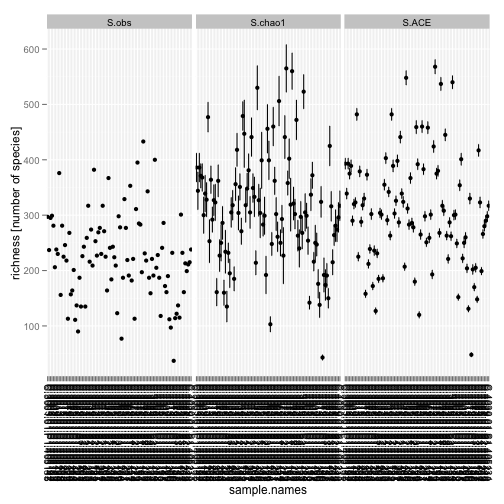 

```r
(p = plot_richness(Bushman, x = "SEX"))
```

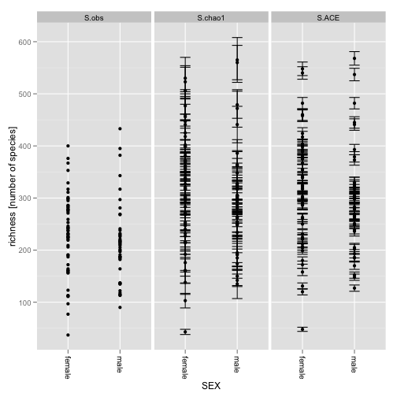 

```r
p + geom_boxplot(data = p$data, aes(x = SEX, y = value, color = NULL), alpha = 0.1)
```

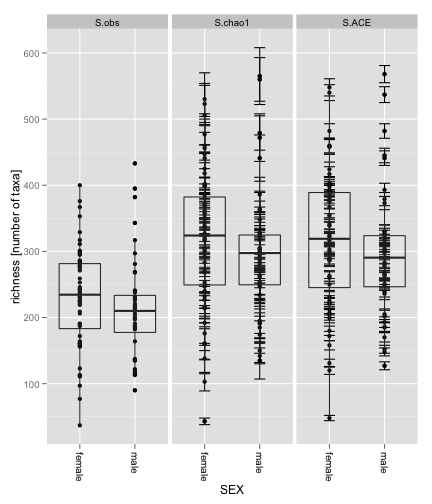 

Some others you might try (not run in demo)

```r
plot_richness(Bushman, x = "INSOLUBLE_DIETARY_FIBER_G_AVE")
plot_richness(Bushman, x = "AGE_IN_YEARS")
plot_richness(Bushman, x = "VEGETABLE_PROTEIN_G_AVE")
```


## Plotting an Annotated Phylogenetic Tree
A useful display on a phylogenetic tree is to add points next to tips/leaves/OTUs to represent samples in which the OTU was observed. This is facilitated in [the phyloseq package](http://joey711.github.com/phyloseq/) through the [plot_tree](http://joey711.github.io/phyloseq/plot_tree-examples.html) function, which produces a [ggplot](http://had.co.nz/ggplot2/)-based phylogenetic tree, and also allows several options for mapping color, shape, and size of these sample points to variables in the dataset. These point aesthetics can be mapped to sample data or to taxonomic data, depending on needs and which information needs to be reinforced in your graphic.

Caution: Trying to plot too many taxa (tree tips) at once obscures meaning. Let's look at just the *Chlamydiae* phylum in the incldued `GlobalPatterns` dataset. Note that this also requires subsetting the `GlobalPatterns` dataset using the `subset_taxa` function, part of the "preprocessing" tools described in the following section.

```r
data(GlobalPatterns)
GlobalPatterns
```

```
## phyloseq-class experiment-level object
## otu_table()   OTU Table:         [ 19216 taxa and 26 samples ]
## sample_data() Sample Data:       [ 26 samples by 7 sample variables ]
## tax_table()   Taxonomy Table:    [ 19216 taxa by 7 taxonomic ranks ]
## phy_tree()    Phylogenetic Tree: [ 19216 tips and 19215 internal nodes ]
```

```r
GP.chl = subset_taxa(GlobalPatterns, Phylum == "Chlamydiae")
```


Map the sample environment (`"SampleType"`) to point color, and taxonomic family to point shape. Additionally, label the tips with the Genus name and scale the point size by abundance

```r
plot_tree(GP.chl, color = "SampleType", shape = "Family", label.tips = "Genus", 
    size = "abundance", plot.margin = 0.5, ladderize = TRUE)
```

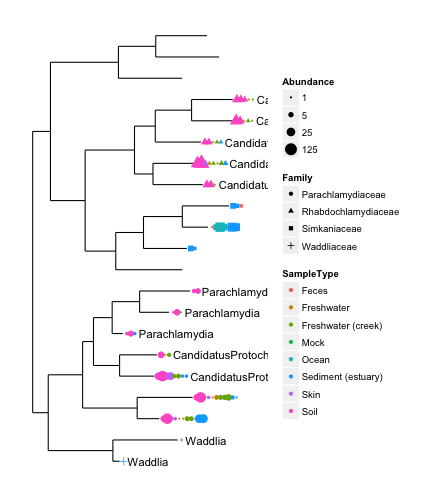 

This figure contains the graphic produced by the [plot_tree](http://joey711.github.io/phyloseq/plot_tree-examples.html) function in phyloseq. In this case the data is a subset of the `GlobalPatterns` dataset in which only OTUs from the phylum *Chlamydiae* are included. Additionally, the tree has been annotated with genus labels at each tree tip. The points next to tips represent samples in which the OTU was observed, and are shaped according to taxonomic rank of Family, and shaded according to the sample type (sample source environment).


```r
plot_tree(GP.chl, "treeonly", nodeplotblank)
```

 

This figure is the result of plotting the "bare" tree with no options directing the mapping of a variable to the tree, and `"treeonly"` as the argument to `method`. Not as informative as the previous tree.


## Abundance bar plots
For direct quantitative observation/comparison of abundances.

```r
data(enterotype)
TopNOTUs = names(sort(taxa_sums(enterotype), TRUE)[1:10])
ent10 = prune_taxa(TopNOTUs, enterotype)
plot_bar(ent10, "SeqTech", fill = "Enterotype", facet_grid = ~Genus)
```

 


```r
plot_bar(ent10, "Genus", fill = "Genus", facet_grid = SeqTech ~ Enterotype)
```

 


This one takes a little while to render (not run).

```r
plot_bar(Bushman, "Phylum", NULL, 0.9, "SEX", "INSOLUBLE_DIETARY_FIBER_G_AVE")
```


---

# Preprocessing Abundance Data

This section includes examples of preprocessing (filtering, trimming, subsetting, etc) phyloseq data. There is a whole [tutorial page devoted to preprocessing](http://joey711.github.io/phyloseq/preprocess.html), and more exmaples and discussion could always be added, it seems. For starters, we will reset the `GlobalPatterns` example data, add a human category, and show a few options for preprocessing here.


```r
data(GlobalPatterns)
GlobalPatterns
```

```
## phyloseq-class experiment-level object
## otu_table()   OTU Table:         [ 19216 taxa and 26 samples ]
## sample_data() Sample Data:       [ 26 samples by 7 sample variables ]
## tax_table()   Taxonomy Table:    [ 19216 taxa by 7 taxonomic ranks ]
## phy_tree()    Phylogenetic Tree: [ 19216 tips and 19215 internal nodes ]
```

```r
# prune OTUs that are not present in at least one sample
GP = prune_taxa(taxa_sums(GlobalPatterns) > 0, GlobalPatterns)
# Define a human-associated versus non-human categorical variable:
sample_data(GP)$human = factor(get_variable(GP, "SampleType") %in% c("Feces", 
    "Mock", "Skin", "Tongue"))
```


## "Rarefy" Abundances to Even Depth
Although of perhaps dubious necessity, it is common for OTU abundance tables to be randomly subsampled to even sequencing depth prior various analyses, especially UniFrac. Here is an example comparing the UniFrac-PCoA results with and without "rarefying" the abundances (Requires phyloseq v1.1.28+)

Test with esophagus dataset

```r
data(esophagus)
eso = rarefy_even_depth(esophagus)
```

```
## You set `rngseed` to FALSE. Make sure you've set & recorded
##  the random seed of your session for reproducibility.
## See `?set.seed`
## 
## ...
## 8OTUs were removed because they are no longer 
## present in any sample after random subsampling
## 
## ...
```

```r
# plot(as(otu_table(eso), 'vector'), as(otu_table(esophagus), 'vector'))
```


```r
UniFrac(eso)
```

```
##        B      C
## C 0.5806       
## D 0.5451 0.6747
```

```r
UniFrac(esophagus)
```

```
##        B      C
## C 0.5176       
## D 0.5182 0.5422
```


Test with GlobalPatterns dataset

```r
data(GlobalPatterns)
GP.chl = subset_taxa(GlobalPatterns, Phylum == "Chlamydiae")
# remove the samples that have less than 20 total reads from Chlamydiae
GP.chl = prune_samples(names(which(sample_sums(GP.chl) >= 20)), GP.chl)
# (p = plot_tree(GP.chl, color='SampleType', shape='Family',
# label.tips='Genus', size='abundance'))
GP.chl.r = rarefy_even_depth(GP.chl)
```

```
## You set `rngseed` to FALSE. Make sure you've set & recorded
##  the random seed of your session for reproducibility.
## See `?set.seed`
## 
## ...
## 3OTUs were removed because they are no longer 
## present in any sample after random subsampling
## 
## ...
```

```r
# plot(as(otu_table(GP.chl.r), 'vector'), as(otu_table(GP.chl), 'vector'))
```


To compare MDS of unweighted-UniFrac for GP.chl and GP.chl.r (default distance is unweighted UniFrac) 

```r
plot_ordination(GP.chl, ordinate(GP.chl, "MDS"), color = "SampleType") + geom_point(size = 5)
```

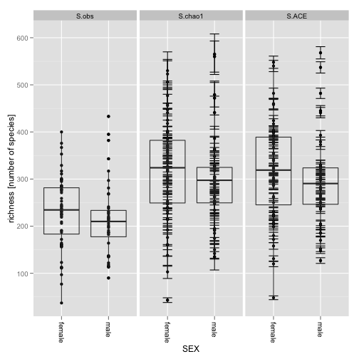 


```r
plot_ordination(GP.chl.r, ordinate(GP.chl.r, "MDS"), color = "SampleType") + 
    geom_point(size = 5)
```

 


How does rarefying affect the larger untrimmed dataset? (not run)

```r
GP.r = rarefy_even_depth(GP)
plot_ordination(GP, ordinate(GP), color = "SampleType") + geom_point(size = 5)
```


```r
plot_ordination(GP.r, ordinate(GP.r), color = "SampleType") + geom_point(size = 5)
```


## prune_taxa() vs. subset_taxa()
These are two very different methods for subsetting OTUs in a dataset.


```r
topN = 20
most_abundant_taxa = sort(taxa_sums(GP), TRUE)[1:topN]
print(most_abundant_taxa)
```

```
##  549656  331820  279599  360229  317182   94166  158660  329744  550960 
## 2481214 1001492  927850  556441  528629  444142  443938  436539  384205 
##  189047  326977  317658  244304  171551  263681   98605   12812  536311 
##  312161  291577  234024  222365  215470  212089  203583  196550  196355 
##  192573  298875 
##  179312  177879
```

```r
GP20 = prune_taxa(names(most_abundant_taxa), GP)
# Exploratory tree #1 (Note, too ma) plot_tree(ex2, color='SampleType',
# label.tips='Family', size='abundance')
ntaxa(GP20)
```

```
## [1] 20
```

```r
length(get_taxa_unique(GP20, "Phylum"))
```

```
## [1] 5
```

That was `prune_taxa`, applicable when we know (or can provide) the OTU IDs of the OTUs we want to retain in the dataset, or a logical vector with the same length as `ntaxa` reseulting from a test (useful for `genefilter` or``genefilter_sample` results (see next section)).

Alternatively, you can subset based on taxonomy expressions, using `subset_taxa`.

```r
GP.chl = subset_taxa(GP, Phylum == "Chlamydiae")
# Exploratory tree #2 plot_tree(GP.chl, color='SampleType', shape='Family',
# label.tips='Genus', size='abundance')
ntaxa(GP.chl)
```

```
## [1] 21
```

```r
length(get_taxa_unique(GP.chl, "Phylum"))
```

```
## [1] 1
```


## filterfun_sample() and genefilter_sample()
This tool takes after the `genefilter` function from the genefilter package, but emphasizes within-microbiome conditions. The following code illustrates . The function `topp` is a filter function that returns the most abundant `p` fraction of taxa. The `filterfun_sample` function takes one or or more functions like `topp` and binds them in order to define a filtering protocol function, in this case called: `f1`. This function, `f1`, is then passed to `genefilter_sample` along with the dataset that is going to be pruned as well as a value for `A`, the number of samples in which an OTU must pass the filtering conditions.

```r
topp(0.1)
```

```
## function (x) 
## {
##     if (na.rm) {
##         x = x[!is.na(x)]
##     }
##     x >= sort(x, decreasing = TRUE)[ceiling(length(x) * p)]
## }
## <environment: 0x1234fbb50>
```

```r
f1 = filterfun_sample(topp(0.1))
print(f1)
```

```
## function (x) 
## {
##     fun = flist[[1]]
##     fval = fun(x)
##     for (fun in flist[-1]) {
##         fval = fval & fun(x)
##     }
##     return(fval)
## }
## <environment: 0x11f82d350>
## attr(,"class")
## [1] "filterfun"
```

```r
wh1 = genefilter_sample(GP, f1, A = round(0.5 * nsamples(GP)))
sum(wh1)
```

```
## [1] 793
```

```r
ex2 = prune_taxa(wh1, GP)
print(GP)
```

```
## phyloseq-class experiment-level object
## otu_table()   OTU Table:         [ 18988 taxa and 26 samples ]
## sample_data() Sample Data:       [ 26 samples by 8 sample variables ]
## tax_table()   Taxonomy Table:    [ 18988 taxa by 7 taxonomic ranks ]
## phy_tree()    Phylogenetic Tree: [ 18988 tips and 18987 internal nodes ]
```

```r
print(ex2)
```

```
## phyloseq-class experiment-level object
## otu_table()   OTU Table:         [ 793 taxa and 26 samples ]
## sample_data() Sample Data:       [ 26 samples by 8 sample variables ]
## tax_table()   Taxonomy Table:    [ 793 taxa by 7 taxonomic ranks ]
## phy_tree()    Phylogenetic Tree: [ 793 tips and 792 internal nodes ]
```


### Filtering low-variance OTUs
Suppose we wanted to use the variance of OTUs across samples as a condition for filtering. For example, to remove OTUs that do not change much across all (or most) samples. Note that the value of the variance is highly-dependent on the sequencing effort of each sample (the total number of reads sequenced from a particular sample). Thus, we must first transform the sample counts to relative abundance, which is shown in more detail in the next section. The following code will create a version of the `GP` dataset in which the abundance values have been transformed to relative abundance within each sample, and then OTUs have been filtered to keep only those with variance greater than `0.00001` (assuming we wanted to pick an arbitrary threshold in this way).


```r
GPr = transform_sample_counts(GP, function(x) x/sum(x))
GPf = filter_taxa(GPr, function(x) var(x) > 1e-05, TRUE)
```


## Transformations
Useful for: Standardization / Normalization / Smoothing / Shrinking. Second-order function: `transform_sample_counts`. Also the `threshrank` and `threshrankfun` functions.

For more advanced normalization features (like shrinkage, etc.), also consider features in [the edgeR package](http://www.bioconductor.org/packages/release/bioc/html/edgeR.html), [the DESeq package](http://bioconductor.org/packages/release/bioc/html/DESeq.html), and for standardization the `decostand` function in [the vegan-package](http://cran.r-project.org/web/packages/vegan//index.html); as well as probably many others that could be useful in this context.


# Graphics for Inference and Exploration
In the following section(s) we will illustrate using graphical tools provided by [the phyloseq package](http://joey711.github.com/phyloseq/). These are meant to be flexible ways to explore and summarize the data.

For further details, there is a collection of "show and tell" tutorial-pages describing the available graphics options supported by the phyloseq-package. These include example code for reproducing the figures shown. Many of the default settings are modifiable within the function arguments directly, and virtually everything about these plots can be further modified via the layers interface of [ggplot2](http://had.co.nz/ggplot2/).

For quick reference (even though some have been described already), the key graphics-producing functions in phyloseq are:

### [plot_heatmap](http://joey711.github.io/phyloseq/plot_heatmap-examples)

### [plot_tree](http://joey711.github.io/phyloseq/plot_tree-examples)

### [plot_ordination](http://joey711.github.io/phyloseq/plot_ordination-examples)

### [plot_network](http://joey711.github.io/phyloseq/plot_network-examples)

### [plot_richness](http://joey711.github.io/phyloseq/plot_richness-examples)

### [plot_bar](http://joey711.github.io/phyloseq/plot_bar-examples)

Let's (re)load the Global Patterns dataset, prune the empty taxa, and add a custom sample variable called "human", a logical indicating whether or not the samples are human-associated.

```r
data(GlobalPatterns)  # Reload GlobalPatterns
GP = prune_taxa(taxa_sums(GlobalPatterns) > 0, GlobalPatterns)
sample_data(GP)$human = factor(get_variable(GP, "SampleType") %in% c("Feces", 
    "Mock", "Skin", "Tongue"))
```

We are going to show some examples that would take a lot of time to calculate and render on a dataset as large as `GlobalPatterns`. For the sake of time in re-running these examples, let's subset the data further to the most abundant 5 phyla.

```r
top5ph = sort(tapply(taxa_sums(GP), tax_table(GP)[, "Phylum"], sum), TRUE)[1:5]
GP1 = subset_taxa(GP, Phylum %in% names(top5ph))
```


##  Distance Functions
Before we get to network plots, let's discuss distances. Many tools use distances to perform their calculations. In phyloseq, ordinations, heatmaps, and network plots all use the `distance` function for calculating OTU or Sample distance matrices (actually represented as a "dist" object) when needed, particularly when PCoA/MDS or NMDS is involved.


```r
help("distance")  # Same as '?distance'
`?`(distance)
```


A relatively recent, popular distance method that relies heavily on the phylogenetic tree is [UniFrac](http://joey711.github.io/phyloseq-demo/unifrac.html). It has been implemented in phyloseq as a fast parallel function, also wrapped by [the distance function](http://joey711.github.io/phyloseq/distance). See the phyloseq demo page specifically devoted to [Fast Parallel UniFrac](http://joey711.github.io/phyloseq-demo/unifrac.html) for further details, citations, and performance results. 


```r
data(esophagus)
distance(esophagus)  # unweighted UniFrac
```

```
##        B      C
## C 0.5176       
## D 0.5182 0.5422
```

```r
distance(esophagus, weighted = TRUE)  # weighted UniFrac
```

```
##        B      C
## C 0.2035       
## D 0.2603 0.2477
```

Here are some other examples. There are some 45 or so methods. 

```r
distance(esophagus, "jaccard")  # vegdist jaccard
distance(esophagus, "bray")  # vegdist bray-curtis
distance(esophagus, "gower")  # vegdist option 'gower'
distance(esophagus, "g")  # designdist method option 'g'
distance(esophagus, "minkowski")  # invokes a method from the base dist() function.
distance(esophagus, "(A+B-2*J)/(A+B)")  # designdist custom distance
distance("help")
distance("list")
```


## [The plot_network function](http://joey711.github.io/phyloseq/plot_network-examples)
The following code illustrates using the `make_network` and `plot_network` functions in phyloseq. In this context, we are using networks to graphically represent thresholded distances between samples or OTUs. The euclidean distances between points on the plot are essentially arbitrary, only the "edges" (lines) between "nodes" (OTUs/samples) are derived directly from the data. For further examples, it is recommended that you take a look at [the plot_network tutorial](http://joey711.github.io/phyloseq/plot_network-examples)

The `GP` variable is an only-slightly-modified version of the `GlobalPatterns` dataset. The threshold was determined empirically to show something interesting for demonstration. In practice, this value has a huge effect on the resulting network, and its usefulness, and it is highly recommended that you investigate the results from multiple values.


```r
ig = make_network(GP, type = "samples", distance = "bray", max.dist = 0.85)
plot_network(ig, GP, color = "SampleType", shape = "human", line_weight = 0.4, 
    label = NULL)
```

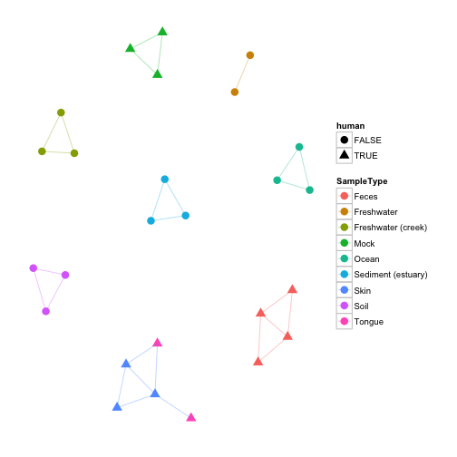 


A similar network representation of samples from [the "Enterotypes" dataset](http://www.nature.com/nature/journal/v473/n7346/full/nature09944.html).

```r
data(enterotype)
ig = make_network(enterotype, max.dist = 0.3)
plot_network(ig, enterotype, color = "SeqTech", shape = "Enterotype", line_weight = 0.4, 
    label = NULL)
```

 


An example showing a network representation of OTUs, representing communities of bacteria that occurr in similar profiles of samples.

```r
data(GlobalPatterns)
# prune to just the top 100 most abundant OTUs across all samples (crude).
GP100 = prune_taxa(names(sort(taxa_sums(GlobalPatterns), TRUE))[1:100], GlobalPatterns)
jg = make_network(GP100, "taxa", "jaccard", 0.3)
plot_network(jg, GP100, "taxa", color = "Phylum", line_weight = 0.4, label = NULL)
```

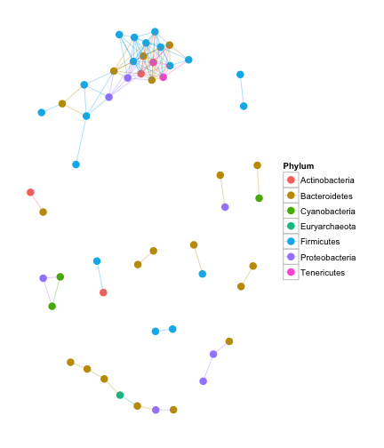 


## Ordination Methods

["Ordination methods"](http://en.wikipedia.org/wiki/Ordination_(statistics)) in this context refers to methods for dimensional reduction of data -- usually the OTU abundance data, which is probably a large sparse matrix not so amenable to graphical display on its own. Graphically investigating the (usually) information-dense first few axes of an ordination result can be very useful for exploring and summarizing phylogenetic sequencing data. One of the resons for this is that many ordination methods are [non-parametric](http://en.wikipedia.org/wiki/Non-parametric_statistics), so they do not depend upon a prior hypothesis or model. This is essential for many microbiome investigations in which a model is only vaguely described or not available.

A good quick summary of ordination methods is provided in the introductory vignette for the vegan package:

[vegan introductory vignette](http://cran.r-project.org/web/packages/vegan/vignettes/intro-vegan.pdf)

The following R task views are also useful for understanding ordination tools in R:

[Analysis of Ecological and Environmental Data](http://cran.r-project.org/web/views/Environmetrics.html)

[Multivariate Statistics](http://cran.r-project.org/web/views/Multivariate.html)

The [ade4 package](http://cran.r-project.org/web/packages/ade4/index.html) also provides a large number of ordination methods, and may be useful in your analysis.


### [The ordinate function](http://joey711.github.io/phyloseq/ordinate)
This function wraps several commonly-used [ordination](http://en.wikipedia.org/wiki/Ordination_(statistics)) methods for OTU abundance tables (as well as related tables, in some cases). The type of ordination performed depends upon the argument to `method`. Try `ordinate("help")` or `ordinate("list")` for the currently supported method options.

The output of this function will be an ordination class. The specific class depends upon [the ordination method](http://en.wikipedia.org/wiki/Ordination_(statistics)) used, as well as the underlying function/package that is called internally by phyloseq to perform it. As a general rule, any of the ordination classes returned by this function, `ordinate`, will be recognized by downstream tools in [the phyloseq package](http://joey711.github.com/phyloseq/) -- for example the ordination plotting function, [plot_ordination](http://joey711.github.io/phyloseq/plot_ordination-examples) (See next section for plot examples).

Using `GP100` from the previous section, let's calculate [the unweighted-UniFrac distance](http://joey711.github.io/phyloseq-demo/unifrac.html) for each sample pair in the dataset, and then perform [Multidimensional Scaling](http://en.wikipedia.org/wiki/Multidimensional_scaling) (aka [Principle Coordinates Analysis](http://en.wikipedia.org/wiki/Multidimensional_scaling)) on the resulting distance. For details about calculating the UniFrac distance on larger datasets using parallel-computing options in supported by phyloseq, see [the tutorial page on Fast Parallel UniFrac in phyloseq](http://joey711.github.io/phyloseq-demo/unifrac.html)

```r
GP.MDS = ordinate(GP100, method = "MDS", distance = "unifrac")
```

Here are just a few examples of other supported combinations.

```r
GP.NMDS = ordinate(GP, "NMDS", "gower")
GP.NMDS = ordinate(GP, "NMDS", "bray")  # perform NMDS on bray-curtis distance
GP.NMDS.UF.ord = ordinate(GP, "NMDS")  # UniFrac. Takes a while.
GP.NMDS.wUF.ord = ordinate(GP, "NMDS", "unifrac", weighted = TRUE)  # weighted-UniFrac
GP.NMDS.gower = ordinate(GP, "NMDS", "gower")
```


### [The plot_ordination function](http://joey711.github.io/phyloseq/plot_ordination-examples)

The `plot_ordination` function has many options, and supports many combinations of ordinations, including the mapping of sample and/or OTU variables to color and shape [aesthetics](http://had.co.nz/ggplot2/aes.html). Many additional examples (with results) are included on [the plot_ordination tutorial page](http://joey711.github.io/phyloseq/plot_ordination-examples). For quicker reference, some example "1-liners" are also included at bottom of this section.

This combination of MDS/PCoA ordination of [the UniFrac distance](http://joey711.github.io/phyloseq-demo/unifrac.html) is recently very popular in microbiome analyses. 

```r
require("ggplot2")
ptitle = "GP PCoA of UniFrac distance, GP most abundant 100 OTUs only"
p = plot_ordination(GP100, GP.MDS, type = "samples", color = "SampleType", title = ptitle)
p + geom_point(size = 5) + geom_polygon(aes(fill = SampleType))
```

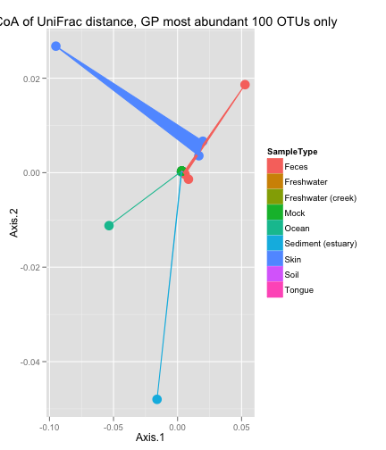 


Get the names of the most-abundant phyla, and use for subsetting.

```r
top.phyla = sort(tapply(taxa_sums(GP), tax_table(GP)[, "Phylum"], sum), TRUE)
top.phyla = top.phyla[1:5]
# Prune to just the most-abundant 5 phyla
GP2 = subset_taxa(GP, Phylum %in% names(top.phyla))
get_taxa_unique(GP2, "Phylum")
```

```
## [1] "Actinobacteria" "Proteobacteria" "Cyanobacteria"  "Bacteroidetes" 
## [5] "Firmicutes"
```

```r
# Prune further, to top 200 most abundant taxa of top 5 phyla
GP2 = prune_taxa(names(sort(taxa_sums(GP2), TRUE)[1:200]), GP2)
```


Let's try [Correspondence Analysis](http://en.wikipedia.org/wiki/Correspondence_analysis) with "one-liner" syntax in which we include the `ordinate` call within the `plot_ordination` command.

```r
require("ggplot2")
p2 = plot_ordination(GP2, ordinate(GP2, "CCA"), type = "samples", color = "SampleType")
p2 + geom_point(size = 5) + geom_polygon(aes(fill = SampleType))
```

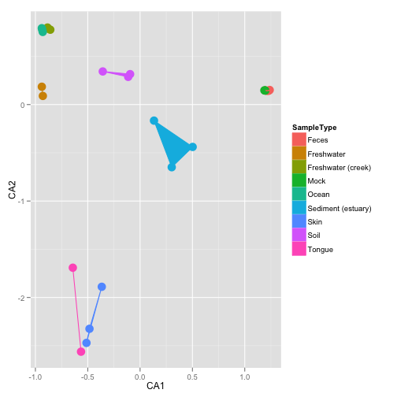 


```r
plot_ordination(GP2, ordinate(GP2, "CCA"), type = "taxa", color = "Phylum") + 
    geom_point(size = 4)
plot_ordination(GP2, ordinate(GP2, "CCA"), type = "split")
plot_ordination(GP2, ordinate(GP2, "CCA"), type = "split", color = "SampleType")
plot_ordination(GP2, ordinate(GP2, "CCA"), type = "biplot", shape = "Phylum")
plot_ordination(GP2, ordinate(GP2, "CCA"), type = "split", color = "Phylum", 
    label = "SampleType")
plot_ordination(GP2, ordinate(GP2, "CCA"), type = "split", color = "SampleType", 
    shape = "Phylum", label = "SampleType")
```


### Mapping Continuous Variables to Color
(Note: can't map continuous variables to shape with `plot_ordination` function)

```r
p4title = "Bushman dataset, PCoA/MDS ordination on Bray-Curtis distance"
Bushman.ord = ordinate(Bushman, method = "MDS", distance = "bray")
plot_ordination(Bushman, Bushman.ord, "samples", color = "OMEGA3_FATTY_ACIDS_G_AVE", 
    title = p4title) + geom_point(size = 4)
```

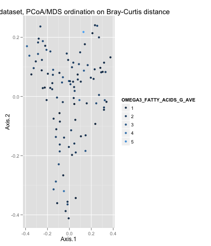 


## [The plot_heatmap() function](http://joey711.github.io/phyloseq/plot_heatmap-examples)
In a [2010 article in BMC Genomics](http://www.biomedcentral.com/1471-2105/11/45), Rajaram and Oono describe an approach to creating a heatmap using ordination methods (namely, NMDS and PCA) to organize the rows and columns instead of (hierarchical) cluster analysis. In many cases the ordination-based ordering does a much better job than h-clustering at providing an order of elements that is easily interpretable. The authors provided an immediately useful example of their approach as [the NeatMap package for R](http://cran.r-project.org/web/packages/NeatMap/index.html). The NeatMap package can be used directly on the abundance table (`"otu_table"`-class) of phylogenetic-sequencing data, but the NMDS or PCA ordination options that it supports are not based on ecological distances. To fill this void, and because phyloseq already provides support for a large number of [ecological distances](http://joey711.github.io/phyloseq/distance) and [ordination methods](http://joey711.github.io/phyloseq/ordinate), phyloseq now includes the `plot_heatmap()` function: an ecology-oriented variant of the NeatMap approach to organizing a heatmap and build it using [ggplot](http://had.co.nz/ggplot2/) graphics tools. The [distance](http://joey711.github.io/phyloseq/distance) and [method](http://joey711.github.io/phyloseq/ordinate) arguments are the same as for the [plot_ordination](http://joey711.github.io/phyloseq/plot_ordination-examples) function, and support large number of distances and ordination methods, respectively, with a strong leaning toward ecology. This function also provides the options to re-label the OTU and sample axis-ticks with a taxonomic name and/or sample variable, respectively, in the hope that this might hasten your interpretation of the patterns (See the documentation for the `sample.label` and `species.label` arguments, and the examples below). Note that this function makes no attempt to overlay dendrograms from hierarchical clustering next to the axes, as hierarchical clustering is not used to organize these plots. Also note that each re-ordered axis repeats at the edge, and so apparent clusters at the far right/left or top/bottom of the heat-map may actually be the same. For now, the placement of this edge can be considered arbitrary, so beware of this artifact of the graphic and visually check if there are two "mergeable" clusters at the edges of a particular axis. If you benefit from this phyloseq-specific implementation of [the NeatMap approach](http://cran.r-project.org/web/packages/NeatMap/index.html), please cite [the NeatMap article](http://www.biomedcentral.com/1471-2105/11/45), as well as phyloseq.

Further examples are provided at [the plot_heatmap tutorial page](http://joey711.github.io/phyloseq/plot_heatmap-examples)


```r
plot_heatmap(GP2, "NMDS", "bray", "SampleType", "Family")
```

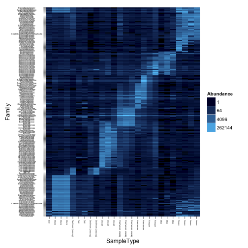 


Some alternative `plot_heatmap` transformations.

```r
plot_heatmap(GP2, "NMDS", "bray", "SampleType", "Family", trans = log_trans(10))
plot_heatmap(GP2, "NMDS", "bray", "SampleType", "Family", trans = identity_trans())
plot_heatmap(GP2, "NMDS", "bray", "SampleType", "Family", trans = boxcox_trans(0.15))
```


#  Validation
In this section, we will look at examples for using R to validate/test hypotheses we may have generated through some of the previous exploration.


##  Multiple Testing
In this example we will perform testing on fractional abundances to remove effect of differences in total sequencing across samples for same taxa. We first filter the low-variance taxa, avoiding the noise and "penalty" we pay for testing taxa that don't vary at much across samples. In practice, these OTU abundances probably need additional preprocessing prior to testing, and many good methods in microarray analysis and differential expression sequencing could probably apply to this data (but are not directly implemented/supported in phyloseq, yet). Otherwise, beware that the old motto "garbage-in, garbage-out" can definitely apply to your data if you are not careful.


```r
GPr = transform_sample_counts(GP, function(x) x/sum(x))
GP3f = filter_taxa(GPr, function(x) var(x) > 1e-05, TRUE)
```


We are going to use the multtest wrapper included in phyloseq, `mt`. Try `?mt` for help on this function. The following code uses this wrapper to calculate the multiple-inference-adjusted P-values, using the "human" sample variable. 

```r
GP.fwer.table = mt(GP3f, "human")
```

```
## B=10000
## b=100	b=200	b=300	b=400	b=500	b=600	b=700	b=800	b=900	b=1000	
## b=1100	b=1200	b=1300	b=1400	b=1500	b=1600	b=1700	b=1800	b=1900	b=2000	
## b=2100	b=2200	b=2300	b=2400	b=2500	b=2600	b=2700	b=2800	b=2900	b=3000	
## b=3100	b=3200	b=3300	b=3400	b=3500	b=3600	b=3700	b=3800	b=3900	b=4000	
## b=4100	b=4200	b=4300	b=4400	b=4500	b=4600	b=4700	b=4800	b=4900	b=5000	
## b=5100	b=5200	b=5300	b=5400	b=5500	b=5600	b=5700	b=5800	b=5900	b=6000	
## b=6100	b=6200	b=6300	b=6400	b=6500	b=6600	b=6700	b=6800	b=6900	b=7000	
## b=7100	b=7200	b=7300	b=7400	b=7500	b=7600	b=7700	b=7800	b=7900	b=8000	
## b=8100	b=8200	b=8300	b=8400	b=8500	b=8600	b=8700	b=8800	b=8900	b=9000	
## b=9100	b=9200	b=9300	b=9400	b=9500	b=9600	b=9700	b=9800	b=9900	b=10000	
## r=1	r=2	r=3	r=4	r=5	r=6	r=7	r=8	r=9	r=10	
## r=11	r=12	r=13	r=14	r=15	r=16	r=17	r=18	r=19	r=20	
## r=21	r=22	r=23	r=24	r=25	r=26	r=27	r=28	r=29	r=30	
## r=31	r=32	r=33	r=34	r=35	r=36	r=37	r=38	r=39	r=40	
## r=41	r=42	r=43	r=44	r=45	r=46	r=47	r=48	r=49	r=50	
## r=51	r=52	r=53	r=54	r=55	r=56	r=57	r=58	r=59	r=60	
## r=61	r=62	r=63	r=64	r=65	r=66	r=67	r=68	r=69	r=70	
## r=71	r=72	r=73	r=74	r=75	r=76	r=77	r=78	r=79	r=80	
## r=81	r=82	r=83	r=84	r=85	r=86	r=87	r=88	r=89	r=90	
## r=91	r=92	r=93	r=94	r=95	r=96	r=97	r=98	r=99	r=100	
## r=101	r=102	r=103	r=104	r=105	r=106	r=107	r=108	r=109	r=110	
## r=111	r=112	r=113	r=114	r=115	r=116	r=117	r=118	r=119	r=120	
## r=121	r=122	r=123	r=124	r=125	r=126	r=127	r=128	r=129	r=130	
## r=131	r=132	r=133	r=134	r=135	r=136	r=137	r=138	r=139	r=140	
## r=141	r=142	r=143	r=144	r=145	r=146	r=147	r=148	r=149	r=150	
## r=151	r=152	r=153	r=154	r=155	r=156	r=157	r=158	r=159	r=160	
## r=161	r=162	r=163	r=164	r=165	r=166	r=167	r=168	r=169	r=170	
## r=171	r=172	r=173	r=174	r=175	r=176	r=177	
```


Let's presume you are interested in those OTUs with an adjusted P-value below .

```r
subset(GP.fwer.table, adjp < alpha)
```

```
##        index teststat  rawp   adjp plower  Kingdom        Phylum
## 108747   173    2.574 4e-04 0.0300 0.0233 Bacteria    Firmicutes
## 348374   122    1.263 4e-04 0.0300 0.0233 Bacteria Bacteroidetes
## 158660   110    2.313 5e-04 0.0356 0.0296 Bacteria Bacteroidetes
##              Class           Order           Family         Genus
## 108747     Bacilli Lactobacillales Streptococcaceae Streptococcus
## 348374 Bacteroidia   Bacteroidales   Bacteroidaceae   Bacteroides
## 158660 Bacteroidia   Bacteroidales   Bacteroidaceae   Bacteroides
##                          Species
## 108747 Streptococcusthermophilus
## 348374                      <NA>
## 158660                      <NA>
```


##  What if we want FDR instead of FWER?

The easiest thing to do is use the `stats::p.adjust` function.


```r
mtm = mt(GP3f, "human")
```

```
## B=10000
## b=100	b=200	b=300	
## b=400	b=500	b=600	b=700	b=800	b=900	b=1000	b=1100	b=1200	b=1300	
## b=1400	b=1500	b=1600	b=1700	b=1800	b=1900	b=2000	b=2100	b=2200	b=2300	
## b=2400	b=2500	b=2600	b=2700	b=2800	b=2900	b=3000	b=3100	b=3200	b=3300	
## b=3400	b=3500	b=3600	b=3700	b=3800	b=3900	b=4000	b=4100	b=4200	b=4300	
## b=4400	b=4500	b=4600	b=4700	b=4800	b=4900	b=5000	b=5100	b=5200	b=5300	
## b=5400	b=5500	b=5600	b=5700	b=5800	b=5900	b=6000	b=6100	b=6200	b=6300	
## b=6400	b=6500	b=6600	b=6700	b=6800	b=6900	b=7000	b=7100	b=7200	b=7300	
## b=7400	b=7500	b=7600	b=7700	b=7800	b=7900	b=8000	b=8100	b=8200	b=8300	
## b=8400	b=8500	b=8600	b=8700	b=8800	b=8900	b=9000	b=9100	b=9200	b=9300	
## b=9400	b=9500	b=9600	b=9700	b=9800	b=9900	b=10000	r=1	r=2	r=3	
## r=4	r=5	r=6	r=7	r=8	r=9	r=10	r=11	r=12	r=13	
## r=14	r=15	r=16	r=17	r=18	r=19	r=20	r=21	r=22	r=23	
## r=24	r=25	r=26	r=27	r=28	r=29	r=30	r=31	r=32	r=33	
## r=34	r=35	r=36	r=37	r=38	r=39	r=40	r=41	r=42	r=43	
## r=44	r=45	r=46	r=47	r=48	r=49	r=50	r=51	r=52	r=53	
## r=54	r=55	r=56	r=57	r=58	r=59	r=60	r=61	r=62	r=63	
## r=64	r=65	r=66	r=67	r=68	r=69	r=70	r=71	r=72	r=73	
## r=74	r=75	r=76	r=77	r=78	r=79	r=80	r=81	r=82	r=83	
## r=84	r=85	r=86	r=87	r=88	r=89	r=90	r=91	r=92	r=93	
## r=94	r=95	r=96	r=97	r=98	r=99	r=100	r=101	r=102	r=103	
## r=104	r=105	r=106	r=107	r=108	r=109	r=110	r=111	r=112	r=113	
## r=114	r=115	r=116	r=117	r=118	r=119	r=120	r=121	r=122	r=123	
## r=124	r=125	r=126	r=127	r=128	r=129	r=130	r=131	r=132	r=133	
## r=134	r=135	r=136	r=137	r=138	r=139	r=140	r=141	r=142	r=143	
## r=144	r=145	r=146	r=147	r=148	r=149	r=150	r=151	r=152	r=153	
## r=154	r=155	r=156	r=157	r=158	r=159	r=160	r=161	r=162	r=163	
## r=164	r=165	r=166	r=167	r=168	r=169	r=170	r=171	r=172	r=173	
## r=174	r=175	r=176	r=177	
```


Add the FDR correction based on the unadjusted ("raw") P-values...


```r
mtm$FDR <- p.adjust(c(mtm[, "rawp"]), method = c("fdr"))
subset(mtm, FDR < 0.05)
```

```
##        index teststat   rawp   adjp plower  Kingdom        Phylum
## 108747   173    2.574 0.0004 0.0300 0.0233 Bacteria    Firmicutes
## 348374   122    1.263 0.0004 0.0300 0.0233 Bacteria Bacteroidetes
## 158660   110    2.313 0.0005 0.0356 0.0296 Bacteria Bacteroidetes
## 259569   125    2.311 0.0017 0.0972 0.0928 Bacteria Bacteroidetes
## 322235   108    1.686 0.0017 0.0972 0.0928 Bacteria Bacteroidetes
## 291090   123    1.520 0.0018 0.1006 0.0964 Bacteria Bacteroidetes
## 561077    32   -2.066 0.0019 0.1049 0.0994 Bacteria Cyanobacteria
## 331820   111    2.152 0.0021 0.1130 0.1094 Bacteria Bacteroidetes
##              Class           Order             Family           Genus
## 108747     Bacilli Lactobacillales   Streptococcaceae   Streptococcus
## 348374 Bacteroidia   Bacteroidales     Bacteroidaceae     Bacteroides
## 158660 Bacteroidia   Bacteroidales     Bacteroidaceae     Bacteroides
## 259569 Bacteroidia   Bacteroidales      Rikenellaceae       Alistipes
## 322235 Bacteroidia   Bacteroidales     Bacteroidaceae     Bacteroides
## 291090 Bacteroidia   Bacteroidales Porphyromonadaceae Parabacteroides
## 561077 Chloroplast   Stramenopiles               <NA>            <NA>
## 331820 Bacteroidia   Bacteroidales     Bacteroidaceae     Bacteroides
##                          Species     FDR
## 108747 Streptococcusthermophilus 0.02950
## 348374                      <NA> 0.02950
## 158660                      <NA> 0.02950
## 259569       Alistipesputredinis 0.04646
## 322235      Bacteroidesuniformis 0.04646
## 291090 Parabacteroidesdistasonis 0.04646
## 561077                      <NA> 0.04646
## 331820                      <NA> 0.04646
```


Some alternative packages for multiple inference correction: [the qvalue package](http://www.bioconductor.org/packages/release/bioc/html/qvalue.html), [the multcomp package](http://cran.r-project.org/web/packages/multcomp/index.html)


---
#  Getting phyloseq Data into Other R Tools

A common question from many users related to how they can easily get phyloseq-formatted data into other R tools. The following examples are meant to illustrate doing that with some commonly-requested tasks.


##  Porting Data to [vegan](http://cran.r-project.org/web/packages/vegan//index.html) Functions

[The vegan package](http://vegan.r-forge.r-project.org/) is a popular and well-maintained R package (hosted in [CRAN](CRAN.r-project.org)) "for community and vegetation ecologists". It provides ordination methods, diversity analysis and other functions. Many of [vegan](http://cran.r-project.org/web/packages/vegan//index.html)'s distance and ordination functions are wrapped by functions in phyloseq. Of course, not everything in [vegan](http://cran.r-project.org/web/packages/vegan//index.html) is wrapped by phyloseq, and it may turn out that you need to use some function that is not wrapped by phyloseq. What do you do? The following subsection provides example code for running just such a function by accessing and coercing the necessary data components from a phyloseq data object.

For OTU abundance tables, [vegan](http://cran.r-project.org/web/packages/vegan//index.html) expects samples as rows, and OTUs/species/taxa as columns (so does the picante package). The following is an example function, called `veganotu`, for extracting the OTU table from a phyloseq data object, and converting it to a properly oriented standard matrix recognized by the [vegan](http://cran.r-project.org/web/packages/vegan//index.html) package.

We will use the `bioenv` function from [vegan](http://cran.r-project.org/web/packages/vegan//index.html) to test for sample variables that correlate well with the microbial community distances.


```r
veganotu = function(physeq) {
    require("vegan")
    OTU = otu_table(physeq)
    if (taxa_are_rows(OTU)) {
        OTU = t(OTU)
    }
    return(as(OTU, "matrix"))
}
```


Now we can use this function for data input to [vegan](http://cran.r-project.org/web/packages/vegan//index.html) functions. Let's try this with the `Bushman` dataset, since it has ample continuous variables with which to correlate microbiom distances. First, let's coerce the Bushman sample data component into a vanilla `"data.frame"` class that we will call `bushsd`.


```r
keepvariables = which(sapply(sample_data(Bushman), is.numeric))
bushsd = data.frame(sample_data(Bushman))[keepvariables]
```

Now let's make a call to `bioenv` to see what happens... (not actually run in example, takes too long, be prepared to stop the run if you try it)

```r
bioenv(veganotu(Bushman), bushsd)
```

There are so many sample variables in the `Bushman` data that we would have to calculate `1.225996e+55` possible subsets in an exhaustive search calculation. That could take a long time! Note from the `bioenv` documentation that we could have expected that issue: 

"There are `2^p-1` subsets of `p` variables, and an exhaustive search may take a very, very, very long time (parameter `upto` offers a partial relief)."

So one option is to use the `upto` parameter. Another is to specify [a model formula](http://stat.ethz.ch/R-manual/R-devel/library/stats/html/formula.html) when specifying the primary data argument to this function (see `?"~"` for some details), which allows us to specify variables in the correlation search. We could also simply trim the number of columns in `bushsd` to just the few variables that we really care about. Let's try the second option here, the [model formula](http://stat.ethz.ch/R-manual/R-devel/library/stats/html/formula.html) approach, and focus on a few that we are interested in comparing. We'll look at the variable names again to remind us what is available

```r
names(bushsd)[1:10]
```

```
##  [1] "ASPARTAME_MG_AVE"            "TOT_CONJUGLINOLEICA_G_AVE"  
##  [3] "AGE"                         "VITC_ASCORBIC_ACID_MG_AVE"  
##  [5] "OXALIC_ACID_MG_AVE"          "PUFA_EICOSAPENTAENOIC_G_AVE"
##  [7] "PHOSPHORUS_G_AVE"            "SOLUBLE_DIETARY_FIBER_G_AVE"
##  [9] "SFA_MARGARIC_ACID_G_AVE"     "CLA_TRANS10_CIS12_G_AVE"
```


I arbitrarily chose a mixture of variables from the full list previewed above.

```r
bioenv(veganotu(Bushman) ~ DEPTH + AGE + TOTAL_FAT_G_AVE + INSOLUBLE_DIETARY_FIBER_G_AVE, 
    bushsd)
```

```
## Error: could not find function "bioenv"
```


Now that you know how to get phyloseq data into vegan, all of vegan's tools are now available to you to use as well. The following list is not exhaustive and focuses on the most popular tools, taken from [the vegan website front page](http://vegan.r-forge.r-project.org/):

- Diversity analysis: Shannon, Simpson, Fisher indices, Rényi diversities and Hill numbers.
- Species abundance models: Fisher and Preston models, species abundance distributions.
- Analysis of species richness: species accumulation curves, extrapolated richness.
- Ordination: support and meta functions for NMDS, redundancy analysis, constrained correspondence analysis, constrained analysis of proximities (all three with partial analysis),
- Support functions for ordination: dissimilarity indices, extended dissimilarities, Procrustes analysis, ordination diagnostics, permutation tests.
- Ordination and environment: vector fitting, centroid fitting and smooth surface fitting, adding species scores as weighted averages, adding convex hull, SD ellipses, arrows etc. to ordination.
- Dissimilarity analyses: ANOVA using dissimilarities, ANOSIM, MRPP, BIOENV, Mantel and partial Mantel tests.
- Data standardization: Hellinger, Wisconsin, Chi-square, Beals smoothing.


##  Ordination Example on the Gap Statistic

### Gap Statistic: How many clusters are there?
From [the clusGap documentation](http://stat.ethz.ch/R-manual/R-devel/library/cluster/html/clusGap.html): 
The `clusGap` function from [the cluster package](http://cran.r-project.org/web/packages/cluster/index.html) calculates a goodness of clustering measure, called [the “gap” statistic](www.stanford.edu/~hastie/Papers/gap.pdf). For each number of clusters `k`, it compares \log(W(k)) with E^*[\log(W(k))] where the latter is defined via bootstrapping, i.e. simulating from a reference distribution.

The following is an example performing the gap statistic on ordination results calculated using phyloseq tools, followed by an example of how a [ggplot](http://had.co.nz/ggplot2/)-based wrapper for this example might be included in [the phyloseq package](http://joey711.github.com/phyloseq/). 

### First perform the ordination using correspondence analysis

```r
library("cluster")
# Load data
data(enterotype)
# ordination
ent.ca = ordinate(enterotype, method = "CCA", distance = NULL)
```

### Now the Gap Statistic code

```r
pam1 = function(x, k) list(cluster = pam(x, k, cluster.only = TRUE))
x = scores(ent.ca, display = "sites")
```

```
## Error: could not find function "scores"
```

```r
# gskmn = clusGap(x[, 1:2], FUN=kmeans, nstart=20, K.max = 6, B = 500)
gskmn = clusGap(x[, 1:2], FUN = pam1, K.max = 6, B = 50)
```

```
## Error: object 'x' not found
```

```r
gskmn
```

```
## Error: object 'gskmn' not found
```


That's nice. Just in case it is useful, let's look at what the wrapper-function might look like.

```r
gap_statistic_ordination = function(ord, FUNcluster, type = "sites", K.max = 6, 
    axes = c(1:2), B = 500, verbose = interactive(), ...) {
    require("cluster")
    # If 'pam1' was chosen, use this internally defined call to pam
    if (FUNcluster == "pam1") {
        FUNcluster = function(x, k) list(cluster = pam(x, k, cluster.only = TRUE))
    }
    # Use the scores function to get the ordination coordinates
    x = scores(ord, display = type)
    # If axes not explicitly defined (NULL), then use all of them
    if (is.null(axes)) {
        axes = 1:ncol(x)
    }
    # Finally, perform, and return, the gap statistic calculation using
    # cluster::clusGap
    clusGap(x[, axes], FUN = FUNcluster, K.max = K.max, B = B, verbose = verbose, 
        ...)
}
```


Define a plot method for results

```r
plot_clusgap = function(clusgap, title = "Gap Statistic calculation results") {
    require("ggplot2")
    gstab = data.frame(clusgap$Tab, k = 1:nrow(clusgap$Tab))
    p = ggplot(gstab, aes(k, gap)) + geom_line() + geom_point(size = 5)
    p = p + geom_errorbar(aes(ymax = gap + SE.sim, ymin = gap - SE.sim))
    p = p + ggtitle(title)
    return(p)
}
```


Now try out this function. Should work on ordination classes recognized by `scores` function, and provide a [ggplot](http://had.co.nz/ggplot2/) graphic instead of a base graphic. (Special Note: the phyloseq-defined `scores` extensions are not exported as regular functions to avoid conflict, so phyloseq-defined `scores` extensions can only be accessed with the `phyloseq:::` namespace prefix in front.)


```r
gs = gap_statistic_ordination(ent.ca, "pam1", B = 50, verbose = FALSE)
```

```
## Error: could not find function "scores"
```

```r
print(gs, method = "Tibs2001SEmax")
```

```
## Error: object 'gs' not found
```

```r
plot_clusgap(gs)
```

```
## Error: object 'gs' not found
```


Base graphics plotting, for comparison.


```r
plot(gs, main = "Gap statistic for the 'Enterotypes' data")
```

```
## Error: object 'gs' not found
```

```r
mtext("k = 2 is best ... but  k = 3  pretty close")
```

```
## Error: plot.new has not been called yet
```


---
# Suggestions from Users/Developers
Don't be afraid to post feedback / needs on [the phyloseq issues tracker](https://github.com/joey711/phyloseq/issues):

https://github.com/joey711/phyloseq/issues

