<link href="http://kevinburke.bitbucket.org/markdowncss/markdown.css" rel="stylesheet"></link>

Demo: phyloseq – A Bioconductor package for handling and analysis of high-throughput phylogenetic sequence data 
========================================================

## Paul J. McMurdie and Susan Holmes

Statistics Department, Stanford University,

Stanford, CA 94305, USA
    
### E-mail

mcmurdie@stanford.edu

susan@stat.stanford.edu

### Websites
joey711.github.com/phyloseq

http://www-stat.stanford.edu/~susan/


# Summary and Other Documentation Resources

This document supports a live demonstration of tools in [the phyloseq package](http://joey711.github.com/phyloseq/), and supplements other documentation resources available for [the phyloseq package](https://github.com/joey711/phyloseq) (e.g. wiki, vignettes, publications, function-level documentation, etc.). It is built automatically from its [R-markdown source file](http://www.r-bloggers.com/announcing-the-r-markdown-package/) with example [code-chunks](http://rstudio.org/docs/authoring/using_markdown) that can be reused if you have phyloseq installed. The R-markdown file and other related materials are publicly available, and hosted on GitHub with an explicit open-access license/ copyright statement:

## [Demo Materials Available Here](https://github.com/joey711/phyloseq-demo/zipball/master)

## Other Package-Level Documentation

As mentioned, vignettes are included in phyloseq. A quick way to load them from within `R` is:


```r
vignette("phyloseq_basics")
vignette("phyloseq_analysis")
```


### [The phyloseq Wiki](https://github.com/joey711/phyloseq/wiki)
There is also a [GitHub-hosted wiki for phyloseq](https://github.com/joey711/phyloseq/wiki). Some of these pages contain more detailed examples of the topics/tasks covered in this demonstration.

### [The phyloseq Issue Tracker](https://github.com/joey711/phyloseq/issues)
There is also a GitHub-hosted [issue-tracker for phyloseq](https://github.com/joey711/phyloseq/issues), currently describing over 100 feature requests, bug reports, documentation revisions, help requests, and other suggestions. Only a small fraction of these issues are still outstanding, but the descriptions remain available for anyone to view and add comments/code.


# Installation
The phyloseq package is under active development. Users are encouraged to consistently update their version from [the phyloseq development website on GitHub](http://joey711.github.com/phyloseq/). The following code should install the newest "bleeding edge" version of [the phyloseq package](http://joey711.github.com/phyloseq/) onto your system, including dependencies. 


```r
source("http://bioconductor.org/biocLite.R")
biocLite("multtest")
biocLite("genefilter")
```

Make sure you have devtools installed

```r
install.packages("devtools")
```

Load the devtools package, and install with `install_github`

```r
library("devtools")
install_github("phyloseq", "joey711")
```


## Alternative Installation Methods and Versions:
The most stable releases and development versions of phyloseq are hosted by Bioconductor. For installing from Bioconductor, and alternatives to "the bleeding edge", as well as the most updated installation news/instructions, please see [the installation wiki page](https://github.com/joey711/phyloseq/wiki/Installation).


# Load phyloseq, and Import Data.
Of course we need to start this tutorial by loading [the phyloseq package](http://joey711.github.com/phyloseq/). This assumes you have already [installed phyloseq](https://github.com/joey711/phyloseq/wiki/Installation).

```r
library("phyloseq")
```

```
## Warning: A specification for S3 class "connection" in package
## 'BiocGenerics' seems equivalent to one from package 'RJSONIO' and is not
## turning on duplicate class definitions for this class
```

```
## Warning: A specification for S3 class "file" in package 'BiocGenerics'
## seems equivalent to one from package 'RJSONIO' and is not turning on
## duplicate class definitions for this class
```

```
## Warning: A specification for S3 class "pipe" in package 'BiocGenerics'
## seems equivalent to one from package 'RJSONIO' and is not turning on
## duplicate class definitions for this class
```

```
## Warning: A specification for S3 class "textConnection" in package
## 'BiocGenerics' seems equivalent to one from package 'RJSONIO' and is not
## turning on duplicate class definitions for this class
```


There is package-level documentation available. Note the following difference:

```r
help("phyloseq-package")
help("phyloseq")
```

The latter loads instead the documentation for the constructor function named `phyloseq()`


## Basic Data Import


### Importing the Output from [QIIME](http://qiime.org/)

```r
otufile <- system.file("extdata", "GP_otu_table_rand_short.txt.gz", 
    package = "phyloseq")
mapfile <- system.file("extdata", "master_map.txt", package = "phyloseq")
trefile <- system.file("extdata", "GP_tree_rand_short.newick.gz", 
    package = "phyloseq")
qiimex <- import_qiime(otufile, mapfile, trefile, showProgress = FALSE)
print(qiimex)
```

```
## phyloseq-class experiment-level object
## OTU Table:          [500 species and 26 samples]
##                      species are rows
## Sample Data:         [26 samples by 7 sample variables]:
## Taxonomy Table:     [500 species by 7 taxonomic ranks]:
## Phylogenetic Tree:  [500 tips and 499 internal nodes]
##                      rooted
```


### Importing the Output from [mothur](http://www.mothur.org/)
Example: Manually re-import [the "esophagus dataset"](http://www.ncbi.nlm.nih.gov/pmc/articles/PMC384727), which is already inclduded in [the phyloseq package](http://joey711.github.com/phyloseq/). Note that the esophagus dataset is a simple dataset consisting of just 3 samples and a relatively small richness, described with just a tree and OTU table. It is most useful for showing quick examples, such as computing the UniFrac distance, but for not much else. If interested, further details can be found by entering `?esophagus`.

```r
mothlist <- system.file("extdata", "esophagus.fn.list.gz", package = "phyloseq")
mothgroup <- system.file("extdata", "esophagus.good.groups.gz", package = "phyloseq")
mothtree <- system.file("extdata", "esophagus.tree.gz", package = "phyloseq")
cutoff <- "0.10"
esophman <- import_mothur(mothlist, mothgroup, mothtree, cutoff)
print(esophman)
```

```
## phyloseq-class experiment-level object
## OTU Table:          [58 species and 3 samples]
##                      species are rows
## Phylogenetic Tree:  [58 tips and 57 internal nodes]
##                      rooted
```

```r
nspecies(esophman)
```

```
## [1] 58
```


Let's test if they are identical as expected

```r
data(esophagus)
identical(esophagus, esophman)
```

```
## [1] TRUE
```


### Importing [biom-format](http://biom-format.org/) files
The biom-format is intended to be a complete representation of the OTU-clustering results, and so import can be performed with just one connection/file path.


```r
rich_sparse_biom <- system.file("extdata", "rich_sparse_otu_table.biom", 
    package = "phyloseq")
rich_sparse <- import_biom(rich_sparse_biom, taxaPrefix = "greengenes")
print(rich_sparse)
```

```
## phyloseq-class experiment-level object
## OTU Table:          [5 species and 6 samples]
##                      species are rows
## Sample Data:         [6 samples by 4 sample variables]:
## Taxonomy Table:     [5 species by 7 taxonomic ranks]:
```


Note: the current biom-format definition lacks an phylogenetic tree. I am working with the biom-format team on including a phylogenetic tree in the next version of the format, and have contributed a [preliminary R package for biom-format I/O support](https://github.com/biom-format/biom-format/pull/27) as a pull-request to [the biom-format development page on GitHub](https://github.com/biom-format/biom-format). 

The biom-format definition allows for both sparse and dense representations of the abundance data, and is also flexible enough to allow a "minimal" (abundance table onle) and "rich" forms (includes sample and taxonomy data). *All of these forms are supported and automatically recognized/interpreted in phyloseq* through the `import_biom` function.


```r
# Define file path to all four format combinations
rich_dense_biom <- system.file("extdata", "rich_dense_otu_table.biom", 
    package = "phyloseq")
rich_sparse_biom <- system.file("extdata", "rich_sparse_otu_table.biom", 
    package = "phyloseq")
min_dense_biom <- system.file("extdata", "min_dense_otu_table.biom", 
    package = "phyloseq")
min_sparse_biom <- system.file("extdata", "min_sparse_otu_table.biom", 
    package = "phyloseq")
# Each import is only one line, we will import four different example
# 'datasets'
rich_dense <- import_biom(rich_dense_biom, taxaPrefix = "greengenes")
rich_sparse <- import_biom(rich_sparse_biom, taxaPrefix = "greengenes")
min_dense <- import_biom(min_dense_biom, taxaPrefix = "greengenes")
min_sparse <- import_biom(min_sparse_biom, taxaPrefix = "greengenes")
# print summary if phyloseq, the component class otherwise.
biom_ex_print <- function(i) {
    if (class(i) != "phyloseq") {
        class(i)
    } else {
        i
    }
}
sapply(list(rich_dense, rich_sparse, min_dense, min_sparse), biom_ex_print)
```

```
## [[1]]
## phyloseq-class experiment-level object
## OTU Table:          [5 species and 6 samples]
##                      species are rows
## Sample Data:         [6 samples by 4 sample variables]:
## Taxonomy Table:     [5 species by 7 taxonomic ranks]:
## 
## [[2]]
## phyloseq-class experiment-level object
## OTU Table:          [5 species and 6 samples]
##                      species are rows
## Sample Data:         [6 samples by 4 sample variables]:
## Taxonomy Table:     [5 species by 7 taxonomic ranks]:
## 
## [[3]]
## [1] "otuTable"
## 
## [[4]]
## [1] "otuTable"
## 
```


## A More Complicated Import Example
One of the example datasets included in [the phyloseq package](http://joey711.github.com/phyloseq/) is derived from [the study first describing human microbiome "Enterotypes"](http://www.nature.com/nature/journal/v473/n7346/full/nature09944.html), and that dataset is called simply `enterotype`. It will be called in later examples using the `data` command.

A more recent study investigating human microbiome "Enterotypes" is titled [Linking Long-Term Dietary Patterns with Gut Microbial Enterotypes](http://www.sciencemag.org/content/334/6052/105.short) by Wu et al., Science, 334 (6052), 105–108. One of the three corresponding authors has the last name "Bushman", which also happens to be the title of the QIIME-processed version of this dataset at [the microbio.me/qiime database](http://www.microbio.me/qiime/).

We will import this data to illustrate a more complicated situation in which we need to import 3 different data components from two different file types (one is [biom-format](http://biom-format.org/), the other is  [sample data contained in a tab-delimited "Mapping File" format produced by QIIME](http://qiime.org/tutorials/tutorial.html).

For convenience and stability, these "Bushman" data files have been saved onto the AMI for the conference, and will be imported from their local system location. An even more complicated "direct import" example is provided in the next subsection, but produces the same result and is not run by the embedded code.


```r
# biom_file <-
# '/R-pkgs/BioC_phyloseq_materials/Bushman/study_1011_closed_reference_otu_table.biom'
biom_file <- "/R-pkgs/data/study_1011_closed_reference_otu_table.biom.gz"
# map_file <-
# '/R-pkgs/BioC_phyloseq_materials/Bushman/study_1011_mapping_file.txt.gz'
map_file <- "/R-pkgs/data/study_1011_mapping_file.txt.gz"
# Now import the .biom-formatted otuTable-taxonomyTable file.
biom_otu_tax <- import_biom(biom_file, "greengenes")
# Add sample data to the dataset using merge
bmsd <- import_qiime_sampleData(map_file)
class(bmsd)
```

```
## [1] "sampleData"
## attr(,"package")
## [1] "phyloseq"
```

```r
dim(bmsd)
```

```
## [1] 102 225
```

```r
biom_otu_tax
```

```
## phyloseq-class experiment-level object
## OTU Table:          [1873 species and 100 samples]
##                      species are rows
## Taxonomy Table:     [1873 species by 7 taxonomic ranks]:
```


## Merging datasets or components
We need to merge these two separate Bushman dataset objects into one "phyloseq" object. Presently, the two data objects contain the `otuTable`, `taxonomyTable`, and `sampleData` components, respectively. If we had three objects that were all components (think single tables, or a tree), then we would use the constructor function, `phyloseq`. However, because the `.biom` file contained two tables (including an `otuTable`), the `import_biom` function returned a valid `"phyloseq-class"` instance instead that contained both components. Whenever you need to add or merge data componentes from one (or more) phyloseq-class objects, the merging function, `merge_phyloseq`, is recommended, rather than the constructor (`phyloseq`).

```r
Bushman <- merge_phyloseq(biom_otu_tax, bmsd)
```


## Extra Example: [the Human Microbiome Project](http://obs.rc.fas.harvard.edu/turnbaugh/Papers/Turnbaugh_HMP.pdf)

[Import the HMP-v35 Dataset](https://github.com/joey711/phyloseq/wiki/Import-Human-Microbiome-Data-v35)

This is an example importing into [phyloseq](http://joey711.github.com/phyloseq/) the files produced by [Qiime](http://qiime.org/) after being run on [the Human Microbiome Project](http://obs.rc.fas.harvard.edu/turnbaugh/Papers/Turnbaugh_HMP.pdf)'s [v35 dataset](http://hmpdacc.org/micro_analysis/microbiome_analyses.php), which is avilable from [HMP-DACC](http://hmpdacc.org/).

This takes about 35 minutes on a laptop, and we are providing the resulting phyloseq-formatted result as an `.RData` file, so that you do not have to repeat the process. See [the wiki page devoted to importing the HMPv35 dataset into phyloseq](https://github.com/joey711/phyloseq/wiki/Import-Human-Microbiome-Data-v35)


## Extra Example: Direct ftp Download, Unzip, and Import
The `.biom` and sample data files are also [provided online (ftp)](ftp://thebeast.colorado.edu/pub/QIIME_DB_Public_Studies/study_1011_split_library_seqs_and_mapping.zip), and a useful way to download and import into phyloseq directly from the ftp address in the following example code. This is an example in which we download a zip file with both biom- and qiime-formatted data, unzip it in a temporary directory from with in R, import the relavant files using phyloseq importers, and then delete the temporary files. This code *should* be platform independent, but occasionally there are finicky Windows issues that arise.

(Note: this is not actually run in this demo. Would be redundant, and occasionally Windows issues might crash it, based on experience.)

```r
zipftp <- "ftp://thebeast.colorado.edu/pub/QIIME_DB_Public_Studies/study_1011_split_library_seqs_and_mapping.zip"
# First create a temporary directory in which to store the unpacked
# file(s) from the .zip
tmpdir <- tempdir()
# Second create a temp file where you will put the .zip-file itself
temp <- tempfile()
# Now download the file and unzip to tmpdir directory
download.file(zipftp, temp)
unzip(temp, exdir = tmpdir)
# Define the biom file-path
biom_file <- file.path(tmpdir, list.files(tmpdir, pattern = ".biom"))
# Define the mapping file-path
map_file <- file.path(tmpdir, list.files(tmpdir, pattern = "mapping"))
# Now import the .biom-formatted otuTable/taxonomyTable file.
biom_otu_tax <- import_biom(biom_file, "greengenes")
# Add sample data to the dataset using merge
bmsd <- import_qiime_sampleData(map_file)
# Remove the temperorary file and directory where you unpacked the zip
# files
unlink(temp)
unlink(tmpdir)
```


# Basic Interaction with phyloseq Data

Let's look at some basic print and accessor functions/methods provided in phyloseq.


## Print method

```r
Bushman
```

```
## phyloseq-class experiment-level object
## OTU Table:          [1873 species and 100 samples]
##                      species are rows
## Sample Data:         [100 samples by 225 sample variables]:
## Taxonomy Table:     [1873 species by 7 taxonomic ranks]:
```


## Convenience accessors

```r
nspecies(Bushman)
```

```
## [1] 1873
```

```r
nsamples(Bushman)
```

```
## [1] 100
```

```r
sample.names(Bushman)[1:10]
```

```
##  [1] "C.3075.01.S1.405156" "C.3068.01.S1.405137" "C.3003.01.P1.405142"
##  [4] "C.4007.01.P1.405187" "C.4001.01.P1.405188" "C.3067.01.S1.405183"
##  [7] "C.3043.01.S1.405217" "C.3006.01.P1.405164" "C.3078.01.S1.405181"
## [10] "C.3086.01.S1.405130"
```

```r
species.names(Bushman)[1:10]
```

```
##  [1] "248563" "110059" "223351" "358030" "367581" "16076"  "313844"
##  [8] "49837"  "517282" "296166"
```


## Interacting with the sample variables
This is useful later in plotting

```r
sample.variables(Bushman)[1:10]
```

```
##  [1] "X.SampleID"                  "BarcodeSequence"            
##  [3] "LinkerPrimerSequence"        "ASSIGNED_FROM_GEO"          
##  [5] "ASPARTAME_MG_AVE"            "TOT_CONJUGLINOLEICA_G_AVE"  
##  [7] "AGE"                         "VITC_ASCORBIC_ACID_MG_AVE"  
##  [9] "OXALIC_ACID_MG_AVE"          "PUFA_EICOSAPENTAENOIC_G_AVE"
```

```r
length(sample.variables(Bushman))
```

```
## [1] 225
```

How can we look at the values for a particular variable? (Here I've arbitrarily chose the name of the 5th sample variable)

```r
getVariable(Bushman, sample.variables(Bushman)[5])
```

```
##   [1] 267.759   0.000   0.000   0.000   0.000   0.000   0.000   0.000
##   [9]  67.961   1.167 253.080   0.000   0.000  10.263   0.000 472.708
##  [17]  60.739   0.000 178.793 282.437   0.000  94.628   0.000   0.000
##  [25]  62.989   0.000   0.000  16.990   0.000   0.000   0.000   0.000
##  [33] 113.269  60.739   0.000  33.981   0.000   0.000   0.000   0.000
##  [41]   0.000 107.208   0.000   0.000   0.000   0.000   0.000  58.875
##  [49]   0.000   0.000   0.000 257.124   0.000   1.771   0.000   0.000
##  [57]   0.000   0.000   0.000   0.000   0.000   0.000 217.392   0.000
##  [65]   0.000  31.671   0.000 161.971   0.000   0.000   0.000   0.000
##  [73]  33.981   0.000  60.739   0.000   0.000   0.000 176.812  51.820
##  [81]   0.000 110.667 157.867   0.000  34.100   0.000   0.000   0.000
##  [89]   1.167   0.000 830.102   0.000  60.739   0.000   0.000   0.000
##  [97]   0.000   0.000   0.000  70.496
```


## Interacting with the taxonomic ranks
This is useful later in plotting

```r
rank.names(Bushman)
```

```
## [1] "ta1" "ta2" "ta3" "ta4" "ta5" "ta6" "ta7"
```

```r
getTaxa(Bushman, "ta1")
```

```
## [1] "Bacteria"
```


The `rank.names` returned in the previous chunk are a little weird. Let's assign more meaningful taxonomic rank names to the Bushman dataset, since we know (in this case) that the "greengenes" taxonomy tools were used for the assignment we actually then know the names of the seven taxonomic ranks used.

```r
colnames(taxTab(Bushman)) <- c(k = "Kingdom", p = "Phylum", c = "Class", 
    o = "Order", f = "Family", g = "Genus", s = "Species")
getTaxa(Bushman, "Kingdom")
```

```
## [1] "Bacteria"
```

```r
getTaxa(Bushman, "Phylum")
```

```
##  [1] "Firmicutes"      "Bacteroidetes"   "Tenericutes"    
##  [4] "Proteobacteria"  "Cyanobacteria"   "Actinobacteria" 
##  [7] "Lentisphaerae"   "Fusobacteria"    "TM7"            
## [10] "Verrucomicrobia" "Synergistetes"  
```


## Abundance Accessors
The purposes of the `sampleSums` and `speciesSums` function are pretty straightforward, but the `getSamples` and `getSpecies` functions can bet a bit confusing.

```r
sampleSums(Bushman)[1:10]
```

```
## C.3075.01.S1.405156 C.3068.01.S1.405137 C.3003.01.P1.405142 
##               13919               10488                6776 
## C.4007.01.P1.405187 C.4001.01.P1.405188 C.3067.01.S1.405183 
##                2098                3911               11690 
## C.3043.01.S1.405217 C.3006.01.P1.405164 C.3078.01.S1.405181 
##               11825                6748               14934 
## C.3086.01.S1.405130 
##               13554 
```

```r
speciesSums(Bushman)[1:10]
```

```
## 248563 110059 223351 358030 367581  16076 313844  49837 517282 296166 
##     53     71    692     90  15559   1219      3     18      4      1 
```

```r
getSpecies(Bushman, sample.names(Bushman)[5])[1:10]
```

```
## 248563 110059 223351 358030 367581  16076 313844  49837 517282 296166 
##      0      0      0      0      0      0      0      0      0      0 
```

```r
getSamples(Bushman, species.names(Bushman)[5])[1:10]
```

```
## C.3075.01.S1.405156 C.3068.01.S1.405137 C.3003.01.P1.405142 
##                 100                 337                 104 
## C.4007.01.P1.405187 C.4001.01.P1.405188 C.3067.01.S1.405183 
##                  64                   0                 374 
## C.3043.01.S1.405217 C.3006.01.P1.405164 C.3078.01.S1.405181 
##                   0                   0                 123 
## C.3086.01.S1.405130 
##                   9 
```


Note how a *sample name* is required by `getSpecies`, and vice versa. This might seem confusing at first, but `getSpecies` is returning all the OTU abundances from *one* sample, while `getSamples` is returning the abundances from all samples for *one* OTU.


# Simple Summary Graphics
Load additional graphics-related packages

```r
library("ggplot2")
library("scales")
library("grid")
```


##  Some examples for plotting richness estimates from un-trimmed data.

```r
plot_richness_estimates(Bushman)  #, 'sample.names', 'SampleType')
```

 

```r
(p <- plot_richness_estimates(Bushman, x = "SEX"))
```

 

```r
p + geom_boxplot(data = p$data, aes(x = SEX, y = value, color = NULL), 
    alpha = 0.1)
```

 

Some others you might try (not run in demo)

```r
plot_richness_estimates(Bushman, x = "INSOLUBLE_DIETARY_FIBER_G_AVE")
plot_richness_estimates(Bushman, x = "AGE_IN_YEARS")
plot_richness_estimates(Bushman, x = "VEGETABLE_PROTEIN_G_AVE")
```


## Plotting an Annotated Phylogenetic Tree
A useful display on a phylogenetic tree is to add points next to tips/leaves/OTUs to represent samples in which the OTU was observed. This is facilitated in [the phyloseq package](http://joey711.github.com/phyloseq/) through the `plot_tree` function, which produces a [ggplot](http://had.co.nz/ggplot2/)-based phylogenetic tree, and also allows several options for mapping color, shape, and size of these sample points to variables in the dataset. These point aesthetics can be mapped to sample data or to taxonomic data, depending on needs and which information needs to be reinforced in your graphic.

Caution: Trying to plot too many taxa (tree tips) at once obscures meaning. Let's look at just the *Chlamydiae* phylum in the incldued `GlobalPatterns` dataset. Note that this also requires subsetting the `GlobalPatterns` dataset using the `subset_species` function, part of the "preprocessing" tools described in the following section.

```r
data(GlobalPatterns)
GlobalPatterns
```

```
## phyloseq-class experiment-level object
## OTU Table:          [19216 species and 26 samples]
##                      species are rows
## Sample Data:         [26 samples by 7 sample variables]:
## Taxonomy Table:     [19216 species by 7 taxonomic ranks]:
## Phylogenetic Tree:  [19216 tips and 19215 internal nodes]
##                      rooted
```

```r
GP.chl <- subset_species(GlobalPatterns, Phylum == "Chlamydiae")
```


Map the sample environment (`"SampleType"`) to point color, and taxonomic family to point shape. Additionally, label the tips with the Genus name and scale the point size by abundance

```r
plot_tree(GP.chl, color = "SampleType", shape = "Family", label.tips = "Genus", 
    size = "abundance")
```

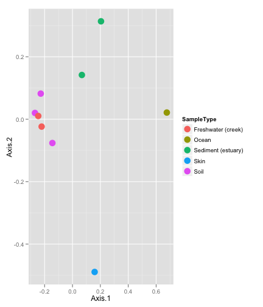 

This figure contains the graphic produced by the `plot_tree` function in phyloseq. In this case the data is a subset of the `GlobalPatterns` dataset in which only OTUs from the phylum *Chlamydiae* are included. Additionally, the tree has been annotated with genus labels at each tree tip. The points next to tips represent samples in which the OTU was observed, and are shaped according to taxonomic rank of Family, and shaded according to the sample type (sample source environment).


```r
plot_tree(GP.chl, "treeonly")
```

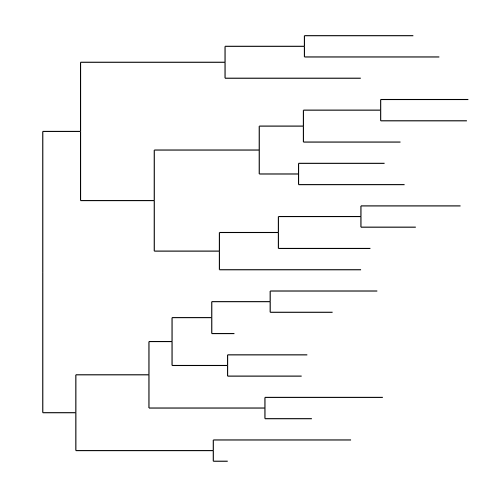 

This figure is the result of plotting the "bare" tree with no options directing the mapping of a variable to the tree, and `"treeonly"` as the argument to `method`. Not as informative as the previous tree.


## Abundance bar plots
For direct quantitative observation/comparison of abundances.

```r
data(enterotype)
TopNOTUs <- names(sort(speciesSums(enterotype), TRUE)[1:10])
ent10 <- prune_species(TopNOTUs, enterotype)
plot_taxa_bar(ent10, "Genus", x = "SeqTech", fill = "TaxaGroup")
```

 


```r
plot_taxa_bar(ent10, "Genus", x = "SeqTech", fill = "TaxaGroup") + 
    facet_wrap(~Enterotype)
```

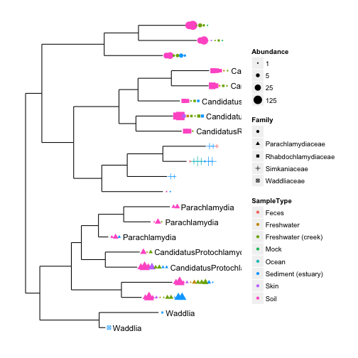 


This one takes a little while to calculate (not run).

```r
plot_taxa_bar(Bushman, "Phylum", NULL, 0.9, "SEX", "INSOLUBLE_DIETARY_FIBER_G_AVE")
```


# Preprocessing Abundance Data

This section includes examples preprocessing (filtering, trimming, subsetting, etc) phyloseq data. Let's start by resetting the `GlobalPatterns` example data and adding a human category.


```r
data(GlobalPatterns)
GlobalPatterns
```

```
## phyloseq-class experiment-level object
## OTU Table:          [19216 species and 26 samples]
##                      species are rows
## Sample Data:         [26 samples by 7 sample variables]:
## Taxonomy Table:     [19216 species by 7 taxonomic ranks]:
## Phylogenetic Tree:  [19216 tips and 19215 internal nodes]
##                      rooted
```

```r
# prune OTUs that are not present in at least one sample
GP <- prune_species(speciesSums(GlobalPatterns) > 0, GlobalPatterns)
# Define a human-associated versus non-human categorical variable:
sampleData(GP)$human <- factor(getVariable(GP, "SampleType") %in% 
    c("Feces", "Mock", "Skin", "Tongue"))
```


## "Rarefy" Abundances to Even Depth
Although of perhaps dubious necessity, it is common for OTU abundance tables to be randomly subsampled to even sequencing depth prior various analyses, especially UniFrac. Here is an example comparing the UniFrac-PCoA results with and without "rarefying" the abundances (Requires phyloseq v1.1.28+)

Test with esophagus dataset

```r
data(esophagus)
eso <- rarefy_even_depth(esophagus)
# plot(as(otuTable(eso), 'vector'), as(otuTable(esophagus), 'vector'))
```


```r
UniFrac(eso)
```

```
##        B      C
## C 0.5692       
## D 0.5416 0.6439
```

```r
UniFrac(esophagus)
```

```
##        B      C
## C 0.5176       
## D 0.5182 0.5422
```


Test with GlobalPatterns dataset

```r
data(GlobalPatterns)
GP.chl <- subset_species(GlobalPatterns, Phylum == "Chlamydiae")
# remove the samples that have less than 20 total reads from Chlamydiae
GP.chl <- prune_samples(names(which(sampleSums(GP.chl) >= 20)), GP.chl)
# (p <- plot_tree(GP.chl, color='SampleType', shape='Family',
# label.tips='Genus', size='abundance'))
GP.chl.r <- rarefy_even_depth(GP.chl)
# plot(as(otuTable(GP.chl.r), 'vector'), as(otuTable(GP.chl), 'vector'))
```


To compare MDS of unweighted-UniFrac for GP.chl and GP.chl.r (default distance is unweighted UniFrac) 

```r
plot_ordination(GP.chl, ordinate(GP.chl, "MDS"), color = "SampleType") + 
    geom_point(size = 5)
```

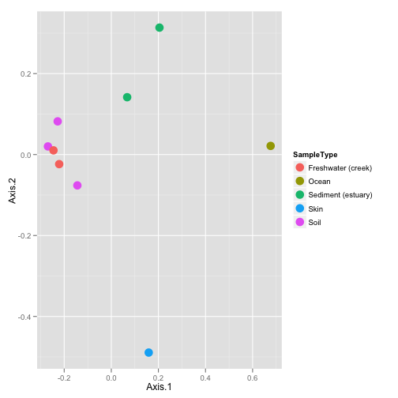 


```r
plot_ordination(GP.chl.r, ordinate(GP.chl.r, "MDS"), color = "SampleType") + 
    geom_point(size = 5)
```

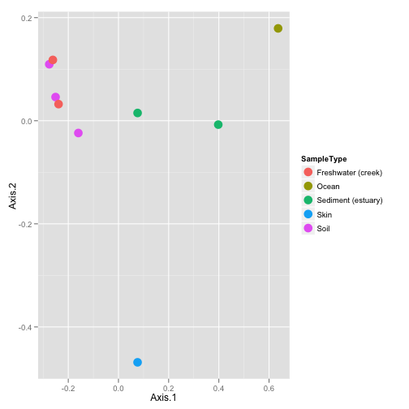 


How does rarefying affect the larger untrimmed dataset? (not run)

```r
GP.r <- rarefy_even_depth(GP)
plot_ordination(GP, ordinate(GP), color = "SampleType") + geom_point(size = 5)
```


```r
plot_ordination(GP.r, ordinate(GP.r), color = "SampleType") + geom_point(size = 5)
```


## `prune_species` vs. `subset_species`
These are two very different methods for subsetting OTUs in a dataset.


```r
topN <- 20
most_abundant_taxa <- sort(speciesSums(GP), TRUE)[1:topN]
print(most_abundant_taxa)
```

```
##  549656  331820  279599  360229  317182   94166  158660  329744  550960 
## 2481214 1001492  927850  556441  528629  444142  443938  436539  384205 
##  189047  326977  317658  244304  171551  263681   98605   12812  536311 
##  312161  291577  234024  222365  215470  212089  203583  196550  196355 
##  192573  298875 
##  179312  177879 
```

```r
GP20 <- prune_species(names(most_abundant_taxa), GP)
# Exploratory tree #1 (Note, too ma) plot_tree(ex2, color='SampleType',
# label.tips='Family', size='abundance')
nspecies(GP20)
```

```
## [1] 20
```

```r
length(getTaxa(GP20, "Phylum"))
```

```
## [1] 5
```

That was `prune_species`, applicable when we know (or can provide) the OTU IDs of the OTUs we want to retain in the dataset, or a logical vector with the same length as `nspecies` reseulting from a test (useful for `genefilter` or``genefilterSample` results (see next section)).

Alternatively, you can subset based on taxonomy expressions, using `subset_species`.

```r
GP.chl <- subset_species(GP, Phylum == "Chlamydiae")
# Exploratory tree #2 plot_tree(GP.chl, color='SampleType',
# shape='Family', label.tips='Genus', size='abundance')
nspecies(GP.chl)
```

```
## [1] 21
```

```r
length(getTaxa(GP.chl, "Phylum"))
```

```
## [1] 1
```


## `filterfunSample` and `genefilterSample`
This tool takes after the `genefilter` function from the genefilter package, but emphasizes within-microbiome conditions. The following code illustrates . The function `topp` is a filter function that returns the most abundant `p` fraction of taxa. The `filterfunSample` function takes one or or more functions like `topp` and binds them in order to define a filtering protocol function, in this case called: `f1`. This function, `f1`, is then passed to `genefilterSample` along with the dataset that is going to be pruned as well as a value for `A`, the number of samples in which an OTU must pass the filtering conditions.

```r
topp(0.1)
```

```
## function (x) 
## {
##     if (na.rm) {
##         x = x[!is.na(x)]
##     }
##     x >= sort(x, decreasing = TRUE)[ceiling(length(x) * p)]
## }
## <environment: 0x1099c1bf0>
```

```r
f1 <- filterfunSample(topp(0.1))
print(f1)
```

```
## function (x) 
## {
##     fun = flist[[1]]
##     fval = fun(x)
##     for (fun in flist[-1]) {
##         fval = fval & fun(x)
##     }
##     return(fval)
## }
## <environment: 0x1090a3628>
## attr(,"class")
## [1] "filterfun"
```

```r
wh1 <- genefilterSample(GP, f1, A = round(0.5 * nsamples(GP)))
sum(wh1)
```

```
## [1] 793
```

```r
ex2 <- prune_species(wh1, GP)
print(GP)
```

```
## phyloseq-class experiment-level object
## OTU Table:          [18988 species and 26 samples]
##                      species are rows
## Sample Data:         [26 samples by 8 sample variables]:
## Taxonomy Table:     [18988 species by 7 taxonomic ranks]:
## Phylogenetic Tree:  [18988 tips and 18987 internal nodes]
##                      rooted
```

```r
print(ex2)
```

```
## phyloseq-class experiment-level object
## OTU Table:          [793 species and 26 samples]
##                      species are rows
## Sample Data:         [26 samples by 8 sample variables]:
## Taxonomy Table:     [793 species by 7 taxonomic ranks]:
## Phylogenetic Tree:  [793 tips and 792 internal nodes]
##                      rooted
```


### Filtering low-variance OTUs
Suppose we wanted to use the variance of OTUs across samples as a condition for filtering. For example, to remove OTUs that do not change much across all (or most) samples. We start this example by subsetting just the *Crenarchaeota* from all samples:

```r
gpac <- subset_species(GP, Phylum == "Crenarchaeota")
```


Now define a function to get the across-sample variance of each OTU/taxa/species.

```r
specvar <- sapply(species.names(gpac), function(i, physeq) {
    var(getSamples(physeq, i))
}, gpac)
# p1 <- qplot(x=log10(variance), data=data.frame(variance=specvar),
# binwidth=abs(do.call('-', as.list(range(log10(specvar))))/20) )
# print(p1)
```


However, the value of the variance is highly-dependent on the sequencing effort of each sample (the total number of reads sequenced from a particular sample). Thus we segway to transformations (e.g. convert to fractional abundance prior to filtering)


## Transformations
Useful for: Standardization / Normalization / Smoothing / Shrinking. Second-order function: `transformSampleCounts`.

Example normalizing to sample fraction before estimating variance for filtering.

```r
gpacf <- transformSampleCounts(gpac, function(x) {
    x/sum(x)
})
specvar <- sapply(species.names(gpacf), function(i, physeq) {
    var(getSamples(physeq, i))
}, gpacf)
```


More plots not run...

```r
qplot(x = log10(variance), data = data.frame(variance = specvar))
p2 <- qplot(x = log10(variance), data = data.frame(variance = specvar), 
    binwidth = abs(do.call("-", as.list(range(log10(specvar))))/20))
grid.newpage()
pushViewport(viewport(layout = grid.layout(2, 1)))
print(p1, vp = viewport(layout.pos.row = 1, layout.pos.col = 1))
print(p2, vp = viewport(layout.pos.row = 2, layout.pos.col = 1))
```


Now how would we filter the taxa with variance smaller than 0.001 (Assuming we wanted to pick an arbitrary threshold in this way)?

```r
gpac_filt <- prune_species(specvar > 0.001, gpac)
```

Show results with a heatmap

```r
plot_heatmap(gpac_filt, "NMDS", "bray", "SampleType", "Family")
```

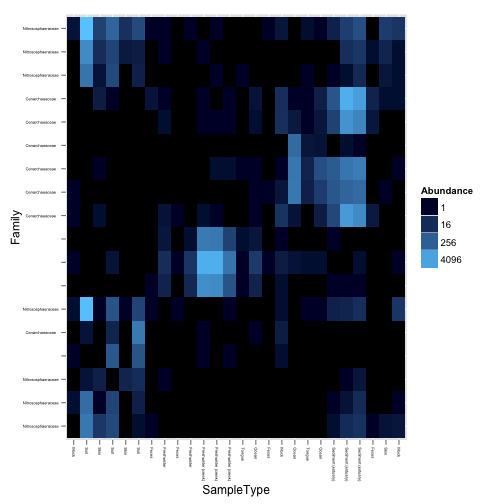 

```r
plot_heatmap(gpac, "NMDS", "bray", "SampleType", "Family")
```

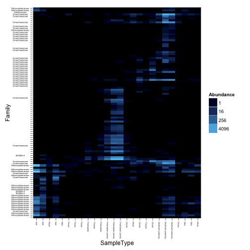 

Note that the code in this section is not an endorsement of this particular threshold (0.001), just a demonstration for how you might remove OTUs/taxa/species that do not change much across the samples in your experiment.

For more advanced normalization features (like shrinkage, etc.), also consider features in [the edgeR package](http://www.bioconductor.org/packages/release/bioc/html/edgeR.html), [the DESeq package](http://bioconductor.org/packages/release/bioc/html/DESeq.html), and for standardization the `decostand` function in [the vegan-package](http://cran.r-project.org/web/packages/vegan//index.html); as well as probably many others that could be useful in this context.


# Graphics for Inference and Exploration
In the following section(s) we will illustrate using graphical tools provided by [the phyloseq package](http://joey711.github.com/phyloseq/). These are meant to be flexible ways to explore and summarize the data.

For further details, there is a collection of "show and tell" wiki-pages describing the available graphics options supported by the phyloseq-package. These include example code for reproducing the figures shown. Many of the default settings are modifiable within the function arguments directly, and virtually everything about these plots can be further modified via the layers interface of [ggplot2](http://had.co.nz/ggplot2/).

For quick reference (even though some have been described already), the key graphics-producing functions in phyloseq are:

### [plot_heatmap](https://github.com/joey711/phyloseq/wiki/plot_heatmap)

### [plot_tree](https://github.com/joey711/phyloseq/wiki/plot_tree)

### [plot_ordination](https://github.com/joey711/phyloseq/wiki/plot_ordination)

### [plot_network](https://github.com/joey711/phyloseq/wiki/plot_network)

### [plot_richness_estimates](https://github.com/joey711/phyloseq/wiki/plot_richness_estimates)

### [plot_taxa_bar](https://github.com/joey711/phyloseq/wiki/plot_taxa_bar)

We are going to show some examples that would take a lot of time to calculate and render on a dataset as large as `GlobalPatterns`. For the sake of time in this section, let's subset the data further to the most abundant 5 phyla.

```r
data(GlobalPatterns)  # Reload GlobalPatterns
GP <- prune_species(speciesSums(GlobalPatterns) > 0, GlobalPatterns)
sampleData(GP)$human <- factor(getVariable(GP, "SampleType") %in% 
    c("Feces", "Mock", "Skin", "Tongue"))
top5ph <- sort(tapply(speciesSums(GP), taxTab(GP)[, "Phylum"], sum), 
    decreasing = TRUE)[1:5]
GP1 <- subset_species(GP, Phylum %in% names(top5ph))
```


##  Distance Functions
Before we get to network plots, let's discuss distances. Many tools use distances to perform their calculations. In phyloseq, ordinations, heatmaps, and network plots all use the `distance` function for calculating OTU or Sample distance matrices (actually represented as a "dist" object) when needed, particularly when PCoA/MDS or NMDS is involved.


```r
help("distance")  # Same as '?distance'
`?`(distance)
```


A relatively recent, popular distance method that relies heavily on the phylogenetic tree is [UniFrac](https://github.com/joey711/phyloseq/wiki/Fast-Parallel-UniFrac). It has been implemented in phyloseq as a fast parallel function, also wrapped by [the distance function](https://github.com/joey711/phyloseq/wiki/distance). See the phyloseq wiki page describing [Fast Parallel UniFrac](https://github.com/joey711/phyloseq/wiki/Fast-Parallel-UniFrac) for further details, citations, and performance results. 


```r
data(esophagus)
distance(esophagus)  # unweighted UniFrac
```

```
##        B      C
## C 0.5176       
## D 0.5182 0.5422
```

```r
distance(esophagus, weighted = TRUE)  # weighted UniFrac
```

```
##        B      C
## C 0.2035       
## D 0.2603 0.2477
```

Here are some other examples. There are some 45 or so methods. 

```r
distance(esophagus, "jaccard")  # vegdist jaccard
distance(esophagus, "bray")  # vegdist bray-curtis
distance(esophagus, "gower")  # vegdist option 'gower'
distance(esophagus, "g")  # designdist method option 'g'
distance(esophagus, "minkowski")  # invokes a method from the base dist() function.
distance(esophagus, "(A+B-2*J)/(A+B)")  # designdist custom distance
distance("help")
distance("list")
```


## [The plot_network function](https://github.com/joey711/phyloseq/wiki/plot_network)
The following code illustrates using the `make_network` and `plot_network` functions in phyloseq. In this context, we are using networks to graphically represent thresholded distances between samples or OTUs. The euclidean distances between points on the plot are essentially arbitrary, only the "edges" (lines) between "nodes" (OTUs/samples) are derived directly from the data. For further examples, it is recommended that you take a look at [the plot_network wiki page](https://github.com/joey711/phyloseq/wiki/plot_network)

The `GP` variable is an only-slightly-modified version of the `GlobalPatterns` dataset. The threshold was determined empirically to show something interesting for demonstration. In practice, this value has a huge effect on the resulting network, and its usefulness, and it is highly recommended that you investigate the results from multiple values.


```r
ig <- make_network(GP, type = "samples", distance = "bray", max.dist = 0.85)
plot_network(ig, GP, color = "SampleType", shape = "human", line_weight = 0.4, 
    label = NULL)
```

 


A similar network representation of samples from [the "Enterotypes" dataset](http://www.nature.com/nature/journal/v473/n7346/full/nature09944.html).

```r
data(enterotype)
ig <- make_network(enterotype, max.dist = 0.3)
plot_network(ig, enterotype, color = "SeqTech", shape = "Enterotype", 
    line_weight = 0.4, label = NULL)
```

```
## Warning: Removed 5 rows containing missing values (geom_point).
```

 


An example showing a network representation of OTUs, representing communities of bacteria that occurr in similar profiles of samples.

```r
data(GlobalPatterns)
# prune to just the top 100 most abundant OTUs across all samples (crude).
GP100 <- prune_species(names(sort(speciesSums(GlobalPatterns), TRUE))[1:100], 
    GlobalPatterns)
jg <- make_network(GP100, "species", "jaccard", 0.3)
plot_network(jg, GP100, "species", color = "Phylum", line_weight = 0.4, 
    label = NULL)
```

 


## Ordination Methods

["Ordination methods"](http://en.wikipedia.org/wiki/Ordination_(statistics)) in this context refers to methods for dimensional reduction of data -- usually the OTU abundance data, which is probably a large sparse matrix not so amenable to graphical display on its own. Graphically investigating the (usually) information-dense first few axes of an ordination result can be very useful for exploring and summarizing phylogenetic sequencing data. One of the resons for this is that many ordination methods are [non-parametric](http://en.wikipedia.org/wiki/Non-parametric_statistics), so they do not depend upon a prior hypothesis or model. This is essential for many microbiome investigations in which a model is only vaguely described or not available.

A good quick summary of ordination methods is provided in the introductory vignette for the vegan package:

[vegan introductory vignette](http://cran.r-project.org/web/packages/vegan/vignettes/intro-vegan.pdf)

The following R task views are also useful for understanding ordination tools in R:

[Analysis of Ecological and Environmental Data](http://cran.r-project.org/web/views/Environmetrics.html)

[Multivariate Statistics](http://cran.r-project.org/web/views/Multivariate.html)

The [ade4 package](http://cran.r-project.org/web/packages/ade4/index.html) also provides a large number of ordination methods, and may be useful in your analysis.


### [The ordinate function](https://github.com/joey711/phyloseq/wiki/ordinate)
This function wraps several commonly-used [ordination](http://en.wikipedia.org/wiki/Ordination_(statistics)) methods for OTU abundance tables (as well as related tables, in some cases). The type of ordination performed depends upon the argument to `method`. Try `ordinate("help")` or `ordinate("list")` for the currently supported method options.

The output of this function will be an ordination class. The specific class depends upon [the ordination method](http://en.wikipedia.org/wiki/Ordination_(statistics)) used, as well as the underlying function/package that is called internally by phyloseq to perform it. As a general rule, any of the ordination classes returned by this function, `ordinate`, will be recognized by downstream tools in [the phyloseq package](http://joey711.github.com/phyloseq/) -- for example the ordination plotting function, [plot_ordination](https://github.com/joey711/phyloseq/wiki/plot_ordination) (See next section for plot examples).

Using `GP100` from the previous section, let's calculate [the unweighted-UniFrac distance](https://github.com/joey711/phyloseq/wiki/Fast-Parallel-UniFrac) for each sample pair in the dataset, and then perform [Multidimensional Scaling](http://en.wikipedia.org/wiki/Multidimensional_scaling) (aka [Principle Coordinates Analysis](http://en.wikipedia.org/wiki/Multidimensional_scaling)) on the resulting distance. For details about calculating the UniFrac distance on larger datasets using parallel-computing options in supported by phyloseq, see [the wiki page on Fast Parallel UniFrac in phyloseq](https://github.com/joey711/phyloseq/wiki/Fast-Parallel-UniFrac)

```r
GP.MDS <- ordinate(GP100, method = "MDS", distance = "unifrac")
```

Here are just a few examples of other supported combinations.

```r
GP.NMDS <- ordinate(GP, "NMDS", "gower")
GP.NMDS <- ordinate(GP, "NMDS", "bray")  # perform NMDS on bray-curtis distance
GP.NMDS.UF.ord <- ordinate(GP, "NMDS")  # UniFrac. Takes a while.
GP.NMDS.wUF.ord <- ordinate(GP, "NMDS", "unifrac", weighted = TRUE)  # weighted-UniFrac
GP.NMDS.gower <- ordinate(GP, "NMDS", "gower")
```


### [The plot_ordination function](https://github.com/joey711/phyloseq/wiki/plot_ordination)

The `plot_ordination` function has many options, and supports many combinations of ordinations, including the mapping of sample and/or OTU variables to color and shape [aesthetics](http://had.co.nz/ggplot2/aes.html). Many additional examples (with results) are included on [the plot_ordination wiki page](https://github.com/joey711/phyloseq/wiki/plot_ordination). For quicker reference, some example "1-liners" are also included at bottom of this section.

This combination of MDS/PCoA ordination of [the UniFrac distance](https://github.com/joey711/phyloseq/wiki/Fast-Parallel-UniFrac) is recently very popular in microbiome analyses. 

```r
require("ggplot2")
ptitle <- "GP PCoA of UniFrac distance, GP most abundant 100 OTUs only"
(p <- plot_ordination(GP100, GP.MDS, type = "samples", color = "SampleType", 
    title = ptitle))
```

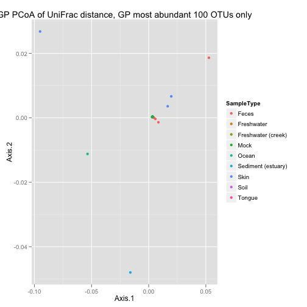 

```r
p + geom_point(size = 5) + geom_polygon(aes(fill = SampleType))
```

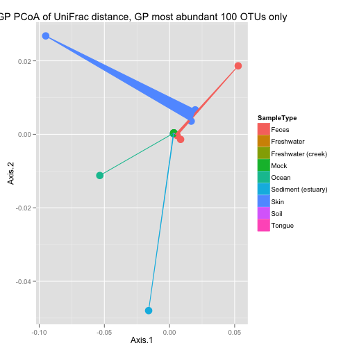 


Get the names of the most-abundant phyla, and use for subsetting.

```r
top.TaxaGroup <- sort(tapply(speciesSums(GP), taxTab(GP)[, "Phylum"], 
    sum, na.rm = TRUE), decreasing = TRUE)
top.TaxaGroup <- top.TaxaGroup[top.TaxaGroup > 1 * 10^6]
# Now prune further, to just the most-abundant phyla
GP2 <- subset_species(GP, Phylum %in% names(top.TaxaGroup))
topsp <- names(sort(speciesSums(GP2), TRUE)[1:200])
GP2 <- prune_species(topsp, GP2)
```


Let's try [Correspondence Analysis](http://en.wikipedia.org/wiki/Correspondence_analysis) with "one-liner" syntax in which we include the `ordinate` call within the `plot_ordination` command.

```r
(p2 <- plot_ordination(GP2, ordinate(GP2, "CCA"), type = "samples", 
    color = "SampleType"))
```

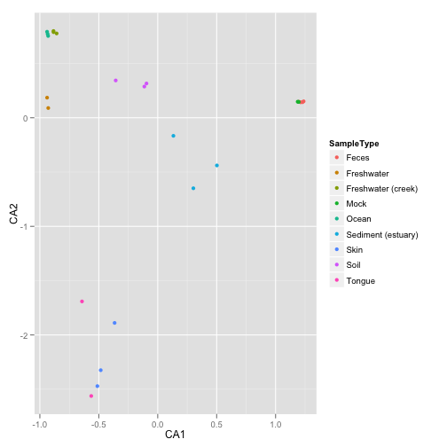 

```r
p2 + geom_point(size = 5) + geom_polygon(aes(fill = SampleType))
```

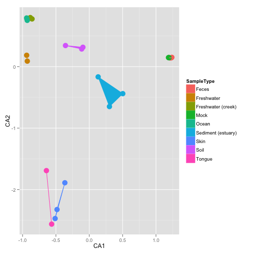 


```r
plot_ordination(GP2, ordinate(GP2, "CCA"), type = "species", color = "Phylum") + 
    geom_point(size = 4)
plot_ordination(GP2, ordinate(GP2, "CCA"), type = "split")
plot_ordination(GP2, ordinate(GP2, "CCA"), type = "split", color = "SampleType")
plot_ordination(GP2, ordinate(GP2, "CCA"), type = "biplot", shape = "Phylum")
plot_ordination(GP2, ordinate(GP2, "CCA"), type = "split", color = "Phylum", 
    label = "SampleType")
plot_ordination(GP2, ordinate(GP2, "CCA"), type = "split", color = "SampleType", 
    shape = "Phylum", label = "SampleType")
```


### Mapping Continuous Variables to Color
(Note: can't map continuous variables to shape with `plot_ordination` function)

```r
p4title <- "Bushman dataset, PCoA/MDS ordination on Bray-Curtis distance"
Bushman.ord <- ordinate(Bushman, method = "MDS", distance = "bray")
plot_ordination(Bushman, Bushman.ord, "samples", color = "OMEGA3_FATTY_ACIDS_G_AVE", 
    title = p4title)
```

 


## [The plot_heatmap() function](https://github.com/joey711/phyloseq/wiki/plot_heatmap)
In a [2010 article in BMC Genomics](http://www.biomedcentral.com/1471-2105/11/45), Rajaram and Oono describe an approach to creating a heatmap using ordination methods (namely, NMDS and PCA) to organize the rows and columns instead of (hierarchical) cluster analysis. In many cases the ordination-based ordering does a much better job than h-clustering at providing an order of elements that is easily interpretable. The authors provided an immediately useful example of their approach as [the NeatMap package for R](http://cran.r-project.org/web/packages/NeatMap/index.html). The NeatMap package can be used directly on the abundance table (`"otuTable"`-class) of phylogenetic-sequencing data, but the NMDS or PCA ordination options that it supports are not based on ecological distances. To fill this void, and because phyloseq already provides support for a large number of [ecological distances](https://github.com/joey711/phyloseq/wiki/distance) and [ordination methods](https://github.com/joey711/phyloseq/wiki/ordinate), phyloseq now includes the `plot_heatmap()` function: an ecology-oriented variant of the NeatMap approach to organizing a heatmap and build it using [ggplot](http://had.co.nz/ggplot2/) graphics tools. The [distance](https://github.com/joey711/phyloseq/wiki/distance) and [method](https://github.com/joey711/phyloseq/wiki/ordinate) arguments are the same as for the [plot_ordination](https://github.com/joey711/phyloseq/wiki/plot_ordination) function, and support large number of distances and ordination methods, respectively, with a strong leaning toward ecology. This function also provides the options to re-label the OTU and sample axis-ticks with a taxonomic name and/or sample variable, respectively, in the hope that this might hasten your interpretation of the patterns (See the documentation for the `sample.label` and `species.label` arguments, and the examples below). Note that this function makes no attempt to overlay dendrograms from hierarchical clustering next to the axes, as hierarchical clustering is not used to organize these plots. Also note that each re-ordered axis repeats at the edge, and so apparent clusters at the far right/left or top/bottom of the heat-map may actually be the same. For now, the placement of this edge can be considered arbitrary, so beware of this artifact of the graphic and visually check if there are two "mergeable" clusters at the edges of a particular axis. If you benefit from this phyloseq-specific implementation of [the NeatMap approach](http://cran.r-project.org/web/packages/NeatMap/index.html), please cite [the NeatMap article](http://www.biomedcentral.com/1471-2105/11/45), as well as phyloseq.

Further examples are provided at [the plot_heatmap wiki page](https://github.com/joey711/phyloseq/wiki/plot_heatmap)


```r
plot_heatmap(GP2, "NMDS", "bray", "SampleType", "Family")
```

 


Some alternative `plot_heatmap` transformations.

```r
plot_heatmap(gpac_filt, "NMDS", "bray", "SampleType", "Family", trans = log_trans(10))
plot_heatmap(gpac_filt, "NMDS", "bray", "SampleType", "Family", trans = identity_trans())
plot_heatmap(gpac_filt, "NMDS", "bray", "SampleType", "Family", trans = boxcox_trans(0.15))
```


#  Validation
In this section, we will look at examples for using R to validate/test hypotheses we may have generated through some of the previous exploration.


##  Multiple Testing
In this example we will perform testing on fractional abundances to remove effect of differences in total sequencing across samples for same taxa. For the sake of time, let's subset our testing to the first 200 most abundant OTUs, and transform these counts to their relative abundance in their source sample (note that this introduce bias in real-life scenarios). In practice, these OTU abundances need to be preprocessed prior to testing, and many good methods in microarray analysis and differential expression sequencing could probably apply to this data (but are not directly implemented/supported in phyloseq, yet). Otherwise, beware that the old motto "garbage-in, garbage-out" can definitely apply to your data if you are not careful.


```r
topsp <- names(sort(speciesSums(GP), TRUE)[1:200])
GP3f <- transformSampleCounts(GP, function(x) {
    x/sum(x)
})
GP3f <- prune_species(topsp, GP3f)
```


We are going to use the multtest wrapper included in phyloseq, `mt`. Try `?mt` for help on this function. To use this wrapper to calculate the multiple-inference-adjusted P-values, using the "human" sample variable:

```r
GP.fwer.table <- mt(GP3f, "human")
```

```
## B=10000
## b=100	b=200	b=300	b=400	b=500	b=600	b=700	b=800	b=900	b=1000	
## b=1100	b=1200	b=1300	b=1400	b=1500	b=1600	b=1700	b=1800	b=1900	b=2000	
## b=2100	b=2200	b=2300	b=2400	b=2500	b=2600	b=2700	b=2800	b=2900	b=3000	
## b=3100	b=3200	b=3300	b=3400	b=3500	b=3600	b=3700	b=3800	b=3900	b=4000	
## b=4100	b=4200	b=4300	b=4400	b=4500	b=4600	b=4700	b=4800	b=4900	b=5000	
## b=5100	b=5200	b=5300	b=5400	b=5500	b=5600	b=5700	b=5800	b=5900	b=6000	
## b=6100	b=6200	b=6300	b=6400	b=6500	b=6600	b=6700	b=6800	b=6900	b=7000	
## b=7100	b=7200	b=7300	b=7400	b=7500	b=7600	b=7700	b=7800	b=7900	b=8000	
## b=8100	b=8200	b=8300	b=8400	b=8500	b=8600	b=8700	b=8800	b=8900	b=9000	
## b=9100	b=9200	b=9300	b=9400	b=9500	b=9600	b=9700	b=9800	b=9900	b=10000	
## r=2	r=4	r=6	r=8	r=10	r=12	r=14	r=16	r=18	r=20	
## r=22	r=24	r=26	r=28	r=30	r=32	r=34	r=36	r=38	r=40	
## r=42	r=44	r=46	r=48	r=50	r=52	r=54	r=56	r=58	r=60	
## r=62	r=64	r=66	r=68	r=70	r=72	r=74	r=76	r=78	r=80	
## r=82	r=84	r=86	r=88	r=90	r=92	r=94	r=96	r=98	r=100	
## r=102	r=104	r=106	r=108	r=110	r=112	r=114	r=116	r=118	r=120	
## r=122	r=124	r=126	r=128	r=130	r=132	r=134	r=136	r=138	r=140	
## r=142	r=144	r=146	r=148	r=150	r=152	r=154	r=156	r=158	r=160	
## r=162	r=164	r=166	r=168	r=170	r=172	r=174	r=176	r=178	r=180	
## r=182	r=184	r=186	r=188	r=190	r=192	r=194	r=196	r=198	r=200	
```


No add some taxonomic columns to the result for interpretation (rows are OTUs)

```r
jranks <- c("Phylum", "Family", "Genus")
GP.fwer.table <- data.frame(GP.fwer.table, taxTab(GP3f)[rownames(GP.fwer.table), 
    jranks])
subset(GP.fwer.table, adjp < 0.05)
```

```
##        index teststat  rawp   adjp plower        Phylum           Family
## 108747   150    2.574 4e-04 0.0302 0.0243    Firmicutes Streptococcaceae
## 348374    52    1.263 4e-04 0.0302 0.0243 Bacteroidetes   Bacteroidaceae
## 158660     7    2.313 5e-04 0.0356 0.0298 Bacteroidetes   Bacteroidaceae
##                Genus
## 108747 Streptococcus
## 348374   Bacteroides
## 158660   Bacteroides
```


##  What if we want FDR instead of FWER?
Or to use other tools in multtest-package?

```r
library("multtest")
```

```
## Loading required package: Biobase
```

```
## Loading required package: BiocGenerics
```

```
## Attaching package: 'BiocGenerics'
```

```
## The following object(s) are masked from 'package:stats':
## 
## xtabs
```

```
## The following object(s) are masked from 'package:base':
## 
## Filter, Find, Map, Position, Reduce, anyDuplicated, cbind, colnames,
## duplicated, eval, get, intersect, lapply, mapply, mget, order, paste,
## pmax, pmax.int, pmin, pmin.int, rbind, rep.int, rownames, sapply, setdiff,
## table, tapply, union, unique
```

```
## Welcome to Bioconductor
## 
## Vignettes contain introductory material; view with 'browseVignettes()'. To
## cite Bioconductor, see 'citation("Biobase")', and for packages
## 'citation("pkgname")'.
```

```
## Attaching package: 'Biobase'
```

```
## The following object(s) are masked from 'package:phyloseq':
## 
## sampleNames
```

```r
mtm <- mt(GP3f, "human")
```

```
## B=10000
## b=100	b=200	b=300	b=400	b=500	b=600	b=700	b=800	b=900	b=1000	
## b=1100	b=1200	b=1300	b=1400	b=1500	b=1600	b=1700	b=1800	b=1900	b=2000	
## b=2100	b=2200	b=2300	b=2400	b=2500	b=2600	b=2700	b=2800	b=2900	b=3000	
## b=3100	b=3200	b=3300	b=3400	b=3500	b=3600	b=3700	b=3800	b=3900	b=4000	
## b=4100	b=4200	b=4300	b=4400	b=4500	b=4600	b=4700	b=4800	b=4900	b=5000	
## b=5100	b=5200	b=5300	b=5400	b=5500	b=5600	b=5700	b=5800	b=5900	b=6000	
## b=6100	b=6200	b=6300	b=6400	b=6500	b=6600	b=6700	b=6800	b=6900	b=7000	
## b=7100	b=7200	b=7300	b=7400	b=7500	b=7600	b=7700	b=7800	b=7900	b=8000	
## b=8100	b=8200	b=8300	b=8400	b=8500	b=8600	b=8700	b=8800	b=8900	b=9000	
## b=9100	b=9200	b=9300	b=9400	b=9500	b=9600	b=9700	b=9800	b=9900	b=10000	
## r=2	r=4	r=6	r=8	r=10	r=12	r=14	r=16	r=18	r=20	
## r=22	r=24	r=26	r=28	r=30	r=32	r=34	r=36	r=38	r=40	
## r=42	r=44	r=46	r=48	r=50	r=52	r=54	r=56	r=58	r=60	
## r=62	r=64	r=66	r=68	r=70	r=72	r=74	r=76	r=78	r=80	
## r=82	r=84	r=86	r=88	r=90	r=92	r=94	r=96	r=98	r=100	
## r=102	r=104	r=106	r=108	r=110	r=112	r=114	r=116	r=118	r=120	
## r=122	r=124	r=126	r=128	r=130	r=132	r=134	r=136	r=138	r=140	
## r=142	r=144	r=146	r=148	r=150	r=152	r=154	r=156	r=158	r=160	
## r=162	r=164	r=166	r=168	r=170	r=172	r=174	r=176	r=178	r=180	
## r=182	r=184	r=186	r=188	r=190	r=192	r=194	r=196	r=198	r=200	
```


Re-order to original, and use raw p-values for adjustment via `mt.rawp2adjp()`

```r
procedure <- c("Bonferroni", "Hochberg", "BH")
p.mtm <- mt.rawp2adjp(mtm[order(mtm[, "index"]), "rawp"], procedure)
# Re-order so that you can return original table (ordered p-value table)
p.adjp.ord <- p.mtm$adjp[order(p.mtm$index), ]
# Give it the original row names from m
rownames(p.adjp.ord) <- species.names(GP3f)
# Return the table of adjusted p-values for each hypothesis.
GP3f.mt.table <- data.frame(p.adjp.ord, taxTab(GP3f)[rownames(p.adjp.ord), 
    jranks])
# Re-rorder based on BH
GP3f.mt.table <- GP3f.mt.table[order(GP3f.mt.table[, "BH"]), ]
subset(GP3f.mt.table, BH < 0.05)
```

```
##          rawp Bonferroni Hochberg      BH        Phylum             Family
## 158660 0.0005       0.10   0.0990 0.03333 Bacteroidetes     Bacteroidaceae
## 348374 0.0004       0.08   0.0796 0.03333 Bacteroidetes     Bacteroidaceae
## 108747 0.0004       0.08   0.0796 0.03333    Firmicutes   Streptococcaceae
## 194053 0.0008       0.16   0.1576 0.04000    Firmicutes    Lachnospiraceae
## 331820 0.0021       0.42   0.4032 0.04462 Bacteroidetes     Bacteroidaceae
## 322235 0.0017       0.34   0.3315 0.04462 Bacteroidetes     Bacteroidaceae
## 259569 0.0017       0.34   0.3315 0.04462 Bacteroidetes      Rikenellaceae
## 291090 0.0018       0.36   0.3492 0.04462 Bacteroidetes Porphyromonadaceae
## 561077 0.0019       0.38   0.3667 0.04462 Cyanobacteria                   
## 357795 0.0029       0.58   0.5452 0.04462    Firmicutes    Lachnospiraceae
## 518438 0.0026       0.52   0.4966 0.04462    Firmicutes    Lachnospiraceae
## 261912 0.0027       0.54   0.5130 0.04462    Firmicutes    Lachnospiraceae
## 542011 0.0028       0.56   0.5292 0.04462 Cyanobacteria                   
## 317182 0.0037       0.74   0.6882 0.04933 Cyanobacteria                   
## 470172 0.0037       0.74   0.6882 0.04933    Firmicutes    Lachnospiraceae
##                  Genus
## 158660     Bacteroides
## 348374     Bacteroides
## 108747   Streptococcus
## 194053       Roseburia
## 331820     Bacteroides
## 322235     Bacteroides
## 259569       Alistipes
## 291090 Parabacteroides
## 561077                
## 357795       Roseburia
## 518438       Roseburia
## 261912           Dorea
## 542011                
## 317182                
## 470172     Coprococcus
```


Some alternative packages for multiple inference correction: [the qvalue package](http://www.bioconductor.org/packages/release/bioc/html/qvalue.html), [the multcomp package](http://cran.r-project.org/web/packages/multcomp/index.html)


#  Getting phyloseq Data into Other R Tools

A common question from many users related to how they can easily get phyloseq-formatted data into other R tools. The following examples are meant to illustrate doing that with some commonly-requested tasks.


##  Porting Data to [vegan](http://cran.r-project.org/web/packages/vegan//index.html) Functions

[The vegan package](http://vegan.r-forge.r-project.org/) is a popular and well-maintained R package (hosted in [CRAN](CRAN.r-project.org)) "for community and vegetation ecologists". It provides ordination methods, diversity analysis and other functions. Many of [vegan](http://cran.r-project.org/web/packages/vegan//index.html)'s distance and ordination functions are wrapped by functions in phyloseq. Of course, not everything in [vegan](http://cran.r-project.org/web/packages/vegan//index.html) is wrapped by phyloseq, and it may turn out that you need to use some function that is not wrapped by phyloseq. What do you do? The following subsection provides example code for running just such a function by accessing and coercing the necessary data components from a phyloseq data object.

For OTU abundance tables, [vegan](http://cran.r-project.org/web/packages/vegan//index.html) expects samples as rows, and OTUs/species/taxa as columns (so does the picante package). The following is an example function, called `veganotu`, for extracting the OTU table from a phyloseq data object, and converting it to a properly oriented standard matrix recognized by the [vegan](http://cran.r-project.org/web/packages/vegan//index.html) package.

We will use the `bioenv` function from [vegan](http://cran.r-project.org/web/packages/vegan//index.html) to test for sample variables that correlate well with the microbial community distances.


```r
veganotu <- function(physeq) {
    require("vegan")
    OTU <- otuTable(physeq)
    if (speciesAreRows(OTU)) {
        OTU <- t(OTU)
    }
    return(as(OTU, "matrix"))
}
```


Now we can use this function for data input to [vegan](http://cran.r-project.org/web/packages/vegan//index.html) functions. Let's try this with the `Bushman` dataset, since it has ample continuous variables with which to correlate microbiom distances. First, let's coerce the Bushman sample data component into a vanilla `"data.frame"` class that we will call `bushsd`.


```r
keepvariables <- which(sapply(sampleData(Bushman), is.numeric))
bushsd <- data.frame(sampleData(Bushman))[keepvariables]
```

Now let's make a call to `bioenv` to see what happens... (not actually run in example, takes too long, be prepared to stop the run if you try it)

```r
bioenv(veganotu(Bushman), bushsd)
```

There are so many sample variables in the `Bushman` data that we would have to calculate `1.225996e+55` possible subsets in an exhaustive search calculation. That could take a long time! Note from the `bioenv` documentation that we could have expected that issue: 

"There are 2^p-1 subsets of `p` variables, and an exhaustive search may take a very, very, very long time (parameter `upto` offers a partial relief)."

So one option is to use the `upto` parameter. Another is to specify [a model formula](http://stat.ethz.ch/R-manual/R-devel/library/stats/html/formula.html) when specifying the primary data argument to this function (see `?"~"` for some details), which allows us to specify variables in the correlation search. We could also simply trim the number of columns in `bushsd` to just the few variables that we really care about. Let's try the second option here, the [model formula](http://stat.ethz.ch/R-manual/R-devel/library/stats/html/formula.html) approach, and focus on a few that we are interested in comparing. We'll look at the variable names again to remind us what is available

```r
names(bushsd)[1:10]
```

```
##  [1] "ASPARTAME_MG_AVE"            "TOT_CONJUGLINOLEICA_G_AVE"  
##  [3] "AGE"                         "VITC_ASCORBIC_ACID_MG_AVE"  
##  [5] "OXALIC_ACID_MG_AVE"          "PUFA_EICOSAPENTAENOIC_G_AVE"
##  [7] "PHOSPHORUS_G_AVE"            "SOLUBLE_DIETARY_FIBER_G_AVE"
##  [9] "SFA_MARGARIC_ACID_G_AVE"     "CLA_TRANS10_CIS12_G_AVE"    
```

I arbitrarily chose a mixture of variables from the full list previewed above.

```r
bioenv(veganotu(Bushman) ~ DEPTH + AGE + TOTAL_FAT_G_AVE + INSOLUBLE_DIETARY_FIBER_G_AVE, 
    bushsd)
```

```
## 
## Call:
## bioenv(formula = veganotu(Bushman) ~ DEPTH + AGE + TOTAL_FAT_G_AVE +      INSOLUBLE_DIETARY_FIBER_G_AVE, data = bushsd) 
## 
## Subset of environmental variables with best correlation to community data.
## 
## Correlations:      spearman 
## Dissimilarities:   bray 
## 
## Best model has 2 parameters (max. 4 allowed):
## AGE INSOLUBLE_DIETARY_FIBER_G_AVE
## with correlation  0.1537 
## 
```


Now that you know how to get phyloseq data into vegan, all of vegan's tools are now available to you to use as well. The following list is not exhaustive and focuses on the most popular tools, taken from [the vegan website front page](http://vegan.r-forge.r-project.org/):

- Diversity analysis: Shannon, Simpson, Fisher indices, Rényi diversities and Hill numbers.
- Species abundance models: Fisher and Preston models, species abundance distributions.
- Analysis of species richness: species accumulation curves, extrapolated richness.
- Ordination: support and meta functions for NMDS, redundancy analysis, constrained correspondence analysis, constrained analysis of proximities (all three with partial analysis),
- Support functions for ordination: dissimilarity indices, extended dissimilarities, Procrustes analysis, ordination diagnostics, permutation tests.
- Ordination and environment: vector fitting, centroid fitting and smooth surface fitting, adding species scores as weighted averages, adding convex hull, SD ellipses, arrows etc. to ordination.
- Dissimilarity analyses: ANOVA using dissimilarities, ANOSIM, MRPP, BIOENV, Mantel and partial Mantel tests.
- Data standardization: Hellinger, Wisconsin, Chi-square, Beals smoothing.


##  Ordination Example on the Gap Statistic

### Gap Statistic: How many clusters are there?
From [the clusGap documentation](http://stat.ethz.ch/R-manual/R-devel/library/cluster/html/clusGap.html): 
The `clusGap` function from [the cluster package](http://cran.r-project.org/web/packages/cluster/index.html) calculates a goodness of clustering measure, called [the “gap” statistic](www.stanford.edu/~hastie/Papers/gap.pdf). For each number of clusters `k`, it compares \log(W(k)) with E^*[\log(W(k))] where the latter is defined via bootstrapping, i.e. simulating from a reference distribution.

The following is an example performing the gap statistic on ordination results calculated using phyloseq tools, followed by an example of how a [ggplot](http://had.co.nz/ggplot2/)-based wrapper for this example might be included in [the phyloseq package](http://joey711.github.com/phyloseq/). 

### First perform the ordination using correspondence analysis

```r
library("cluster")
# Load data
data(enterotype)
# ordination
ent.ca <- ordinate(enterotype, method = "CCA", distance = NULL)
```

### Now the Gap Statistic code

```r
pam1 <- function(x, k) list(cluster = pam(x, k, cluster.only = TRUE))
x <- scores(ent.ca, display = "sites")
# gskmn <- clusGap(x[, 1:2], FUN=kmeans, nstart=20, K.max = 6, B = 500)
gskmn <- clusGap(x[, 1:2], FUN = pam1, K.max = 6, B = 50)
gskmn
```

```
## Clustering Gap statistic ["clusGap"].
## B=50 simulated reference sets, k = 1..6
##  --> Number of clusters (method 'firstSEmax', SE.factor=1): 3
##       logW E.logW   gap  SE.sim
## [1,] 4.544  5.749 1.205 0.02332
## [2,] 3.720  5.191 1.471 0.02280
## [3,] 3.428  4.929 1.501 0.01892
## [4,] 3.301  4.781 1.480 0.02129
## [5,] 3.100  4.682 1.582 0.02586
## [6,] 2.957  4.598 1.641 0.02167
```


That's nice. Just in case it is useful, let's look at what the wrapper-function might look like.

```r
gap_statistic_ordination <- function(ord, FUNcluster, type = "sites", 
    K.max = 6, axes = c(1:2), B = 500, verbose = interactive(), ...) {
    require("cluster")
    # If 'pam1' was chosen, use this internally defined call to pam
    if (FUNcluster == "pam1") {
        FUNcluster <- function(x, k) list(cluster = pam(x, k, cluster.only = TRUE))
    }
    # Use the scores function to get the ordination coordinates
    x <- scores(ord, display = type)
    # If axes not explicitly defined (NULL), then use all of them
    if (is.null(axes)) {
        axes <- 1:ncol(x)
    }
    # Finally, perform, and return, the gap statistic calculation using
    # cluster::clusGap
    clusGap(x[, axes], FUN = FUNcluster, K.max = K.max, B = B, verbose = verbose, 
        ...)
}
# Define a plot method for results...
plot_clusgap <- function(clusgap, title = "Gap Statistic calculation results") {
    require("ggplot2")
    gstab <- data.frame(gs$Tab, k = 1:nrow(gs$Tab))
    p <- ggplot(gstab, aes(k, gap)) + geom_line() + geom_point(size = 5)
    p <- p + geom_errorbar(aes(ymax = gap + SE.sim, ymin = gap - SE.sim))
    p <- p + opts(title = title)
    return(p)
}
```


Now try out this function. Should work on ordination classes recognized by `scores` function, and provide a [ggplot](http://had.co.nz/ggplot2/) graphic instead of a base graphic. (Special Note: the phyloseq-defined `scores` extensions are not exported as regular functions to avoid conflict, so phyloseq-defined `scores` extensions can only be accessed with the `phyloseq:::` namespace prefix in front.)


```r
gs <- gap_statistic_ordination(ent.ca, "pam1", B = 50, verbose = FALSE)
print(gs, method = "Tibs2001SEmax")
```

```
## Clustering Gap statistic ["clusGap"].
## B=50 simulated reference sets, k = 1..6
##  --> Number of clusters (method 'Tibs2001SEmax', SE.factor=1): 3
##       logW E.logW   gap  SE.sim
## [1,] 4.544  5.747 1.203 0.02913
## [2,] 3.720  5.190 1.470 0.02020
## [3,] 3.428  4.928 1.500 0.02126
## [4,] 3.301  4.779 1.478 0.02058
## [5,] 3.100  4.680 1.580 0.02306
## [6,] 2.957  4.596 1.639 0.02123
```

```r
plot_clusgap(gs)
```

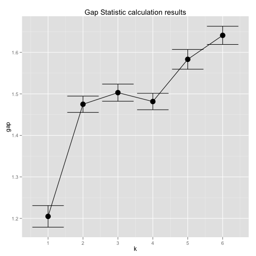 


Base graphics plotting, for comparison.


```r
plot(gs, main = "Gap statistic for the 'Enterotypes' data")
mtext("k = 2 is best ... but  k = 3  pretty close")
```

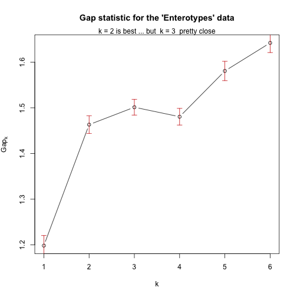 


# Future Directions for phyloseq

## Suggestions from Attendees/Developers
Don't be afraid to post feedback / needs on [the phyloseq issues tracker](https://github.com/joey711/phyloseq/issues):

https://github.com/joey711/phyloseq/issues

## Big(ger) Data
The firehose of new-gen sequencing data is making possible "big" datasets in this realm. We are considering some of the best approaches to help a tool like phyloseq address computational issues that are arising from dealing with this data, without compromising some of the other features (interactivity, reproducibility, connection with existing R tools). Some promising tools already available for R that might help include:

### Sparse matrix classes
Like in [the Matrix package](http://cran.r-project.org/web/packages/Matrix/index.html). This mainly applies to in-ram computations, especially when the full matrix is actually needed. In principle, this might only apply be required to represent the preprocessed data, which could still be sparse.

### Store full dataset in a database
Some suggested packages at this conference so far, obviousl not-yet implemented in phyloseq, are:

- [the hdf5 package](http://cran.r-project.org/web/packages/hdf5/index.html)

- [the ff package](http://cran.r-project.org/web/packages/ff/index.html)

### Use BioConductor tools for representing data

- Alternative ways of representing the related data

- Adding at least a representative sequence for each OTU. Using `DNAStringSet` class?


