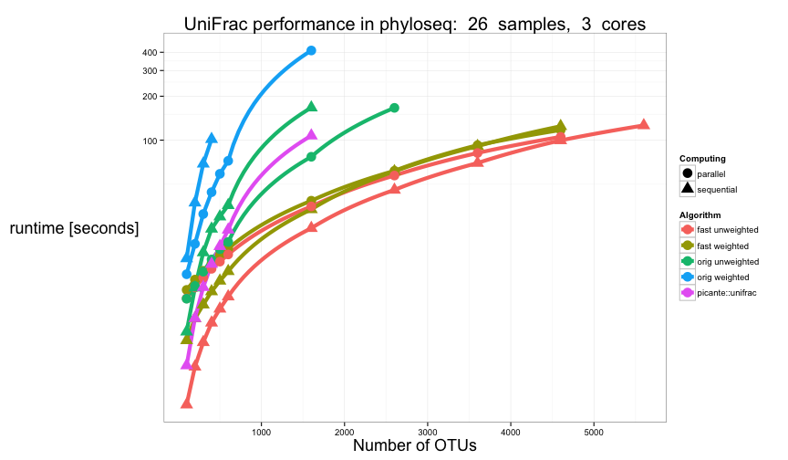

<link href="http://joey711.github.com/phyloseq/markdown.css" rel="stylesheet"></link>

# Fast Parallel UniFrac (in R)

## Background
A common tool in microbial ecology studies involving many samples is to calculate the "UniFrac" distance between all pairs of samples, and then perform various analyses on the resulting distance matrix.

[The phyloseq package](http://joey711.github.com/phyloseq/) includes a native `R` implementation of the better, faster, cleaner [Fast UniFrac algorithm](http://www.nature.com/ismej/journal/v4/n1/abs/ismej200997a.html). For legacy reasons and comparison, it also includes the original UniFrac algorithm, although there is unlikely to be a reason to use the original implementation because it is slower, and both approaches arrive at the same result. There are also two very different types of the standard UniFrac calculation: 

[Weighted UniFrac](http://aem.asm.org/content/73/5/1576.abstract) - which does take into account differences in abundance of taxa between samples, but takes longer to calculate; and

[Unweighted UniFrac](http://aem.asm.org/content/71/12/8228.short) - which only considers the presence/absence of taxa between sample pairs. 

Both can be useful, and share slightly different insight. Both weighted and unweighted UniFrac are included, and all UniFrac calculations have the option of running "in parallel" for faster results on computers that have multiple cores/processors available.

Parallelization in [the phyloseq package] is achieved using [foreach](http://cran.r-project.org/web/packages/foreach/vignettes/foreach.pdf) loops, which flexibly support a large variety of "parallel backends" -- from dual-core CPUs to large computing clusters. See foreach description in [the high performance computing task view](http://cran.r-project.org/web/views/HighPerformanceComputing.html) for further details, and supported architectures.

## Load phyloseq
Check your version number.

```r
library("phyloseq")
packageVersion("phyloseq")
```

```
## [1] '1.3.21'
```

```r
library("ggplot2")
packageVersion("ggplot2")
```

```
## [1] '0.9.3'
```

```r
library("doParallel")
packageVersion("doParallel")
```

```
## [1] '1.0.1'
```

```r
library("foreach")
packageVersion("foreach")
```

```
## [1] '1.4.0'
```


Define a default theme for ggplot graphics.

```r
theme_set(theme_bw())
fontsize = 18L
theme_update(axis.title.x = element_text(size = fontsize))
theme_update(axis.title.y = element_text(size = fontsize))
theme_update(plot.title = element_text(size = fontsize + 2))
```


## Examples
In phyloseq, all variants of the UniFrac distance can be called with the same generic function, `UniFrac`. We can start with a minimal example using the `esophagus` example dataset.

```r
data(esophagus)
UniFrac(esophagus, weighted = TRUE, normalized = TRUE, parallel = FALSE, fast = TRUE)
```

```
##        B      C
## C 0.2035       
## D 0.2603 0.2477
```

```r
(y <- UniFrac(esophagus, TRUE))
```

```
##        B      C
## C 0.2035       
## D 0.2603 0.2477
```

```r
UniFrac(esophagus, TRUE, FALSE)
```

```
##        B      C
## C 0.1050       
## D 0.1401 0.1422
```

```r
UniFrac(esophagus, FALSE)
```

```
##        B      C
## C 0.5176       
## D 0.5182 0.5422
```

where `esophagus` is a small example of a `"phyloseq-class"` experiment-level object, imported or constructed by the phyloseq package.

If you want to compare with the unweighted-unifrac available in picante

```r
picante::unifrac(as(t(otu_table(esophagus)), "matrix"), phy_tree(esophagus))
```

```
##        B      C
## C 0.5176       
## D 0.5182 0.5422
```


## Performance Comparison
In the previous example, the dataset was too small to warrant parallel computing. In fact, the computational overhead to perform the calculation with multiple processors would probably have been more expensive (take longer) than just calculating the 3 distance values sequentially. However, as the numbers of samples and OTUs in a dataset increases, the increased speed of computing these distances in parallel becomes very worthwhile, as shown in the following demonstration.

### Load Global Patterns


```r
data("GlobalPatterns")
GP = prune_taxa(taxa_sums(GlobalPatterns) > 0, GlobalPatterns)
GP
```

```
## phyloseq-class experiment-level object
## otu_table()   OTU Table:         [ 18988 taxa and 26 samples ]
## sample_data() Sample Data:       [ 26 samples by 7 sample variables ]
## tax_table()   Taxonomy Table:    [ 18988 taxa by 7 taxonomic ranks ]
## phy_tree()    Phylogenetic Tree: [ 18988 tips and 18987 internal nodes ]
```

```r
choose(nsamples(GP), 2)
```

```
## [1] 325
```


The `GP` example dataset has 26 samples and 18988 OTUs. Each distance in a `UniFrac` result matrix represents the pairwise distance between samples. The greater the number of samples to compare, the larger the number of pairwise distances to calculate. That is, there are ${n \choose 2}$ combinations, in this case 325 pairwise distances that will be calculated by `UniFrac` on the `GP` dataset. Because the value of one distance does not depend on another, this becomes "embarassingly parallelizable" for a dataset with a large number of samples, or for which each pair of samples takes a noticeable amount of time to compute. 

### Distance combinations
To understand this graphically, let's make a simple plot of the number of pairwise distance elements that must be calculated as a function of the number of samples


```r
nsamples = 3:100
ndistances = sapply(nsamples, choose, 2)
p = ggplot(data.frame(nsamples, ndistances), aes(nsamples, ndistances)) + geom_line(size = 5)
p = p + xlab("number of samples") + ylab("number of distances")
p
```

 


### Computing Time Example
The following code first computes and then plots the computation time required to calculate the distance matrix for the `GP` dataset at varying numbers of OTUs. As you can see, for datasets with less than 1000 OTUs, the choice of algorithm has only inconsequential effect on computation time, with all approaches returning a result in under 10 seconds. However as more and more taxa are included (more complex phylogenetic tree) in the dataset, the computation time increases exponentially; and at a much faster rate for variants of the original UniFrac algorithm. As pointed out in [the article describing Fast UniFrac](http://www.nature.com/ismej/journal/v4/n1/abs/ismej200997a.html), there is much less difference in performance between unweighted/weighted Fast UniFrac, making weighted UniFrac distances much more accessible (than previously) for large datasets. 

#### Parameters


```r
save.data.name = "unifrac.RData"
```

Threshold, in seconds. The maximum allowed time for one trial. Trials will not be conducted for that argument combination after this amount of time...

```r
threshold = 100
```

Number of cores to use for parallel trials

```r
Ncores = 3
```


Create a vector of the numbers of taxa, `Ntaxa`, and then create a list of phyloseq objects for each one. Will loop on the list. Define vector of the number of OTUs to include.

```r
Ntaxa <- c(seq(100, 500, 100), seq(600, ntaxa(GP), 1000), ntaxa(GP))
Ntaxa
```

```
##  [1]   100   200   300   400   500   600  1600  2600  3600  4600  5600
## [12]  6600  7600  8600  9600 10600 11600 12600 13600 14600 15600 16600
## [23] 17600 18600 18988
```

```r
physeq_list <- vector("list", length(Ntaxa))
names(physeq_list) <- as.character(Ntaxa)
```


Create a list with of random subset with `N` OTUs

```r
for (N in Ntaxa) {
    # Randomly subset N taxa from the original
    ex <- prune_taxa(sample(taxa_names(GP), N), GP)
    # Assign a random root from the sub-sampled dataset
    phy_tree(ex) <- root(phy_tree(ex), sample(taxa_names(ex), 1), resolve.root = TRUE)
    # Add to the list of physeq objects
    physeq_list[[as(N, "character")]] <- phyloseq(otu_table(ex), phy_tree(ex))
}
```


Create table of combinations of function calls

```r
UFcalls <- expand.grid(parallel = c(TRUE, FALSE), weighted = c(TRUE, FALSE), 
    fast = c(TRUE, FALSE), KEEP.OUT.ATTRS = FALSE)
```

The following creates a list appropriate for `do.call()`: `UFcalls[1, , drop=TRUE]`

Initialize data.frame of results

```r
time.frame <- data.frame(matrix(NA, 0, 5, FALSE))
```


`StillOK` is index for keeping track of which call combinations in UFcalls are still below time threshold 

```r
stillOK <- rep(TRUE, nrow(UFcalls))
```


Loop over each incrementally more-complex data subset. Stop tabulating a combination if run-time gets above a threshold. For each element of `physeq_list`, track the time for each function call indicated by `UFcalls`.

```r
for (N in Ntaxa) {
    if (sum(stillOK) > 0) {
        for (i in which(stillOK)) {
            # i<-1
            # Create list of arguments to UniFrac
            call.list <- c(physeq = physeq_list[[as.character(N)]], UFcalls[i, 
                , drop = TRUE])
            # Register the appropriate parallel or sequential backend
            if (call.list$parallel) {
                registerDoParallel(makeCluster(Ncores))
            } else {
                registerDoSEQ()
            }
            # Build, and call UniFrac with list of arguments
            runtime <- system.time(do.call("UniFrac", call.list))["elapsed"]
            # Store the values in growing data.frame
            time.frame <- rbind(time.frame, data.frame(taxa = N, runtime, UFcalls[i, 
                , drop = TRUE]))
            # Check if this runtime was below threshold, if not, mark it
            if (runtime > threshold) {
                # mark the combination as too long
                stillOK[i] <- FALSE
            }
        }
    }
}
```


Now run one more loop for `picante::unifrac()` time (unweighted, not-parallel).

Initialize picante.

```r
picante.frame <- data.frame(matrix(NA, 0, 2, FALSE))
stillOK <- TRUE
```


`picante::unifrac` loop over each N in Ntaxa.

```r
for (N in Ntaxa) {
    if (stillOK > 0) {
        # Create list of arguments to UniFrac
        call.list <- c(physeq = physeq_list[[as.character(N)]], UFcalls[i, , 
            drop = TRUE])
        # Determine if should register parallel backend or sequential
        if (call.list$parallel) {
            registerDoParallel(makeCluster(Ncores))
        }
        # calculate, score run-time
        exOTU <- as(t(otu_table(physeq_list[[as.character(N)]])), "matrix")
        extre <- phy_tree(physeq_list[[as.character(N)]])
        runtime <- system.time(picante::unifrac(exOTU, extre))["elapsed"]
        # Store the values in growing data.frame
        picante.frame <- rbind(picante.frame, data.frame(taxa = N, runtime))
        if (runtime > threshold) {
            # If this runtime was above threshold, mark it and stop loop
            stillOK <- FALSE
        }
    }
}
```


That part takes a long time. Save the data before plotting. Plotting is quick

```r
save.image(save.data.name)
```


#### Now build final data.frame of results
Modify logical parameter values to informative text factor

```r
time.frame[, "weighted"] <- factor(ifelse(time.frame[, "weighted"], "weighted", 
    "unweighted"))
time.frame[, "fast"] <- factor(ifelse(time.frame[, "fast"], "fast", "orig"))
time.frame[, "parallel"] <- factor(ifelse(time.frame[, "parallel"], "parallel", 
    "sequential"))
```


Add an "Algorithm" column that summarizes the algorithm approach.

```r
time.frame.plot <- data.frame(time.frame, algorithm = paste(time.frame[, "fast"], 
    time.frame[, "weighted"]))
```


Add `picante.frame` to `time.frame`

```r
picante.frame.plot <- data.frame(picante.frame, parallel = "sequential", weighted = "unweighted", 
    fast = "orig", algorithm = "picante::unifrac")
```


Finally, create a new separate, everything-combined data.frame for plotting

```r
time.df <- rbind(time.frame.plot, picante.frame.plot)
```


#### Now build ggplot of results.


```r
p = ggplot(time.df, aes(taxa, runtime, color = algorithm, shape = parallel))
p = p + geom_path(size = 2) + geom_point(size = 5)
p = p + ggtitle(paste("UniFrac performance in phyloseq: ", nsamples(ex), " samples, ", 
    Ncores, " cores"))
p = p + scale_shape_discrete(name = "Computing") + scale_colour_discrete(name = "Algorithm")
p = p + ylab("runtime [seconds]") + xlab("Number of OTUs")
```


Before plotting, transform the vertical coordinate system to `log10`. See [the documentation for coord_trans](http://docs.ggplot2.org/current/coord_trans.html) for more details.

```r
p = p + coord_trans(y = "log10")
```


Now actually "print" the graphic

```r
p
```

 

**Legend** Computation time required to calculate the distance matrix for a 21-sample experiment at varying numbers of taxa. For comparison, the performance of the original unweighted UniFrac algorithm as implemented in the "picante" package is also included.


Save the workspace for later.

```r
save.image(save.data.name)
```


